# A Complete Guide for Sales Forecast Project Implementation Using Machine Learning: a Rossmann Case

_This sales prediction project uses data from Rossmann, a Germany-based drug store chain with operations over more than 3,000 stores across seven european countries. The dataset is publicly available from a [Kaggle competition](https://www.kaggle.com/c/rossmann-store-sales/data)._

For starters in the Data Science field, it is not always clear how to build end-to-end solutions to solve complex problems involving data. Understanding how to tackle such challenges is key, so does understanding the reasoning behind each step. With this in mind, this project have four goals:

1. Tackle a classic Data Science problem faced by many firms: sales prediction.
2. Go through the statistics theory behind our project steps. We will go deep enough to make sense of the concepts, but won't reach to a point where we bog ourselves down in the road.
3. Unlock insightful information for the business by doing a thorough, detailed data study over the company's data.  
4. Deploy a complete solution suitable for the business needs. Here, we will go from understanding the business demands and prepare the data, to Machine Learning (ML) modeling and posterior production. Our final product will be to generate sales predictions on a smartphone application.

### A note about Machine Learning

In this project, we will use machine learning to predict sales. Therefore, we will intermittently use machine learning terms throughout the project such as _training_, _test data_, _hyperparameter tuning_, and so forth. **If you need a quick intro to Machine Learning**, Google's Yufeng Guo [What is Machine Learning?](https://www.youtube.com/watch?v=HcqpanDadyQ) and [The 7 steps of machine learning](https://www.youtube.com/watch?v=nKW8Ndu7Mjw) videos will get you ready to jump into this project.

### Special Mention

This project was born from [Meigarom Lopes](https://github.com/Meigarom)'s excellent course _Data Science em Produção_. In this course, learners apply data science techniques to deploy a data science solution from scratch from a business perspective. The course is thorough: it goes through data collection and data cleaning, machine learning modeling and project deployment. For more details, please check his course (in portuguese) [here](https://sejaumdatascientist.com/como-ser-um-data-scientist/). 

### How to read this README.MD?

This is a very extensive README since it carries the responsibility of showing the project outcomes and also to explain the intuition behind algorithms and statistical analyses. There is also a somewhat palatable length of explanations on the reasoning of each step in this project. Here is my suggestion for the readers:

1. If you wish to **check the codes for this project**, access the Jupyter notebook [here](https://github.com/alanmaehara/Sales-Prediction/blob/master/notebooks/cycle02_rossmann_sales_prediction.ipynb) and go back to the [table of contents](#table-of-contents) whenever some explanation is lacking there. 
2. If you wish to **read the project's main findings instead of going through the entire project**, look no further and [get there.](#main-findings)
3. **If you wanna bear the adventure with me**, just read the entire readme. A [(go to next section)]() hyperlink will be available for each section to make your reading smoother, and a [(skip theory)]() hyperlink will be there to skip technical explanations. 

I would appreciate any comments or suggestions on how to improve this project. Please feel free to add me on GitHub or [Linkedin](https://www.linkedin.com/in/ammaehara/) - I will get back to you as soon as possible. 

With no further due, let's get started!

---
## Table of Contents
- [Brief Intro - Dirk Rossmann GmbH](#brief-intro-dirk-rossmann-GmbH)
- [Main Findings](#main-findings)
- [Project Methodology](#project-methodology)
- [Cycle Description](#cycle-description)
- [01. A Business Request](#01-a-business-request)
- [02. Data Preparation](#02-data-preparation)
- [03. Feature Engineering](#03-feature-engineering)
- [04. Exploratory Data Analysis (EDA)](#04-exploratory-data-analysis-eda)
- [05. Data Preprocessing](#05-data-preprocessing)
- [06. Feature Selection](#06-feature-selection)
- [07. Machine Learning Modeling](#07-machine-learning-modeling)
- [08. Hyperparameter Tuning](#08-hyperparameter-tuning)
- [09. Error Interpretation and Business Performance](#09-error-interpretation-and-business-performance)
- [10. Deploy Machine Learning Model to Production](#10-deploy-machine-learning-model-to-production)
- [11. A Sales Predictor Bot](#11-a-sales-predictor-bot)
- [Conclusion](#conclusion)
- [Appendix I Datasets](#appendix-i-datasets)

---
## Brief Intro - Dirk Rossmann GmbH

[(go to next section)](#main-findings)

Dirk Rossmann GmbH (Rossmann) is a private, German drug store chain founded in 1972 and is a key player on the European pharmacy market, with operations in healthcare and beauty retail industries. According to [Bloomberg](https://www.bloomberg.com/profile/company/122549Z:GR), Rossmann offers a wide range of products including baby and body care, hygiene, sun protection, cosmetics, dental hygiene, household, pets, hair care, perfume, fragrances, and food products. 

 Aside from the +2,000 on-site Germany stores (see stores location [here](https://www.rossmann.de/de/filialen/index.html)), Rossmann operations extend to Poland, Czech Republic, Turkey, Albania and Hungary, totaling +4,100 on-site stores. 
 
 Rossmann is also active on e-commerce for Germany-based customers, with around [$30 million EUR in online revenues per year](https://www.world-today-news.com/the-giant-of-cosmetics-and-drugstore-rossmann-fixed-in-valencia-the-venue-for-its-deployment-in-spain/), making up for 15.2% of market share in Germany. Rossmann's 2018 annual revenue was approximately \$9 billion EUR ([Dun & Bradstreet](https://www.dnb.com/business-directory/company-profiles.dirk_rossmann_gmbh.7342471a5e75a2072c060665843eeecd.html#financials-anchor)). Further financial information is not publicly available. 

[back to top](#table-of-contents)

---
## Main Findings

[(go to next section)](#project-methodology)

_(If you intend to read the entire project, you can skip this section.)_

In this project, a machine learning model was trained to predict sales revenues for Rossmann. The following setup was utilized:

- [Project Methodology](#project-methodology): the CRISP-DM was used as the main project management methodology. Two cycles were completed within the total project implementation length of 2-months; a log of each CRISP-DM cycle can be accessed [here](#cycle-description).
- [Business Problem and Solution](#01-a-business-request): a fictitious business problem was created to motivate our project. Due to a upper-management request, a 6-week sales prediction project for each Rossmann store will be delivered to the business. Predictions will be available through a Telegram Bot where stakeholders can retrieve information on their smartphones. 
- [Data Collection](#02-data-preparation): Data was acquired from [Rossmann's Store Sales Kaggle competition](https://www.kaggle.com/c/rossmann-store-sales/data):
  - **Data Dimensions (rows x columns):** 
    * Train dataset: 969264 x 18 
    * Valid dataset: 47945  x 18
    * Date Range: 2013-01-01 (first) / 2015-07-31 (last)
  
    In this project, we splitted the whole data into training and validation parts:
    * **Training data** corresponds to all data entries between **2013-01-01 to 2015-06-19**
    * **Validation data** contains entries from the last 6 weeks of available data, **2015-06-19 to 2015-07-31**. 
    * **Test data** corresponds to data entries between **2015-07-31 to 2015-09-16**. This data doesn't have the target variable `sales` and will be used as the input to generate predictions in production;

The following steps were performed on the collected data:

- [Data Cleaning](#iii-data-cleaning): All variables presenting missing values are influenced by time. Therefore, variable statistics weren't used for imputation but the `date` of each sales data entry were used instead; 
- [Feature Engineering](#03-feature-engineering): In order to guide the feature engineering step, a [mindmap](#i-hypothesis-list) was created to map traits that possibly explain sales revenues for the company. As a result, 44 business hypotheses were derived and 19 hypotheses could be addressed on the [Exploratory Data Analysis](#04-exploratory-data-analysis-eda) section with the current dataset. To support the analysis, 13 new features were created including Germany's macroeconomic data: Gross Domestic Product (GDP) per capita, interest rates, Consumer Price Index (CPI), Consumer Confidence Indexe (CCI), and unemployment rates were added (data retrieved from [OECD.stats](#appendix-i-datasets)). 
- [Filtering Variables](#iv-filtering-variables): closed stores or stores without revenues were excluded from the model;
- In the [Exploratory Data Analysis](#04-exploratory-data-analysis-eda) section, univariate, bivariate, and multivariate analysis were conducted. We validated the hypothesis list built previously in the bivariate analysis:

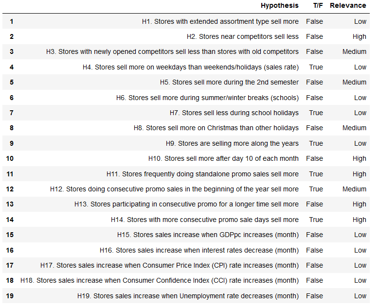
 
In the multivariate analysis, we observed 19 multicollinearity cases (either linear positive or negative strong correlation). This indicated that we would have some problems training a linear model unless some of these variables were excluded. Since data could be non-linear - and decision-based tree algorithms can handle non-linear data well - I opted to keep these variables, rescale and transform some of them, and run both linear and non-linear algorithms to check overall performance.

- [Data Preprocessing](#05-data-preprocessing): MinMax Scaler, Robust Scaler and Yeo-Johnson Transformation were used to rescale numerical variables showing unusual range, skew, and kurtosis. For categorical variables, One-Hot Encoding, Label Encoding and Ordinal Encoding were used according to each variable's case. For the target variable `sales`, Logarithm transformation was utilized. Also, Sine/Cosine Transformation was utilized on time-related variables that are cyclical in nature;

- [Feature Selection](#06-feature-selection): For this project, a wrapper method called Boruta that automatically select the best features for our predictive ML model was used. Boruta selected 21/36 variables. I added two variables to the final list of variables, making it to 23 variables.

- [Machine Learning Modeling](#07-machine-learning-modeling): Seven models were tested as candidates for this project: (1) Mean of the target variable (baseline); (2) Linear Regression; (3) Lasso Regression; (4) Ridge Regression; (5) ElasticNet Regression; (6) Random Forest Regressor; (7) XGBoost Regressor. The following cross-validation results were observed:

**1st CRISP-DM Cycle**:

**2nd CRISP-DM Cycle**:

_Quick note: all cross-validation steps were built to avoid data leakage issues. In order to do so, a `cross_validation()` function was created - for more details, check the [notebook](https://github.com/alanmaehara/Sales-Prediction/blob/master/notebooks/cycle02_rossmann_sales_prediction.ipynb)._

The **Random Forest Regressor** and the **XGBoost Regressor** were the best model performers at both cycles, with a Mean Average Percentage Error (MAPE) of 7% and 9%, respectively. Since the XGBoost Regressor is known to train data fastly than random forest algorithms (and the model performance is not too different), we used the XGBoost regressor as the main machine learning model for our project.

- [Hyperparameter Tuning](#08-hyperparameter-tuning): Using the optimal set of parameters, we obtained the following results with the XGBoost model:

which had a MAPE improvement of ~4.2%.

- [Model Performance](#09-error-interpretation-and-business-performance): Considering all Rossmann stores, we would have a total predicted sales for the next six weeks of \$284,153,920, being \$283,772,779 for the worst scenario sales prediction, and \$284,535,044 for the best scenario. Scenarios were created to reflect MAPE variations. 

- The XGBoost model performed quite well across Rossmann stores except for three stores with MAPE above 14%:

Usually, the business have the final word on how permissible these error percentages can be. However, the model performs fairly well for most of the stores with a MAPE of ~5%. Since we have created a business case for this project, we will fictionally consider that the business has approved the model predictions.

The lineplot below shows that predictions (in orange) were fairly on par with the observed sales values (in blue) across the last six weeks of sales represented by the validation data. 

The following graph shows the error rate (the ratio between prediction values and observed values) across six weeks of sales. The model performs fairly well since it doesn't achieve error rates above 1.075 or below 0.925. The 3rd and 5th weeks were the ones that the model performed not so well compared to other weeks:

One of the premises for a good machine learning model is to have a normal-shaped distribution of residuals with mean zero. In the following graph, we can observe that the errors are centered around zero, and its distribution resembles a normal, bell-shaped curve.

The following graph is a scatterplot with predictions plotted against the error for each sales day. Ideally, we would have all data points concentrated within a "tube", since it represents low error variance across all values that sales prediction can assume:

There are six sales days that the model generated errors above \$10,000. Ideally we would separate these days and conduct a thorough analysis to check why they have such errors. Since it is only six, we proceeded with the trained model to production.

- [Project Deployment to Production](#11-a-sales-predictor-bot): In this project, we deploy a machine learning model that predicts sales for Rossmann stores, and put it into production in the cloud with Heroku. By the end, Rossmann stakeholders will be able to access predictions with a Telegram Bot on their smartphones.

  The production architecture for this project is as follows:
  &nbsp; 
  

    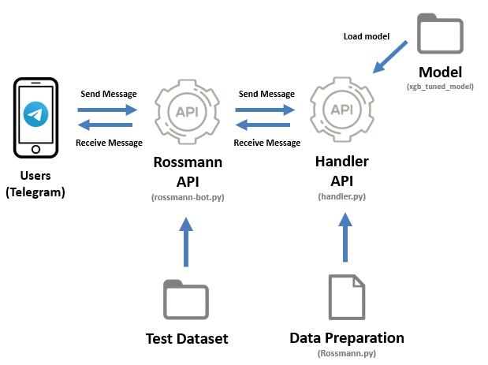
  

  &nbsp; 
  The architecture works like this: (1) a user texts the store number it wishes to receive sales prediction to a Telegram Bot; (2) the Rossmann API (rossmann-bot.py) receives the request and retrieve all the data pertaining to that store number from the test dataset; (3) the Rossmann API send the data to Handler API (handler.py); (4) the Handler API calls the data preparation (Rossmann.py) to shape the raw data and generate predictions using the trained XGBoost model; (5) the API returns the prediction to Rossmann API; (6) the API returns the total sales prediction for a specific store + a graph of sales prediction across the next six weeks to the user on Telegram: 
 
 
  &nbsp; 
  

  &nbsp;

[back to top](#table-of-contents)

---

## Project Methodology

[(go to next section)](#cycle-description)

For this project, we will use the CRISP-DM as the main method for project management. CRISP-DM stands for "**CR**oss-**I**ndustry **S**tandard **P**rocess for **D**ata **M**ining",  and is considered as one of the gold standards for project management methods in Data Science. For further details on the methodology, Himanshu Shekhar has a [great introduction article](https://medium.com/voice-tech-podcast/cross-industry-standard-process-for-data-mining-crisp-dm-9edc0c5e3a1) to CRISP-DM, although the usage of this method will be easily understood if one follow along with this section.

The CRISP-DM is a project management methodology that shows a 360º outlook of data science projects. It is composed of six steps that together forms a complete CRISP-DM cycle as follows:

### The CRISP-DM Cycle
  &nbsp; 
  

    
  

  &nbsp; 
Each cycle is iterative and future cycles serve as a way to improve the current project. There are many benefits for using CRISP-DM as a project management method. Here I highlight three main reasons in favor of CRISP-DM:
*  Delivers an end-to-end solution;
*  Each cycle should be done in a fast-paced. Why? Think of you trying to perfect each and every single step until you are satisfied with the results. It is likely that you will spend weeks (if not months) on a single step, and therefore, won't deliver true value to business since time is usually a constraint;
* By going through a complete cycle, CRISP-DM users can quickly get a grasp of the whole project and map all possible problems on time.

For the purpose of this project, I adapted the CRISP-DM methodology into five steps (instead of six) and allocated each item from the [table of contents](#table-of-contents) on every CRISP-DM step as follows:

**I. Business Understanding**

Goal: to understand the business demand that originates the project in question.

* A Business Request

**II. Data Understanding and Data Preparation**

Goal: to understand the data we are working with, generate business insights, and preprocess data towards the creation of a machine learning model.

* Data Preparation
* Feature Engineering
* Exploratory Data Analysis (EDA)
* Data Preprocessing
* Feature Selection

**III. Modeling**

Goal: to train a machine learning model, optimize model parameters, and measure performance based on predictions.

* Machine Learning Modelling
* Hyperparameter Tuning

**IV. Evaluation**

Goal: to evaluate and translate model predictions in business terms.

* Error Interpretation & Business Performance

**V. Deployment**

Goal: to create a solution that enables the firm's stakeholders to access predictions.

* Deploy Machine Learning Model to Production
* A Sales Predictor Bot

The purpose and application of each step will be explained in much more detail through the project, so bear with me till the end!
___
## Cycle Description

[(go to next section)](#01-a-business-request)

In this project, you will see the results of the 2nd CRISP-DM cycle. See the log of each cycle below:

| Cycle      | Description | Notebooks |
| ----------- | ----------- | ----------- | 
| 1º      | In this cycle, the main dataset for this project was retrieved from [Kaggle](https://www.kaggle.com/c/rossmann-store-sales/data), and complementary datasets related to Germany's economic indicators were retrieved from [OECD.Stat](https://stats.oecd.org/). Customer related data was not utilized in this cycle since such data wouldn't be available at the prediction time.         | [cycle 01](https://github.com/alanmaehara/Sales-Prediction/blob/master/notebooks/cycle01_rossmann_sales_prediction.ipynb)
| 2º   | A few variables were added to the dataset. Number of customers (which was previously dropped from the model) were added. In order to allow this variable into the project, a complementary project to predict number of customers for each Rossmann store was done and predictions were added test dataset. We also remodeled the whole project to attend data leakage issues, although significant effects on performance were not observed.|[complementary project](https://github.com/alanmaehara/Sales-Prediction/blob/master/notebooks/rossmann_customers_prediction.ipynb) & [cycle 02](https://github.com/alanmaehara/Sales-Prediction/blob/master/notebooks/cycle02_rossmann_sales_prediction.ipynb) |

Exact source links of all datasets will be displayed on [Appendix I Datasets](#appendix-i-datasets). 

[back to top](#table-of-contents)

---
## 01. A Business Request
[(go to next section)](#02-data-preparation)

We start this project with the most important step. Here we understand why a data-driven project needs to be done in first place. There are three tasks to be done:

- **Business Question**: understand the main issue to be solved or question to be answered. Answer the question: "What is the company's main problem and what kind of information addresses this issue (what is the target variable?)
- **Issue Owner and Motive**: get to know who originated the request and why.
- **Solution Format and Deliverables**: Check possible methods to solve the problem. Define the solution format (how users will access your solution) and granularity (eg: will it be a six-month sales prediction project or six weeks?).

Since we only have the sales dataset from Kaggle and we don't have professional ties with the company, we don't have any means to acquire internal data. Therefore, we will create a hypothetical business situation to guide our project. 

### The Business Situation
Let's pretend that we are data scientists working for Rossmann, and that we have just received a business request from three sales managers. **They were requesting the exact same thing: a sales forecast for the next six weeks on their respective regional areas.** 

Later on, you find out that the CFO was the one who has made this business request to all sales managers. You reached out the CFO and got to know its initial motive: to figure out the total revenue per store after six weeks in order to finance upcoming investments for each store. Then, you suggest a sales forecast project that has as the main output the 6-week sales forecast to be displayed on a smartphone app.

- **Business Question**: what is the sales forecast for the next six weeks?
- **Issue Owner and Motive**: the CFO wants to finance upcoming investments for each store after two months (~6 weeks)
- **Solution Format and Deliverables**:
    - **Data Problem Type**: sales forecast
    - **Possible Solution Methods**: Regression, Time Series, Neural Networks 
    - **Deliverables**: 6-week daily sales forecast per store. Stakeholders (sales managers, CFO, CEO..) will be able to get forecasts in real time from a smartphone app.

[back to top](#table-of-contents)

---
## 02. Data Preparation
[(go to next section)](#03-feature-engineering)

In this step, we work on acquiring data and get first impressions of our problem. Four tasks to be performed:

### I. Data Collection

Once we've set up the business problem and deliverables of our project, let's get our hands into data. Usually, one must check the data whereabouts: is your data publicly available or do you need to acquire it from the business? Will you have enough processing and capacity power to acquire the data? Or rather you figure out that you don't have the means to get the necessary data (in this case, the project might not be feasible). 

In our case, things are a bit different. As mentioned in [Cycle Description](#cycle-description), our data comes from a Kaggle competition held by Rossmann. Therefore, our project is pretty limited on the information contained in the dataset. In real life, we would collect all information available in the company's data warehouse that helps answering our [Business Question](#01-a-business-request). As for this project, it is fine to proceed as it is, since we are running this project under a fictitional business standpoint.

**At this point, it should be clear what is the phenomenon that we are trying to predict (target variable): sales revenues.**

### II. Data Description

Once you get your hands on data for the first time, analyze the dimension of your data (how many rows vs columns?) and the data types (categorical data? numerical data? Discrete or continuous data?). For a reference on data types, check this diagram:

Our initial set of variables are as follows:

| Variable      | Description | Data Type |
| ----------- | ----------- | ----------- | 
| store   | a unique Id for each store  | numerical (discrete)  |
| day_of_week   | day of the week (1 = Monday, 7 = Sunday) | numerical (discrete)    |
| date  | date of each sales entry | date  |
| **sales**   | **the turnover for any given day (this is what you are predicting)** | **numerical (continuous)**   |
| customers  | the number of customers on a given day  | numerical (discrete) |
| open   | an indicator for whether the store was open: 0 = closed, 1 = open | numerical (dummy*)  | 
| promo  | indicates whether a store is running a promo on that day | numerical (dummy*)   |
| state_holiday   | indicates a state holiday. Normally all stores, with few exceptions, are closed on state holidays. Note that all schools are closed on public holidays and weekends. a = public holiday, b = Easter holiday, c = Christmas, 0 = None | categorical (nominal)  |
| school_holiday  | indicates if the (Store, Date) was affected by the closure of public schools: 1 = affected, 0 = not affected | numerical (dummy*)  |
| store_type   | differentiates between 4 different store models: a, b, c, d | categorical (nominal)  |
| assortment | describes an assortment level: a = basic, b = extra, c = extended | categorical (ordinal)  |
| competition_distance   | distance in meters to the nearest competitor store | numerical (continuous)   |
| competition_open_since_month  | gives the approximate month of the time the nearest competitor was opened | numerical (discrete)  |
| competition_open_since_year   | gives the approximate year of the time the nearest competitor was opened | numerical (discrete) | 
| promo2  | promo2 is a continuing and consecutive promotion for some stores: 0 = store is not participating, 1 = store is participating | numerical (dummy)  |
| promo2_since_week   |describes the calendar week when the store started participating in Promo2 | numerical (discrete) |
| promo2_since_year   |describes the year when the store started participating in Promo2 | numerical (discrete) |
| promo_interval   |describes the consecutive intervals Promo2 is started, naming the months the promotion is started anew. E.g. "Feb,May,Aug,Nov" means each round starts in February, May, August, November of any given year for that store | categorical (nominal) |

_*dummy variable is one that takes either 0 or 1. For more details, check [here](https://en.wikipedia.org/wiki/Dummy_variable_(statistics))._

* **Data Dimensions (rows x columns)**: 

  * Train dataset: 969,264 x 18 
  * Valid dataset: 47,945  x 18
  * Date Range: 2013-01-01 (first) / 2015-07-31 (last)
  
In this project, we splitted the whole data into training and validation parts:
* **Training data** corresponds to all data entries between **2013-01-01 to 2015-06-19**
* **Validation data** contains entries from the last 6 weeks of available data, **2015-06-19 to 2015-07-31**. 

We splitted so that we could test the model performance on a validation data before we use **test data**, which is the data we really want to predict sales revenues. 
* **Test data** corresponds to data entries between **2015-07-31 to 2015-09-16**. 

Once we validate our model, we can put it into "production", so that all stakeholders of this project can access sales predictions for the six weeks corresponding to the test data.

### Understanding Data Terms in Machine Learning 
_Probably you have already identified that we used three specific machine learning terms: training, validation, and test. If you know these terms, or if you have watched the videos I recommended at the [very top of this document](#a-note-about-machine-learning), you are just fine to proceed to the next step; otherwise, watch the videos and keep reading below._

To build a machine learning model that predicts sales, we need **training data**, which is a data that a machine learning algorithm work on to learn (or "train") the data patterns to create a prediction model, and a **validation data**, which is the data that the prediction (or "trained") model will generate predictions to validate whether the model accurately works. Once we validate the model, we can use it on the **test data**, which is the data that we really want to get sales predictions on.

Simply put, machine learning modeling works like this:

1. Split data into **training** and **validation** data;
2. In both datasets, separate the **dependent variable** (the variable we wish to generate predictions - in this case sales) from the **independent variable**;
3. Choose a machine learning algorithm and use the **training data** to train a model. We will get into machine learning algorithms later on;
4. With the model ready to generate predictions, use **validation data** to validate whether the model performs well or not. The mechanics are like this: (1) input the **independent variables** from **validation data** on the model; (2) get sales predictions, and compare them with the real sales data (dependent variable) from the validation data. If predictions are not too off from the real data, then we can use the model to predict sales on **the test data**.
&nbsp;

**A quick note on statistical terminology**: our sales variable, which is what we want to predict in this project, can assume many names such as _dependent variable_, _predicted variable_, _response variable_ or _target variable_. Other variables that helps us explain sales, they are commonly called _independent variable_, _predictor variable_, _feature_, or _explanatory variable_. In a regression model context, you might also see explanatory variables being called as _regressors_.

### III. Data Cleaning

This is a crucial step to any data science project. Many machine learning algorithms don't cope well with missing (null) values or data that isn't in the right format. Here we perform two tasks:

* **Change data types**: In Python language, some features (columns) might not be in the right format to work on (e.g: variable "date" in string format instead of "date" format). In our case, we can simply use the pandas `.astype()` method to change data types.
* **Imputation**: check the volume of null values on each column of the dataset, and find a method to impute null values. Usually, a good way to determine the best imputation method is to reflect upon the reasons why there are null values for each feature on the dataset. 
  _Quick note: depending on the volume of missing values in the dataset, it might be desirable to go back to the previous task "Data Collection"._
    
Let's check the missing values for each dataset:
* Null Values for training data: 

* Null Values for validation data: 

The imputation method for each variable is as follows:
* **promo_interval**: fill null values with 0 (store is not participating in consecutive promo sales "promo2"). With `promo_interval`, a dummy variable `is_promo2` was created to indicate whether a store is holding a consecutive promo sales in the that day. `promo_interval` will be dropped afterwards. 
* **competition_distance**: fill null values with 100000. The reason is that null values are probably an indicative that stores don't have closer competitors. Therefore, missing values will be filled out with a value way above the maximum competition distance seen (75860m)

The following variables don't seem to have an ideal imputation method. Imputing null values with mean, median, or zero doesn't sound good, due to the high percentage of null values. Therefore, the `date` column will be used to support imputation:
* **promo2_since_week**: fill with the week number located in `date` 
* **promo2_since_year**: fill with the year located in `date` 
* **competition_open_since_year**: fill with the year located in `date` 
* **competition_open_since_month**: fill with the year located in `date`   

### IV. Descriptive Statistics

[Descriptive statistics](https://en.wikipedia.org/wiki/Descriptive_statistics) is a summary of the data. It quantitatively describes the data by using some statistic metrics depending on the nature of the data. 

For numerical variables, we usually use statistics that measure **dispersion** (Variance, Standard Deviation, Range, First and Third Quartiles, Minimum, Maximum, Skewness, Kurtosis) and **central tendency** (mean, median). Find below a quick explanation on such measures - if you wish to skip and access the descriptive statistics for this project's data, skip theory.

[(skip theory)](#numerical-data)

Let's start with measures of **Central Tendency**, which are measures of where the center of a data set lies:

### 1. Mean
Most commonly known as the "average", the mean (or arithmetic mean) is equal to the sum of a list of values divided by its total number of elements:

where,

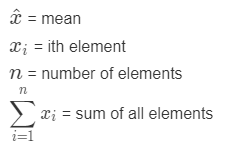

Let's use the following set A and calculate the mean:

  

The mean for set A is **3.5714**.

### 2. Median
Median (or the "middle" value) is simply a value separating the data on half. It is also known as the 2nd quartile (Q2). The median is best understood when given an example:

  
 
* List A has 7 elements; for odd-numbered lists, we find the median by picking the middle term, which is **4**.
* List B has 4 elements; for even-numbered lists, the median is the average of the middle two numbers: **2**

Now we turn our focus to **measures of dispersion**:

### 1. Variance

Variance is the average of the squared differences from the mean. It measures how far a set of numbers is spread out from their mean (average) value. In order to calculate the variance, find the mean value and subtract its value from each number on your set. Then square the result, and average it:

where,

Using the same set A to calculate variance:

  

### 2. Standard Deviation

As we can notice from the formula above, standard deviation is just the square root of the variance. If we use the set A as an example:

This is usually a better statistic to measure data dispersion than variance, since it gives a meaningful interpretation to its value. To better understand the concept of standard deviation, let's graph a normal distribution curve like the one below (graph retrieved [here](https://upload.wikimedia.org/wikipedia/commons/thumb/8/8c/Standard_deviation_diagram.svg/1024px-Standard_deviation_diagram.svg.png)). The x-axis represents the standard deviations from the mean (centered on zero), and can assume negative or positive values. The y-axis is the probability density function (PDF) and represents the likelihood (probability) of an outcome to happen. 

Data that follows a normal distribution has the same value for the mean, median and [mode](https://en.wikipedia.org/wiki/Mode_(statistics)), with its value located exactly at the center of the bell-shaped curve. One example of data that falls into a normal distribution is the height of human beings. Since most people aren't super tall nor very short, their height tend to converge closer to a mean value. 
_Quick note: the mean of human being's height is definitely not zero as the graph depicts. When the mean = median = mode is equal zero, the distribution is called "[standard normal distribution](https://sphweb.bumc.bu.edu/otlt/mph-modules/bs/bs704_probability/bs704_probability9.html)". In the case of human heights, we just substitute the zero by the mean of human heights._

Here's where the standard deviation comes into play: for normal distributions, around 68% of the world's population height falls between -1 and +1 standard deviations from the mean. If we go to +-2 standard deviations, then we could say that 95% of our population height falls into that threshold. Going even further, we could say that 99.7% of the world's population heights are included within +- 3 standard deviations from the mean. 

The following graph (with mean equal 100) illustrates the situation for normal distributed variables (graph retrieved [here](http://www.skillpower.co.nz/wp-content/uploads/2015/12/mmm.png)). For a variable that has a standard deviation of 5 (blue-colored curve), the distribution curve is not widespread and is closer to the mean value of 100. When standard deviation increases, however, the distribution is widespread, showing that the data entries are too sparsed from each other:

_Quick note: while the result of the standard deviation can't be negative, standard deviation thresholds on a distribution can assume negative and positive values to determine dispersion from the mean value (as we showed on the first graph)_

In our project, however, we can´t assume that our variables follows a normal distribution (we will see graphs proving it later on). 

### 3. Minimum/Maximum

Minimum is the smallest value found from a list of numbers. Maximum is the biggest value found from the same list.

  

For list A, the minimum is 1 and the maximum is 6. No big deal.

### 4. Range

Range is the difference between the lowest and highest value. This is a useful statistic that also tell us about the statistical dispersion of the data, and shows a rough idea of the magnitude and scale of our data.

The range of list A is simply:

### 5. Quartiles

Quartiles are values that divide a list of numbers into quartiles (four or less equal parts). We usually have three types of quartiles:
*  **1st Quartile (Q1)**: also known as the 25th percentile, it cuts the lowest 25% of data.
*  **2nd Quartile (Q2)**: known as the 50th percentile, it cuts the dataset in half. Its value is also the **median**. 
*  **3rd Quartile (Q3)**: known as the 75th percentile, it represents the value that splits 75% of the data from the top 25%.

A illustration might help internalizing the idea behind quartiles (retrieved from [here](https://www.mathsisfun.com/data/images/quartiles-c.svg)):

We also have the **Interquartile Range (IQR)**, which is the difference between Q3 and Q1. In the illustration above, IQR would be 4.

This is a good moment to explore **boxplots**, which is a very useful tool for statistic analysis and uses concepts related to quartiles, minimum and maximum, and outliers. I will explain just enough to make ourselves comfortable with boxplots, but you may find a complete explanation on the topic by [Michael Galarnyk](https://towardsdatascience.com/understanding-boxplots-5e2df7bcbd51).

Boxplots is a controlled, neat way to visualize the variability of data. On the x-axis, the numbered ticks represent the values that the data can assume. The figure above shows numbers ranging from -4 to +4 but they could be really any number, for example, from 50 to 250 centimeters (human body height) to -20 to +40 Cº (temperature in Celsius).
There are many ways to read a boxplot, but whenever I deal with them I take the following steps:
  1. **Find the median**: you can identify the median (Q2) as the yellow line that divides the red box into two parts.
  2. **Identify the Interquartile Range (IQR)**: the IQR is the whole red box and represents 50% of the data. If you read the boxplot from right to left, the Q1 is the line where the box starts, and the Q3 is where the box ends. 
  Just by reading the red box, one can understand the variability of the data. If the median line is symmetric between Q1 and Q3, the data distribution is more symmetric. Otherwise, if the median line is closer to either Q1 or Q3, then the distribution is asymmetric.
  3. **Minimum/Maximum**: the minimum and maximum values in a boxplot **are not equal** to the data's true minimum and maximum values. In a boxplot, minimum (also known as _lower fence_) is the difference between the value representing the 25th percentile of your data (Q1) and 1.5 times the IQR. Maximum (or _upper fence_) is the sum of the value representing the 75th percentile of your data (Q3) and 1.5 times the IQR.
  4. **Outliers**: outliers are data points that differ greatly from other data points. You can identify them as mini-circles in the extreme sides of a boxplot. The threshold that determines whether a data point is an outlier or not is the minimum and maximum values.

Let's check a practical example that records time slept (hours) by an individual across weekdays (graph retrieved [here](https://plot.ly/static/img/literacy/boxplot/boxplotfig9.jpg)):

&nbsp;

Although these boxplots are in vertical position, there's nothing different in terms of data interpretation. 
Let's start by looking at Monday's boxplot. The median (Q2) for Monday is approximately 7.5 hours of sleep, and it is closer to the Q3 value, which indicates that the data distribution is asymmetrical (this individual has slept between 6 to 7.5 hours more frequently than 7.5 to 8 hours). Now see the box on its entirety: 50% of the time, this person has slept between 6 to 8 hourse on Mondays and no unusual time sleep hours were recorded (no outliers). 
Now look at the Thursday boxplot. On thursdays, this individual had 5.5 to 6.5 hours of sleep 50% of the time. The box size is very small, which indicates that the data distribuion is more concentrated on the median value (and less dispersed compared to Monday). Sadly, this person didn't sleep well one day - there is an outlier around 2.5 hours of sleep.
&nbsp;

### 6. Skewness

Before explaining skewness, we need to understand what is a random variable and a probability distribution. 

According to [Yale](http://www.stat.yale.edu/Courses/1997-98/101/ranvar.htm), a **random variable** (usually described as X) is a variable whose possible values are numerical outcomes of a random phenomenon. For example, flipping a coin 100 times is a random phenomenon - there is no way to know the outcome for each and every single coin flip unless you actually flip the coin 100 times. But you know that there are only two possible outcomes: heads or tails. When we quantify our possible outcomes - let's say, X = 0 for tails and X = 1 for heads, then we got a random variable.

A **probability distribution** is a list of probabilities associated with each and every single possible values of a random variable. In the graph below, let's say that we calculate the probability distribution on the event (or probability) of getting heads [P(X = 1)], from 100 coin flips. The distribution is plotted below:

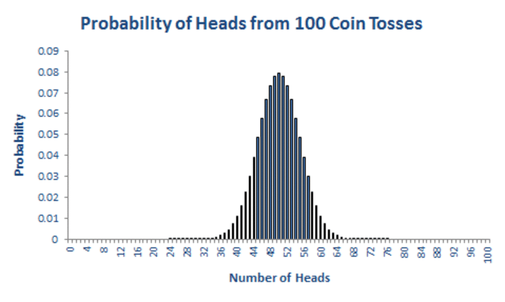

Each bar represents the event of flipping a coin 100 times. Assuming that the coin is not biased (in other words, it doesn't tend to flip one side more than the other), then we notice that our probability distribution has a bell-curve shape resembling a normal distribution with mean 50. Therefore, the probability of getting 50 heads when flipping a coin 100 times is the highest one. It makes sense - if you flip a coin 100 times on your own, you might get a number of heads that is close to 50. This has a theory behind it - the [Law of Large Numbers](https://www.investopedia.com/terms/l/lawoflargenumbers.asp), which states that as the sample size (the number of coin flips) grows, its mean gets closer to the mean value of the whole population (in this case, infinite coin flips). In our flip-a-coin case, if we flip a coin 1000 times instead of 100 times, we would have a probability distribution with a very narrow bell-shaped curve closer to the mean 50.

Now we are ready to dig into **skewness**. Skewness is the degree of distortion (or a measure of the asymmetry) of a probability distribution of a random variable about its mean. In the graph below, we see three graphs: (1) a distribution with positive skew; (2) a symmetrical distribution with zero skewness; (3) a distribution with negative skew.

Take a closer look on the graphs. The one with positive skew has a longer, fatter tail on the right side of the distribution. It has a mean value greater than the median and mode, and its peak is on the left side. Now look to the symmetrical distribution graph in the middle. It has its mean = media = mode, which is basically a normal distribution curve with a centered peak. The last one, with negative skew, has a longer, fatter tail on the left side and its mean value is lower than the median and mode, with a peak located on the left side. 

You can also tell the direction (but not the number) of outliers in skewed distributions. For positive skewed curves, outliers are most present on the right side of the curve, while for negative skewed curves is just the opposite side.

In the real world, data not always assume a normal, symmetric bell-curved shape as the graph depicted in the middle. For instance, there are many types of distribution that describes data (see a few examples [here](https://www.google.com/imgres?imgurl=http%3A%2F%2Fimage.sciencenet.cn%2Falbum%2F201609%2F13%2F175607zopgnj40j00so4ee.png&imgrefurl=https%3A%2F%2Fwww.kaggle.com%2Fgetting-started%2F81761&tbnid=t4_CFhWWxcakyM&vet=12ahUKEwiMuMipvrnsAhWEAbkGHTpyBJkQMygJegUIARCiAQ..i&docid=wiph3DFgr5Q8AM&w=680&h=735&q=distributions%20cheat%20sheet&client=firefox-b-d&ved=2ahUKEwiMuMipvrnsAhWEAbkGHTpyBJkQMygJegUIARCiAQ)). This is the reason why an analysis on skewness is important: it shows how data behaves and what we can do about it when doing ML modeling. 

A very good example on how we should take care of skewness is depicted by linear models, since such models can be optimized if independent variables (features) and dependent variablea have a linear relationship, which normal distributed values. Let's look on an example depicted by [Abhishek Sharma](https://www.analyticsvidhya.com/blog/2020/07/what-is-skewness-statistics/) on its article about skewness in statistics. Let's say you want to predict the mpg (miles per gallon) of a car by running a linear regression that has one independent variable: horsepower:

The shape of this distribution resembles the one with positive skewness. Since your data is concentrated on the left side, our linear regression model will give us good mpg predictions on cars with low horsepower, but will probably perform poor predictions on cars with high horsepower. In this case, skewness is a problem and we usually use rescaling techniques that helps us reshaping the distribution of skewed variables. We will get into more details on rescaling in the [Data Preprocessing](#05-data-preprocessing) part.

To determine when skewness is symmetrical or not just by looking at skewness values, you can check the table below:

| Skewness     | Distribution shape | 
| ----------- | ----------- |
| skew between -0.5 and 0.5 | Symmetrical |
| skew between -1 and -0.5| Negative, moderately skewed | 
|skew between 1 and 0.5| Positive, moderately skewed |
| skew lower than -1| Negative, highly skewed|
| skew higher than 1| Positive, highly skewed|

&nbsp;

### 7. Kurtosis

Kurtosis is a measure of tailedness of a probability distribution - therefore, it solely focuses on the tails of a distribution. This is a great statistic to measure the presence of outliers on our distribution. 

Data distributions with **high kurtosis** (K > 3) indicates that the data has many outliers, and therefore, a detailed investigation on outliers is a must. Distribution with **low kurtosis** (k < 3) has fewer and less extreme outliers.

There are three types of kurtosis as follows:
  * **Leptokurtic (K > 3)**: Distribution has fatter, longer tails, a sharp peak;
  * **Mesokurtic (K = 3)**: Distribution resembles a normal distribution;
  * **Platykurtic (K < 3)**: Distribution has shorter, thinner tails. 

In summary, skewness and kurtosis serve us to indicate: (1) how our data is distributed and if we should be extra careful during data preprocessing; (2) presence of outliers and if we need to figure out a way to make our model more robust to outlier effects.

Now, let's go back to our project! Here we separate numerical and categorical data to perform this step. 

#### Numerical data:

#### Categorical data (boxplots):

Some notes from the summary statistics above:
* `competition_distance, competition_open_since_year` are heavily skewed;
* `customers, competition_distance, competition_open_since_year` have a high kurtosis, which indicates a profusion of outliers;
* `state_holiday, store_type, assortment` have many outliers.

[back to top](#table-of-contents)

---

## 03. Feature Engineering

[(go to next section)](#04-exploratory-data-analysis-eda)

In this task, we create new features (variables) on our dataset based on the existent set of variables. Our main compass for feature creation is the business needs; therefore, three tasks must be performed:

### I. Hypothesis List

In order to guide our feature engineering process (and later on, our [exploratory data analysis](#04-exploratory-data-analysis-eda)), we need to create a hypothesis list first. Hypothesis should be testable (you should able to reject or fail to reject it), and must be written as a clear statement that exposes a personal belief to be tested. In our project's case, we will write hypotheses that are connected with the target variable (sales).

To guide our hypothesis list creation, a mindmap is a great tool to map all factors that influences our target variable.

#### Stores
1. Stores with more employees sell more
2. Stores with bigger available stock sell more
3. Bigger stores sell more
4. Stores with extended assortment type sell more
5. Stores near competitors sell less
6. Stores with newly opened competitors sell less than stores with old competitors

#### Time
1. Stores sell more on weekdays than weekends/holidays
2. Stores sell more during the 2nd semester
3. Stores sell more during summer/winter breaks (schools)
4. Stores sell less during school holidays
5. Stores sell more on Christmas than other holidays
6. Stores sell more after day 10 of each month
7. Stores sell more along the years

#### Products
1. Stores with higher marketing investments sell more
2. Stores with products in promotion displayed at the entrance sell more
3. Stores with cheaper products sell more
4. Stores with aggresive price strategies sell more
5. Stores frequently doing standalone promo sales sell more
6. Stores doing consecutive promo sales in the beginning of the year sell more
7. Stores participating in consecutive promo for a longer time sell more
8. Stores with more consecutive promo sale days sell more

#### Customers
1. Stores with more customers who have children sell more
2. Stores with more customers who have higher income sell more
3. Stores with more elderly customers sell more
4. Stores with more customers who have higher # of family members sell more
5. Stores with more loyal customers sell more

#### Location
_note: Location of each store is not given. Hypothesis are displayed below just for the purpose of completeness._

1. Stores with higher pedestrian count (front street) sell more
2. Stores located in an expensive neighborhood sell more
3. Stores located in urban areas sell more
4. Stores located in residential areas sell more
5. Stores near schools sell more
6. Stores near shopping malls sell more
7. Stores located inside malls sell more than standalone stores

#### External Factors (Economy, Healthcare, Weather)
* **Economy**: macroeconomic data could be not relevant to analyze a firm's sales performance - there are some markets that thrive even when economic indicators are bad.  
Another caveat to economic indicators is that Rossmann stores are not located in Germany on its entirety, and we don't know their precise location since they are not present in the dataset. 
Some macroeconomic data could be relevant if divided by location or month/week, but at the time this project was done, data was not available. 
Another aspect to be considered is the Germany's economy. From 2013 to 2015, Germany has ranked in the top 10 economies in GDP per capita with high HDI value. Therefore, economic fluctuations over the time span might not have affected Rossmann stores directly. Therefore, some hypotheses are displayed below just for the purpose of completeness.
* **Healthcare**: relevant data (per month) was either unavailable on public datasets or not possible to be utilized. Therefore, some hypotheses are displayed for the purpose of completeness.
* **Weather**: although Rossmann stores are mainly located in Germany, their location is not present on the dataset. Therefore, the usage of weather as a predictor for this model would be a big assumption to take, but hypotheses were written below for the purpose of completeness.

1. Stores within areas with low unemployment rate sell more
2. Stores within areas with high number of patients sell more
3. Stores within areas with high Gross Domestic Product Per Capita (GDPpc) sell more
4. Store sales increase when GDPpc increases (month)
5. Store sales increase when interest rates decrease (month)
6. Store sales increase when Consumer Price Index (CPI) rate increases (month)
7. Store sales increase when the number of patients hospitalized (per month) increase
8. Store sales increase when the air quality gets worse (AQI)
9. Store sales increase when the weather is above 28ºC or below 18ºC
10. Store sales increase when Consumer Confidence Index (CCI) rate increases (month)
11. Store sales increase when Unemployment rate decreases (month)
&nbsp;

### II. Viable Hypothesis List

From 44 hypothesis listed, we select **19 hypothesis** that can be tested with the current dataset. Our feature engineering process will be focused on answering the following hypotheses:

1. Stores with extended assortment type sell more
2. Stores near competitors sell less
3. Stores with newly opened competitors sell less than stores with old competitors
4. Stores sell more on weekdays than weekends/holidays (sales rate)
5. Stores sell more during the 2nd semester
6. Stores sell more during summer/winter breaks (schools)
7. Stores sell less during school holidays
8. Stores sell more on Christmas than other holidays
9. Stores are selling more along the years
10. Stores sell more after day 10 of each month
11. Stores frequently doing standalone promo sales sell more
12. Stores doing consecutive promo sales in the beginning of the year sell more
13. Stores participating in consecutive promo for a longer time sell more
14. Stores with more consecutive promo sale days sell more
15. Stores sales increase when GDPpc increases (month)
16. Stores sales increase when interest rates decrease (month)
17. Stores sales increase when Consumer Price Index (CPI) rate increases (month)
18. Stores sales increase when Consumer Confidence Index (CCI) rate increases (month)
19. Stores sales increase when Unemployment rate decreases (month)
&nbsp;

### III. Feature Engineering

The main purpose of feature engineering is to improve the performance of our predictive model. It can be done in two ways: (1) adding new variables to a machine learning model to better predict the target variable; or (2) making the model simpler and less complex by creating features that better explain the target (and eliminating the ones that poorly explain the target). 

As we will see later, feature engineering will help us to reject/fail to reject our hypotheses in the [Exploratory Data Analysis](#04-exploratory-data-analysis-eda) section.

The following tasks were performed:
* The variable `date` was used to create time-related variables. Variables that explains how long stores were holding consecutive promotion sales (`promo2_time_week`, `promo2_time_month`), and how long stores were facing competition from other companies (`competition_since_month`) are now available. All time-related variables are valued by number of months or weeks;
* We also used the variable `date` to get a better sense of seasonality for each sales entry in the dataset - `day`, `month`, `year`, `year_week`, `is_weekday` variables were created;
* Variables with data described by single letters were transformed into full text (e.g: all 'a' in variable `state_holiday` were transformed to 'christmas'). These variables are: `state_holiday`, `assortment`.
* Germany's Gross Domestic Product (GDP) per capita, Consumer Price Index (CPI), interest rates, unemployment rate, Consumer Confidence Index (CCI) datasets were added as new variables. All economic indicators correspond to month values except for GDPpc (quarters). See below a description of these indicators (retrieved from [OECD](https://stats.oecd.org/)):
  * **Gross Domestic Product (GDP)**: monetary measurement of all goods and services produced within a country. income per capita (per head), in US$ (current prices) and current PPPs, adjusted quartely;
  * **Consumer Price Index (CPI)**: measures inflation by looking at the average price changes from a basket of consumer goods and services of a country. The base year is 2015 (2015 = 100).
  * **Interest Rate**: interest rate is the cost of borrowing money. The rate is usually set by governments or central banks. Here we use long-term interest rates, per cent per annum, divided monthly.
  * **Unemployment Rate**: measurement of changes in unemployment within a country. Unemployment rate is the fraction of total number of unemployed population by the total number of active population. 
  * **Consumer Confidence Index (CCI)**: measurement of consumer confidence within a country, it indicates how future developments on consumption and saving will be based on the current households' economic situation. Values below 100 indicate a pessimistic attitude towards future developments in the economy, possibly resulting in a tendency to save more and consume less.  

_All dataset references are available in [Appendix I Dataset](#appendix-i-dataset)._

### IV. Filtering Variables

In this part, we need to check the business restritions that should be considered in the project and filter variables/rows from the dataset that reflect these restritions.

We divide this part into two tasks:
* **Data Entry Filtering**: data entries with characteristics that won't be considered on the model should be excluded from the dataset. **Here we removed closed stores and stores with no sales revenue**, since such entries are irrelevant to our goal of predicting sales revenue. 
* **Column Selection**: variables that won't be available at the moment of prediction must be dropped from the dataset. In the 1st CRISP-DM cycle, we dropped the number of customers from the training dataset since this feature was not present in the test dataset. It makes sense, since this is a business restriction: there is no way to know the number of customers at the time we predict sales revenues for the next six weeks. In order to keep the number of customers in the model, we have created a [new project](https://github.com/alanmaehara/Sales-Prediction/blob/master/notebooks/rossmann_customers_prediction.ipynb) that predicts number of customers for the next six weeks for each Rossmann store, and included results on the test dataset. Otherwise, we wouldn't be able to use this variable in our project.

The following variables were dropped: `promo_interval` (deprecated - `is_promo2` will be used instead), `open`.
The following variables were added: `promo2_time_week`, `promo2_time_month`, `competition_since_month`,`day`, `month`, `year`, `year_week`, `is_weekday`,`gdp`,`cpi`,`interest_rate`,`unemployment_rate`,`cci`.

[back to top](#table-of-contents)

---

## 04. Exploratory Data Analysis (EDA)

[(go to next section)](#05-data-preprocessing)

We shift our focus to explore our dataset and generate valuable insights for the business. This is what Exploratory Data Analysis (EDA) really means: to go even further in the data to unlock precious insights from it. An EDA is an important step to get a sense of which variables are vital to our prediction model, and how our features relate to the target variable. 

We will divide this section into three parts:

1. **Univariate Analysis**: check data distribution of each feature and get a first look on how your data is organized as a whole;
2. **Bivariate Analysis**: check how each feature behaves against the target variable. Here we validate the hypothesis list (created on the [feature engineering](#03-feature-engineering) section), generate business insights, and analyze how relevant each variable is to our model.
3. **Multivariate Analysis**: check whether there are repetitive information across features. Since machine learning models work best when data is less complex, [dimensionality reduction](https://en.wikipedia.org/wiki/Dimensionality_reduction) plays a big role on ML models.

EDA's can take literally days to be performed if one doesn't narrow down the topics to be analyzed. Since we are using the CRISP-DM methodology, we ought to perform a guided EDA to deliver fast, business-driven insights from the data - and this is why the creation of a [hypothesis list](#03-feature-engineering) is very important: to guide our exploratory analysis.

As mentioned before, I also performed a complementary project to predict number of customers for each Rossmann store in a separate notebook. If you wish to see a detailed EDA study on the variable `customers`, please check the project [here](https://github.com/alanmaehara/Sales-Prediction/blob/master/notebooks/rossmann_customers_prediction.ipynb).

### Quick note on Data Visualization

We have already seen some histograms showing distributions, some line plots, barplots and boxplots. From now on, we will go deep on data exploration, and some other types of graphs will inevitably appear here, such as scatterplots, heatmaps, plots with regression lines, and we must get ourselves comfortable with understanding data relationships graphically. 

Data visualization is a key tool for data science practitioners. Although there are several ways to graphically represent data, delivering the right message to an audience by using the right data visualization technique is usually the hardest part. I won't do better job explaining the myriad of data visualization types than Mehul Gupta's article [Data Visualization for Data Science Beginners](https://medium.com/data-science-in-your-pocket/data-visualization-for-data-science-beginners-84bacdb8d72e) - this should suffice to get ourselves on track with EDA.

### I. Univariate Analysis 

Usually, the univariate analysis supports the [descriptive statistics](#iii-descriptive-statistics) part we have done before by showing a distribution analysis on univariate data. Here we check each single variable's distribution by using histograms, with x-axis showing all possible values that a variable can assume, and a y-axis showing the [absolute frequency](https://www.statisticshowto.com/absolute-frequency-definition-examples/).

* **Target Variable (sales)**: distribution looks like a [poisson distribution](https://en.wikipedia.org/wiki/Poisson_distribution), with a positive skew and right tail. We will need to rescale our data before training the model. 

* **Numerical variables (histograms)**

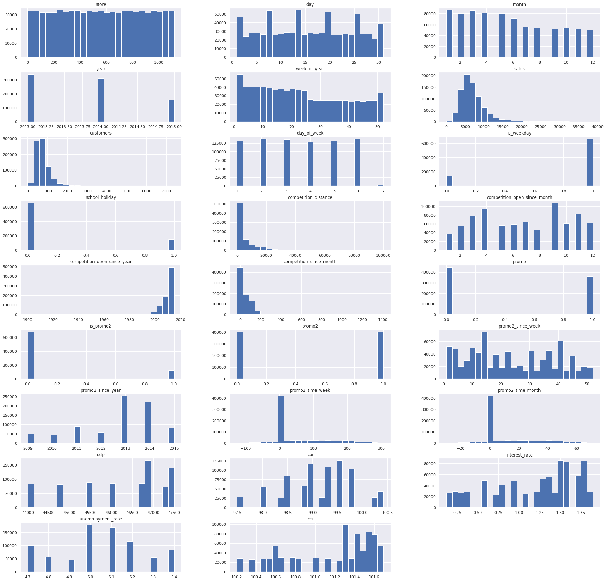

* **Highlights**:
  * All variables don't follow a normal distribution;
  * `day`: there are specific days which has almost double sales data points than others;
  * `month`: more sales data points on the first semester;
  * `year`: less data points in 2015 is observed since our dataset goes until June 2015.
  * `customers`: resemble a poisson distribution, with concentrated data between 500~1000 customers;
  * `week_of_year`: a boom of sales data points during the first weeks of the year is observed;
  * `day_of_week`: there are less sales data points on sundays;
  * `is_weekday`: there are more sales data points on weekdays;
  * `school_holiday`: there are more sales data points on regular days;
  * `competition_distance`: there are more sales data points for stores with closer competitors;
  * `competition_open_since_month`: there are more sales data points for competitors which entered competition on April, July, September;
  * `is_promo2`: there are more sales data points for stores which are not joining consecutive promotion sales;
  * `promo2_since_year`: most stores joined consecutive promotion sales in 2013;
  * `promo`: in the dataset, there are more stores doing traditional, single-day promotions than stores not joining such promotions;   
  
&nbsp;
* **Categorical variables (barplots)**

* **Highlights**:
  * `state_holiday`: there are more sales data points on public holidays than other holidays. Easter and Christmas are on a similar level;
  * `store_type`: there are more sales data points for store of type "a", and less stores of type "b";
  * `assortment`: there are less sales data points for stores with assortment of type 'extra' than other assortment types.

&nbsp;
### II. Bivariate Analysis

Now our focus goes to the bivariate analysis: the process of analyzing how each independent variable behaves against the dependent variable (sales). Here we reject or fail to reject our viable hypothesis list, and raise valuable insights for the business. This is also the place where we analyze a variable's relevancy to the model.

####  H1. Stores with extended assortment type sell more

For the variable `assortment`, we have three types of store assortment: basic, extended and extra. There is no clue on the magnitude of these categories, and therefore we assume that "extra" refers to a bigger assortment type, "extended" is a medium, and "basic" is the smallest assortment type.

 

**Verdict: FALSE**.

Stores with bigger assortment sell less. However, the number of data points for stores with assortment 'extra' is very low compared to the other two (refer to [univariate analysis](#i-univariate-analysis)). Since assortment 'extra' follows a similar sales pattern of the other two, assortment might not be meaningful on our model.

#### H2. Stores near competitors sell less

The variable `competition_distance` is the distance from a Rossmann store to a competitor.

**Verdict: FALSE**

Stores near competitors sell more than stores with competitors located far away. We can tell that because data is concentrated within the range distance of 0-20000 meters (see scatterplot). From the barplot, we can also tell that sales revenue are higher for stores with competitors located within 0-4000 meters.

Quick note: the third graph (from right to left) is a **heatmap**. The value of -0.28 inside the black square is the [pearson correlation](https://en.wikipedia.org/wiki/Pearson_correlation_coefficient) value between the variables `sales` and `competition_distance`. I will explain the pearson correlation in detail later, but as for now think of this negative value as depicting a linear negative relationship between sales and competition distance (as competition distance increase, sales revenues decrease). Pearson correlation values goes from -1 (negative linear correlation) to 1 (positive linear correlation), and the closest the number is to 0, the less linear (weak) is the relationship.

#### H3. Stores with newly opened competitors sell less than stores with old competitors

The variable `competition_since_month` tells us since when a Rossmann store has started facing competitors (in months). Note that negative values mean that competition hasn't started yet.

**Verdict: FALSE**

Stores with newly opened competitors sell more than stores with competitors from a long date.

#### H4. Stores sell more on weekdays than weekends/holidays (sales rate)

To validate this hypothesis, we list the total sales on weekdays and weekends on a data frame, and illustrate this values on the barplots below. 

The variable `is_weekday` is a dummy variable in which 1 corresponds to weekdays, and 0 to weekends. `day_of_week` takes values from 1 to 7, which represents respectively, Monday to Sunday.

**Verdict: TRUE**

From the data table and the right barplot above, sales is bigger on weekdays than weekends. The barplot on the left shows that Rossmann stores sell more on Mondays (1), has a stable sales performance across the weekdays (2-5), and starts declining till the worst day of sales on Sundays (7).

As shown in the heatmap and scatterplot, the variable `day_of_week` shows a strong linear negative correlation with sales, which indicates that `day_of_week` is probably an essential feature to explain our target variable. 
 
#### H5. Stores sell more during the 2nd semester

**Verdict: FALSE** 

Stores sell more on the 1st semester. The heatmap shows that `month` and `sales` have a strong, negative linear correlation: as the months go by, sales decrease.

#### H6. Stores sell more during summer/winter breaks (schools) 

**Verdict: FALSE**

School breaks in Germany are scattered throughout the year. The longest school break is the summer break in August and mid-September. During these months, stores sell less (refer to barplot above on [H5](#h5-stores-sell-more-during-the-2nd-semester)).

#### H7. Stores sell less during school holidays

`school_holiday` takes values of 0 (if regular day) and 1 (if school holiday):

**Verdict: TRUE**

Stores sell less during school holidays except in August. Not a surprise, since the longest school break in Germany happens in August.

#### H8. Stores sell more on Christmas than other holidays

**Verdict: FALSE**

Stores sell more on public holidays and Easter. However, our data doesn't capture christmas sales in 2015 since the dataset goes until mid-June.

#### H9. Stores are selling more along the years

**Verdict: FALSE**

Stores are selling less along the years, and `year` has a strong, negative linear correlation with `sales`. However, the year 2015 is not closed (dataset goes till mid-2015) so our analysis on year should be taken as incomplete.

#### H10. Stores sell more after day 10 of each month
In some companies, the salary payment is set on day 10 every month. To analyze the effect of sales before and after day 10, we create the variables `before_day_10` and `after_day_10`:

**Verdict: TRUE**

Stores sell more after day 10. Not a surprise, since there are more days after day 10.

#### H11. Stores frequently doing traditional promo sales sell more

To analyze traditional, single-day promotion sales, we will use the dummy variable `promo` that carries two values: 1 for traditional promo sales, 0 for regular sales day.

**Verdict: TRUE**

We can observe in the barplot that traditional promotion sales generate bigger sales revenue volume than regular days, although there were more regular sales days than traditional promotion sales days (see `promo` distribution on [univariate analysis section](#i-univariate-analysis)). In the scatterplot, we observe that the more traditional promo sales days a store has, the more sales revenues it makes. 

#### H12. Stores doing consecutive promo sales in the beginning of the year sell more

To analyze consecutive promotion sales, we use the dummy variable `is_promo2` that carries two values: 1 for consecutive promo sales, 0 for regular sales day.

**Verdict: TRUE**

Although the sales volume is higher for regular days (see first barplot), stores running consecutive promo sales sell more in the beginning of the year (see second barplot). However, sales are unstable for February.

#### H13. Stores participating in consecutive promo for a longer time sell more

To validate this hypothesis, we will pick the variable `promo2_time_week` that shows by when a Rossmann store started consecutive promo sales (in weeks). Negative values indicate that stores haven't started consecutive promo yet, and positive values indicate that stores are already doing consecutive promo sales.

**Verdict: FALSE**

As depicted in the first barplot, stores participating in consecutive promo for a longer time sell less.
You may find odd to see a very weak correlation between `sales` and `promo2_time_week`, and a somewhat definite linear relationship on the two scatterplots drawn above. The reason is that we have splitted the variable `promo2_time_week` into positive and negative values. While considering the entire variable as a predictor for sales prediction, dividing `promo2_time_week` into two variables could be a good idea.

#### H14. Stores with more consecutive promo sale days sell more

**Verdict: TRUE**

Stores with more consecutive promo days sell more. However, sales volume is bigger for days with no consecutive promotion.

We can observe in the barplot that regular sales days generate bigger sales revenue volume than consecutive promo sales days. In the scatterplot, we observe that the more consecutive promo sales days a store has, the more sales revenues it makes. 

#### H15. Stores sales increase when GDPpc increases (month)

**Verdict: FALSE**

Given the caveats that including an economic indicator on a model have, we don't expect to find extremely important insights from them.

Overall, sales decrease when GDPpc increase. This is an indicative that Rossmann stores are not impacted by GDPpc fluctuations; therefore, we will not include GDPpc on the prediction model.

The lineplots representing sales and GDP performance over time (we used `year_month`) shows that Rossmann sales and GDP are not correlated. The heatmap also confirms a weak, negative linear correlation between GDP and sales.

A better variable would be Germany's GDPpc per region - however, the location of each Rossmann store in the dataset is unknown. For this and other reasons already discussed in the [feature engineering](#external-factors-economy-healthcare-weather) section, we will drop it from our model.

#### H16. Stores sales increase when interest rates decrease (month)

**Verdict: FALSE**

Sales increase when interest rate increase over time. However, we were expecting to actually confirm this hypothesis, since a low interest rate stimulates people to purchase more (it is cheaper to borrow for consumption).

Since we were not able to confirm this hypothesis (and for other issues already discussed in the [feature engineering](#external-factors-economy-healthcare-weather) section), we will drop it from our model.

#### H17. Stores sales increase when Consumer Price Index (CPI) rate increase (month)

**Verdict: FALSE** 

When inflation increases, we expect people to purchase more since the value of money decreases. In our case, sales decrease when inflation increases. Since we were not able to confirm this hypothesis (and for other issues already discussed in the [feature engineering](#external-factors-economy-healthcare-weather) section), we will drop it from our model.

#### H18. Store sales increase when Consumer Confidence Index (CCI) rate increases (month)

**Verdict: FALSE**

When consumer confidence increases, we expect people to increase their expenditures. In our case, sales decrease when consumer confidence increase. Since we were not able to confirm this hypothesis (and for other issues already discussed in the [feature engineering](#external-factors-economy-healthcare-weather) section), we will drop it from our model.

#### H19. Store sales increase when Unemployment rate decreases (month)

**Verdict: FALSE**

An increase in unemployment rate can lead a economy slowdown. In this case, we might expect people to reduce their expenditures.
In our case, sales increase when unemployment rate increase. Since we were not able to confirm this hypothesis (and for other issues already discussed in the [feature engineering](#external-factors-economy-healthcare-weather) section), we will drop it from our model.

#### Hypothesis Validation

See below a summary of our hypothesis list:

### III. Multivariate Analysis

In a multivariate analysis, we must answer two questions:

1. **Target variable & independent variables (predictors)**: is there any predictor in our dataset that is highly correlated to the target (variable to be predicted)? If so, this predictor is likely to be an important feature to our prediction model.
2. **Independent variables**: is there any predictor that is highly correlated to another predictor? If so, we might consider removing one of them since they "explain" the target variable in a similar fashion. We have to remove one or the other due to two reasons: (1) in machine learning models, a simpler model is preferred (we will get into the reasons on the [feature selection](#06-feature-selection) section); (2) it eliminates [multicollinearity](https://statisticsbyjim.com/regression/multicollinearity-in-regression-analysis/) problems, which can be a serious issue on linear regression models (we will explore linear regression models later) where independent variables should be independent to each other. Models full of highly correlated independent variables creates a lot of noise on the model, which makes our sales prediction unreliable. 

But how to tell whether a variable is correlated to another one? Let's get into a bit of theory again. To directly see the results of the multivariate analysis, skip theory.

[(skip theory)](#numerical-variables)

### Correlation

In statistics, we use correlation to understand relationships between variables. Correlation can be strong (high) or weak (low), and can take positive or negative values. 

Correlation is best understood graphically (graph retrieved [ here](https://miro.medium.com/max/320/0*abk24QJL8-9JKFEz.png)):

How to interpret these graphs? Let's see some examples:

* **Strong Positive Correlation**: the amount of time spent reading this project in the x-axis, and how much you understood this project in a confidence scale in the y-axis. For most of us, the relationship is positive because the more you read this project, the more you understand it.
* **Strong Negative Correlation**: time slept in hours and time awake in hours. This negative relationship is easy to understand: the more you sleep, the less hours you are awake.
* **Weak-No Correlation**: your skills in data science and you driving skills. This has a weak (even zero) correlation because no matter how skilled you are in data science, it doesn't relate to your ability to drive.

A quick note on correlation is needed here. A famous maxim that every statistician knows is that **correlation does not imply causation**. In other words, correlation cannot answer whether one variable **causes** the other. Let's go back to our strong positive correlation example. It may be common sense to affirm that, the more you read this project, the more you understand it. But what if the person is reading this very project in a language that he does not know? Then spending long hours reading it in a different language doesn't imply that he will in fact understand the project. For other examples of correlation not implying causation, see Mark Wilson's article [Hilarious Graphs Prov That Correlation Isn't Causation](https://www.fastcompany.com/3030529/hilarious-graphs-prove-that-correlation-isnt-causation).

Although we have learned that correlation doesn't imply causation, understanding association relationships between variables is crucial in data science projects. In this project, using variables which have some sort of relationship with sales revenues can increase our success rate of getting accurate predictions, and this is why we look at correlation.

But how do we calculate linear correlation? There are few methods to measure association between variables, but we will focus on the **correlation coefficient** (or Pearson correlation coefficient):

where,

The correlation coefficient can assume values from -1 to 1. Graphically, this should look like this:
&nbsp;

| Degree of correlation | Correlation Coefficient (R) |
|----|---|
| Perfect | ± 1 | 
| Strong | between ± 0.5 and ± 1 | 
| Medium | between ± 0.30 and ± 0.49 |
| Weak | below ± 0.29 | 
| No correlation | zero | 

**Important**: while the pearson correlation coefficient works well to measure associative relationships between linear variables, other methods of correlation measurement should be taken for non-linear or too complex data. 

Now we are ready to proceed with our multivariate analysis! There are some techniques to find out correlation depending on the kind of data you are working with:
&nbsp;

_Retrieved from [Outside Two Standard Deviations](https://medium.com/@outside2SDs/an-overview-of-correlation-measures-between-categorical-and-continuous-variables-4c7f85610365)_ 
&nbsp;

For **numerical variables**, we will use  a heatmap with pearson correlation coefficient values, and for **categorical variables** we use Cramer's V technique. 

### Numerical Variables

**1. Target variable & independent variables (predictors)**
* **Variables with positive correlation with sales**:

  * **Strong**: `customers`
  * **Medium**: `promo`
  * **Weak**: `is_weekday`, `promo2_since_year`
  
* **Variables with negative correlation with sales**:

  * **Strong**: -
  * **Medium**: -
  * **Weak**: `promo2`, `day_of_the_week` 

**2. Multicollinearity problems (independent variables that are highly correlated to other independent variables)**

* **Negative correlation**:
  `competition_open_since_year` vs `competition_open_since_month`
  `year` vs `interest_rate`
  `promo2_since_year` vs `promo2_time_month`
  `promo2_since_year` vs `promo2_time_week`
  `day_of_week` vs `is_weekday`
  `year` vs `unemployment_rate`
  `gdp` vs `unemployment_rate`
  `cci` vs `unemployment rate`
&nbsp;
* **Positive correlation**:

  `month` vs `week_of_year`
  `gdp` vs `year`
  `cpi` vs `year`
  `gdp` vs `cpi`
  `promo2` vs `promo2_time_week`
  `promo2` vs `promo2_time_month`
  `cci` vs `year`
  `cci` vs `gdp`
  `cpi` vs `cci`
  `interest rate` vs `unemployment_rate` 
  `promo2_time_week` vs `promo2_time_month`
&nbsp;
### Categorical Variables

In order to compare correlations between categorical variable, we will use Cramér's V technique. The only difference from the Pearson Correlation Coefficient is that Cramér's V values varies from 0 to +1, without negative values. The closer a Cramér's V value is from 1, the stronger the association between variables.

We won't go into details on how to calculate the Cramér's V, but you can find more details on [Wikipedia](https://en.wikipedia.org/wiki/Cram%C3%A9r%27s_V). In this project, I created a python function `cramer_v` that calculates Cramér's V and returns a dataframe with correlation values between categorical data. In the [Jupyter notebook](https://github.com/alanmaehara/Sales-Prediction/blob/master/notebooks/cycle02_rossmann_sales_prediction.ipynb), you can find the function in the section `0.1. Helper Functions`.

`store_type` and `assortment` have a mild correlation of 0.51.

[back to top](#table-of-contents)

---

## 05. Data Preprocessing
[(go to next section)](#06-feature-selection)

Data is usually not ordered in a similar manner. Some variables might have an extremely high range, while others might have minimal range. Some variables might be categorical or numerical, or a data type variable. The problem is: most ML models perform better when data is of numerical type, and without extreme ranges. Think of this project: we are trying to predict sales. If you have a variable with a high range (say, from 0-10000) and another with a low range (from 0 to 3.5), the model will weight the high-range variable more than the low-range variable when predicting sales, and therefore it could generate biased results. In addition, some models can't really interpret categorical variables with words - therefore, we must scale these words with numbers.

 **We will divide data preprocessing according to our variables:(I) numerical scaling, (II) categorical encoding, and (III) time-related variables (cyclic transformation)**. If you wish to skip the theoretical part, skip theory to see the list of current variables present in this project after data preprocessing.

[(skip theory)](#summary)

### I. Numerical Scaling

This part is focused on feature scaling for numerical variables. There are many ways to scale (some you can find on Baijayanta Roy's [article](https://towardsdatascience.com/all-about-feature-scaling-bcc0ad75cb35)), but here we will explain and utilize the ones which suits our needs for this project. But before we go into theory again, we will analyze the skew, kurtosis, and standard deviation of numerical variables present in our data. Dummy, time-related variables (except for `year`) were excluded from the list below:

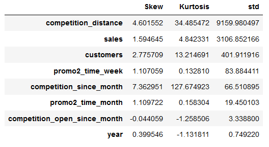

As we can see, there are few variables with problematic statistic values in our dataset. In order to help us judging what scaling technique will be used on each variable, we plot the boxplots for the ones we need to be extra careful:

Looks like we need methods that are robust to outliers for some of them. With no further due, let's explore feature scaling methods:

### Standardization (StandardScaler)

This technique rescale the data in a way that its distribution gets a mean of zero and standard deviation of 1; it transforms the variable data into a [a standard normal distribution](https://sphweb.bumc.bu.edu/otlt/mph-modules/bs/bs704_probability/bs704_probability9.html). All variable values receive a "z-score", which is obtained by subtracting the variable's mean and dividing it by the variable's standard deviation. It is a very effective feature scaling technique for variables that follows a normal distribution:

[Jeff Hale](https://www.kaggle.com/discdiver/guide-to-scaling-and-standardizing) sets a nice example of scaling techniques works on beta, exponential, normal and bimodal distributions. See below how standardization works: 

The only problem of standardization is that it assumes the data comes from a normal distribution. In our dataset, we don't have any variables like this; hence, we will not utilize standardization.

### MinMaxScaler

This technique subtracts each variable's value to the variable's mean, and then divides by the variable's range:

This scaling technique transform values to between 0 and 1. It is a good technique for non-gaussian (non-normal) distributions; however, it doesn't cope well with variables full of outliers (not robust), since the variable's range is in the denominator side of the MinMaxScaler formula.

To illustrate the transformation, distributions would look like this:

In our project, we will use this method with the variable `year` only.

### RobustScaler

RobustScaler is the MinMaxScaler alternative when you have variables with a profusion of outliers:

As the formula tells, the RobustScaler technique utilizes the variable's quartile values for rescaling. While the MinMaxScaler uses the minimum and maximum values (which makes it sensible to outliers), RobustScaler doesn't include them, since Q3 and Q1 does not have minimum and maximum values.

Ater RobustScaler transformation, distributions would look like this:

We will use RobustScaler for the following variables: `promo2_time_week`, `promo2_time_month`.

### Power Transformations: Box-Cox Transformation, Yeo-Johnson Transformation, Log Transformation

Usually, the three previous feature scaling methods would be sufficient to scale our data. However, since we will test linear and non-linear models as candidates to become the main model for sales prediction, we want features that resemble a normal-like distribution.

This is where power transformation comes into play. For features that suffers from high variance and presence of outliers, or for non-linear features that wouldn't behave well linear models, power transformation helps us transforming such features into a more normal-like distribution.

The term "power" refers to the usage of a power function (such as exponents, logarithms) to perform scaling transformations. Here we will utilize three methods: 

* **Logarithm Transformation**

As any power transformation, a log transformation is used to make highly skewed distribution less skewed. It takes care of extreme values very well, as in this example retrieved from [Online Stat Book](http://onlinestatbook.com/2/transformations/log.html):

See how values far from each other (1, 10, 100) are gathered in a nicely, closer pattern (0, 1, 2)?  
A graphical example is the brain weight of animals as a function of their body weight. The first graph is the original dataset plotted with body weight in the x-axis, and brain weight in the y-axis, and the second graph is the log transformed version:

The log transform is very popular for transforming target variables because it linearizes the values very well, and handle well huge variances. It also take care of residuals (aka "errors" - we will get into it later) generated by the prediction model, letting them become more symmetric and less skewed.

This thread [here](https://stats.stackexchange.com/questions/298/in-linear-regression-when-is-it-appropriate-to-use-the-log-of-an-independent-va) on StackOverFlow has a detailed explanation on the benefits of using log-transforms.

Please note that logarithm transformations don't accept negative values. In our case, we applied the log transformation to our target variable `sales`.

* **Box-Cox Transformation**

Box-Cox transformation is suitable for variables in which values are highly skewed, since it tries to transform them into a gaussian-like distribution. For linear models, Box-Cox transformation deals well with [heteroskedascity](http://www.statsmakemecry.com/smmctheblog/confusing-stats-terms-explained-heteroscedasticity-heteroske.html), which is a serious issue on linear models and can lead to unreliable predictions in our model.

The formula is as follows:

where,

_Note: Box-Cox transformation does not accept negative, zeroes, or constant values. If your variable (feature) y has zero, negative, or constant values, use the Yeo-Johnson transformation. 
Also, please note that setting lambda equal to zero is the same as performing a log-transformation._
&nbsp;

Here's an example on how a distribution like this:

becomes like this with a Box-Cox Transformation:

In this project we found that a lambda value of 0.05 generates good results. However, since we don't know what kind of data we will predict, we will not utilize the Box-Cox to transform due to its limitations.

* **Yeo-Johnson Transformation**

With similar traits as the Box-Cox transformation, the Yeo-Johnson transformation is the method to go if you have variables with zero or negative values.

Yeo-Johnson's formula is much similar compared to Box-Cox's, with the exception that y can assume negative, zero, and constant values. We transformed `competition_since_month`,`customers`, and `competition_distance` variable with this method.

For Box-Cox and Yeo-Johnson Transformation, the method `.PowerTransformer` by scikit-learn is utilized. The best lambda values were chosen by the algorithm itself.
&nbsp;

### II. Categorical Encodings

In the model, there are a few features that are categorical and need to be converted into numerical ones. We call this conversion process as "Categorical Encodings". 

There are a myriad of encoding methods available outside, and a few of them will be utilized. For more details on categorical encoding methods, [Baijayanta Roy's article](https://towardsdatascience.com/all-about-categorical-variable-encoding-305f3361fd02) is worth the reading. The criteria to choose the most adequate method for each variable follows this useful chart:
&nbsp;

A few encoding methods will be used, namely: **(1) One Hot Encoding; (2) Label Encoding; and (3) Ordinal Encoding**.

### One-hot Encoding

Also known as the "dummy" encoding method, One-hot encoding creates new binary (0 or 1) columns from the original column. The number of columns to be created correspond to the number of values that the original column can assume.  An [example](https://www.kaggle.com/dansbecker/using-categorical-data-with-one-hot-encoding) retrieved from Kaggle shows how a categorical variable indicating color is transformed by One-Hot Encoding:

where each entry of the original column is transformed into a new variable, with value 1 indicating the presence of that color and 0 indicating otherwise.

This method is simple (and in some cases, just fine) if compared to other methods. However, depending on how many entries a variable has, using One-hot encoding can significantly expand your dataset and therefore make your model complex and prone to issues related to multicollinearity (discussed in the EDA section), which can badly affect model predictions.

We will use this method with the variables `state_holiday`, `assortment`, `store_type`,`competition_open_since_year`, `promo2_since_year`, since they have entries that don't have a ordinal nature, and don't have many entries.

### Label Encoding

Label Encoding is an alternative method for One-hot encoding in case you can't bear up with adding extra features in your dataset. This method encodes, in only one column, values ranging from the number of entries an original variable has. Going back to the variable color example, we would get a column like this: 

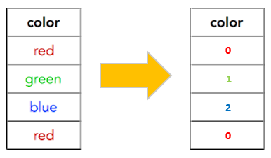

Although it avoids the creation of additional columns, it brings up a new problem: it creates some order between entries. In this example, red is zero and blue is 2, which indicates that entries containing blue color would have extra weight in the prediction time than red. But here, the color does not have an order at all.

Therefore, if you have a nominal variable with a few entries or a variable with some ordering but it isn't quite clear the relationship between the entries, label encoding is a fair candidate. In this project, label encoding was used on the variable `store_type`, since it has three store types but there is no way to guess which store type is worse/better than the other. 

### Ordinal Encoding

As the name suggests, this method is optimal for ordinal variables. The mechanics are the same as label encoding, but with one difference: you determine how to label each entry. For variables that has some magnitude between them, you can order values accordingly. For example, temperature: 1 for "cold", 2 for "warm", 3 for "hot", 4 for "very hot".

I opted to use ordinal encoding for the variable `assortment`, since it has three labels that have some magnitude between them: "basic" , "extra", "extended". I assigned values 1, 2, and 3, respectively.

### III. Time-related Transformation (cyclic transformation)

Some time-related data has a cyclical nature and does "come back" on time. This is the case for variables indicating day, month, day of the week, year week - once they arrive to the last value possible, they return to the initial value. Take month as an example: the calendar runs from January to December, and then goes back to January again.

For such variables, it makes sense to scale them by using a method that is cyclical by nature. This is when trigonometry comes to play: sine and cosine represent values ranging from -1 and 1 that are cyclical!

Think of this trigonometry circle in terms of time: as you start running the circle, at some point you will go back to the same place you have started. This is the rationale under the usage of sine and cosine as an encoder.

Note: variables related to year must not be encoded with sine and cosine. After all, once a year is done, there's no way to go back to the first day of the same year (unless you have a time machine around).

I used the sine and cosine transformations on the following variables: `day`,`month`,`week_of_year`,`day_of_week`,`promo2_since_week`,`competition_open_since_month`. 
New variables will be created and labeled with a prefix indicating sine or cosine like this: `_sin` and `_cos`.

### Summary

Our final list of 25 variables is as follows:

`'store', 'date', 'day', 'month', 'year', 'year_month','week_of_year','year_week', 'sales', 'customers', 'day_of_week', 'is_weekday','school_holiday', 'store_type', 'assortment', 'competition_distance''competition_open_since_month', 'competition_open_since_year','competition_since', 'competition_since_month', 'promo', 'is_promo2','promo2', 'promo2_since', 'promo2_since_week', 'promo2_time_week','promo2_time_month', 'gdp', 'cpi', 'interest_rate', 'unemployment_rate',
'cci', 'state_holiday_christmas', 'state_holiday_easter','state_holiday_public_holiday', 'state_holiday_regular_day',
'promo2_since_year_2009', 'promo2_since_year_2010','promo2_since_year_2011', 'promo2_since_year_2012',
'promo2_since_year_2013', 'promo2_since_year_2014','promo2_since_year_2015', 'month_sin', 'month_cos', 'day_sin',
'day_cos', 'week_of_year_sin', 'week_of_year_cos', 'day_of_week_sin','day_of_week_cos', 'promo2_since_week_sin', 'promo2_since_week_cos','competition_open_since_month_sin', 'competition_open_since_month_cos'`

[back to top](#table-of-contents)

---

## 06. Feature Selection
[(go to next section)](#07-machine-learning-modeling)

For machine learning models, it is fundamental to keep the  variables that best explain our response (target) variable and remove the ones that have repetitive information or are irrelevant. There are three methods to do so: 
* **Filter Methods**, which is usually the simplest, fastest method to select relevant variables. If one utilizes this method to eliminate variables for this project, it would purely use the correlation coefficients, the Cramér's V values, and the information retrieved from the [exploratory data analysis](#04-exploratory-data-analysis-eda) as a criteria to exclude or keep variables.
* **Embedded Methods**, which is a method that uses a machine learning algorithm that already has an in-built feature selection step; 
* **Wrapper Methods**, which is computationally expensive but a reliable method that uses a ML algorithm to determine the best features to keep.

Detailed explanation on feature selection methods can be found [here](https://www.analyticsvidhya.com/blog/2016/12/introduction-to-feature-selection-methods-with-an-example-or-how-to-select-the-right-variables/). An important note is that these methods work as a supportive tool - the final decision on feature selection should be always upon the project owner. This is another reason why an EDA section is put before Feature Selection - it gives us a chance to really understand the data we are working on, and what variables will probably be good to be included in the prediction model.

For this project, a wrapper method called **Borut**a that automatically select the best features for our predictive ML model is used. Manish Pathak has done a wonderful job explaining Boruta [here](https://www.datacamp.com/community/tutorials/feature-selection-R-boruta), in case you want to explore this feature selection algorithm in detail.

Boruta works in four steps:

1. Boruta creates "shadow features" from the original dataset. These shadow features are copies of the original features with their values shuffled. Shuffling the values ensure that we won't have correlation issues between original and shadow variables (otherwise, shadow variables would be just perfect copies of the original features) 
2. With the shadow and original features, Boruta trains a ML model, and calculates its performance. Usually a model which captures non-linear data well is used. In this project, we will use a random forest algorithm that will be able to tell us the importance of each variable when running predictions.
3. With the importance values (performance) of each variable, Boruta uses the shadow variable with the highest importance value, and compare it with all original variables' performance values. If a original value has a higher value than the the shadow variable value in question, then it receives a "hit" (described as 1); otherwise, it receives a zero. Then, we go back to step 1 and shuffle the shadow variables values again, train the ML algorithm, retrieve importance values, and sum up hit numbers for each iteration. The summation of ones and zeroes is then gathered in a "success count" table.
4.  From the success count table, we get binary variables. Then, we use inferential statistics¹ to determine whether a binary variable has statistical relevancy or not. For binary variables that has relevancy, boruta returns their corresponding original variables as the variables with more relevance to the model.

¹ _quick note: we won't go further on how to perform inference, but there are plenty of sources that explains how to do so. Since binary variables can be analyzed within a [binomial distribution](https://www.youtube.com/watch?v=J8jNoF-K8E8), Boruta uses inferential statistics to analyze relevancy on such distributions. A first introduction to inferential statistics can be found [here](https://www.statisticshowto.com/inferential-statistics/) and a complete free course from Udacity can be found [here](https://www.udacity.com/course/intro-to-inferential-statistics--ud201)._

The columns selected by Boruta were:

The columns not selected by Boruta were:

Remember our [hypothesis validation](#hypothesis-validation) list? We will use it to judge whether the Boruta algorithm has indeed selected relevant features to our model. Our compass is the relevance of each validated hypothesis, and a few variables were included/excluded from the final list of selected variables:

1. Boruta has selected `promo2_since_year_2009` and left all the other dummy variables related to `promo2_since_year` out. We saw in the [multivariate analysis](#iii-multivariate-analysis) part that `promo2_since_year` has a high correlation with both `promo2_time_month` and `promo2_time_week`. Since these features possibly behave in a similar way, we will remove `promo2_since_year_2009`. 

2. `week_of_year_cos`, `day_cos`,`month_cos` were selected by Boruta but their counterpart `week_of_year_sin`, `day_sin`,`month_sin` wasn't. We will include them to our model.

3. `is_promo2` has a mild correlation with `promo_2` and very weak correlation with our target variable `sales` as noted in the [multivariate analysis](#iii-multivariate-analysis) section. We will keep `is_promo2` out of the model.

4. We observed that hypothesis related to `school_holiday`, `state_holiday` variables have a low-medium impact. Therefore we will keep them out from the model.

Our final list was reduced to 23 variables:

[back to top](#table-of-contents)

---
## 07. Machine Learning Modeling
[(go to next section)](#08-hyperparameter-tuning)

The fun part has just arrived! We divide this section into four tasks:
  
* **Performance Metrics**: choose suitable metrics to measure performance of the predictive model;
* **Modeling:** split the dataset into training and validation data, choose machine learning models to train the training data, and generate predictions on the validation data;
* **Cross-validation:** assess the trained models' real performance when facing unseen data.

If you wish to see the model's performance on cross-validation section, look no further and [(skip theory)](#iii-cross-validation)!

### I. Performance Metrics
Before we start training machine learning models, we have discussed in [data preparation](#02-data-preparation) that we split the dataset into training and validation datasets. The reason is to train some models by using the training data, and to use validation data to validate which model generates more accurate predictions. Once we define the best model, then we can use it to predict sales for unseen data (in this project, it is called "test data"). 

Let's choose a few metrics to measure performance on them. Performance will be measured by errors, which is the distance between the predicted value generated by the model and the true value. To understand these metrics, let's step back once and understand what is an error (graph retrieved retrieved [here](http://www.sthda.com/english/articles/40-regression-analysis/167-simple-linear-regression-in-r/)):

This is a representation of a regression line (in blue). A regression line is a line which contains predicted y values for each x value. Let's say that x is the number of customers of an individual store, and y is the number of purchases done for a day in that store. The black dots are the observed values (the true values), and the distance between the black dots to the regression line represents the error: by how much the predictions on the regression line is off. For our purposes, the performance metrics will allow us to find and interpreting such errors.

Note that the test data doesn't have "observed values" - therefore, we can't measure error there. It is quite obvious, but worth remembering: the only way we can guess which model would predict more accurate values for unknown data is to measure the error on data that is known.

In this project, three metrics will be used: the Mean Absolute Error, the Mean Absolute Percentage Error, the Root-Mean Squared Error, and the Mean Percentage Error. If you know these metrics, you can skip the theory and go directly to the modeling part.

[(skip theory)](#II-modeling)

### Mean Absolute Error (MAE)

The Mean Absolute Error (MAE) takes the absolute difference between predicted and true (observed) value, sums up all absolute differences, and averages it by the number of elements present in the target variable.

Let's set an example. Consider the weekly income in US$ for 3 workers: \$1,000, \$500, \$100. Then assume that you have a machine learning model that predicts weekly income and you want to check whether this model can accurately predict the same weekly income listed above. Then you get: \$2000, \$100, \$10.

When you apply the MAE, you get the absolute errors (respectively): \$1,000, \$400, \$90. Then you sum up these values: \$1,490. Now average it by the number of workers (3) and you get \$496.66. Your model predicts with an average error of \$496.66.

This is a okay-ish model, but what if you had an even better model? Let's test with the following predictions: \$999, \$499, \$40. Subtract them by the true value: \$1, \$1, \$10. Then sum up these values and average it by 3: \$4. Your model is much better: it predicts with an average error of \$4.

As the example shows, MAE is very interpretable, since it shows by how much the predictions are off (on average). This is a good estimator for businesses since we can immediately recognize the impact of errors in the business.

Also, MAE is robust to outliers since it weights equally for all errors due to the averaging term 1/n. This is not necessarily an advantage: for projects where errors should be close to zero (say, predicting existence of rare diseases on patients), the MAE tends to cover up the effects of outliers in the data.

### Mean Absolute Percentage Error (MAPE)

The Mean Absolute Percentage Error (MAPE) is the MAE in percentage terms. It shows how far the predictions are from the true value, and like the MAE, it is very interpretable.

There is no much to explain here, despite the fact that MAPE is unusable when a variable contains zero (see the denominator term).

### Root Mean Squared Error (RMSE) 

The Root Mean Squared Error (RMSE) is the square root of the average of squared differences between predicted values and true values. 

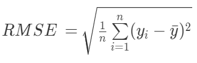

Unlike the MAE that measures absolute error values, here we square the errors - which makes the RMSE very sensitive to outliers. Since the RMSE heavily weights big errors than small errors, this is a good metric to measure a model's performance in a more rigorous way.

Let's set the past example with weekly incomes: \$1,000, \$500, \$100. Assume your predictions are the same as the example given: \$2000, \$100, \$10. Then, we get the error by subtracting actual with predicted values and squaring it: \$1,000,000, \$160,000, \$8,100. Sum them up and divided it by the number of workers (3) to get \$389,366. Then we take the square root: around \$623.99.

The MAE was \$496.66 against a RMSE of \$623.99. Think of predicting rare diseases on patients - you will want to use the RMSE to ensure the model is very accurate. However, for fields that don't need such rigor, the MAE is preferred since it is easier to interpret in business terms than RMSE.

### Mean Percentage Error (MPE)

The Mean Percentage Error (MPE) measures if the model is underestimating or overestimating the predictions in percentage terms. 

Observe the formula's right-hand side. Unlike MAPE, MPE doesn't care about getting the absolue value of the errors - it just sums up all positive and negative errors. If the MPE turns to be positive (MPE > 0), it means that the model is underestimating predictions, while a negative MPE (MPE < 0) means that the model is overestimating them.

Think of the regression line we showed earlier: 

Overall, if the regression line is above the black dots, it means that errors are negative valued (overestimation); if the line is below, the errors become positive valued (underestimation). 

Due to the denominator term in the formula, we can't use MPE if a variable y has zero entries.

### II. Modeling 
In data science projects that uses machine learning techniques, it is good practice to select some algorithms to train the original dataset, and evaluate predictions on them with the validation data. Our performance metrics (and business needs) will tell us which algorithm is best suited as a final solution. 

Machine learning models can be of three types:

* **Supervised**: a supervised machine learning model is when the variable to be predicted is well known. In supervised models, the data to be trained is well defined - the experimenter knows the dependent and independent variables from the data; 

* **Unsupervised**: an unsupervised model is used when the variable to be predicted is not known. This happens when the experimenter wants to find some similarities between data points, such as dividing data into groups/clusters that have some sort of relationship.

* **Reinforcement**: a reinforcement model is used when the experimenters wants to maximize the model's output. The model "learns" on the go by trial-and-error: as new data join the model, it tries to find the best solution that maximizes the "reward". Think of an automated car: its sole goal is to arrive at a particular destination by being fuel efficient, with minimal ride time, and in safety. A reinforcement model learns by trying several routes, registering their performance, and utilizing better routes at each drive.

For a detailed explanation on supervised, unsupervised, and reinforcement models, check this [article](https://intellipaat.com/blog/supervised-learning-vs-unsupervised-learning-vs-reinforcement-learning/).

In this project, we clearly have a target variable to get predictions on, so we will build a supervised model. To get some criteria for which algorithms to run, check a cheat sheet for machine learning algorithms [here](https://blogs.sas.com/content/subconsciousmusings/2017/04/12/machine-learning-algorithm-use/). 

For this project, we will run 7 models: (1) Mean of the target variable (baseline); (2) Linear Regression; (3) Lasso Regression; (4) Ridge Regression; (5) ElasticNet Regression; (6) Random Forest Regressor; (7) XGBoost Regressor.  

If you wish to see a summarized table with each model's performance, you can always [(skip theory)](#model-performance).

### A quick note on Underfitting and Overfitting

Before we proceed with our models, let's talk about underfitting and overfitting. In machine learning models, we usually worry about models presenting underfitting and overfitting problems:

In the graph below (retrieved from [Dados Aleatórios](https://www.dadosaleatorios.com.br/post/overfitting/)) we can get a taste on how overfitting and underfitting can affect a machine learning model. We have three graphs; each one trying to fit a best prediction line/curve that minimizes the error - the distance between the prediction line and the true value (the pink dots). The overfitting model shows a curve that perfectly fits all actual values with zero error; the optimum model predicts fairly good with a few errors; and the underfitting case presents huge error values.

One would say that the overfitting model is the best one, since predictions are precisely the same as the true values (pink dots). But think of how machine learning models work: we pick an algorithm, train it with training data, and utilize a validation data to get predictions. If predictions are too accurate on validation data, it means that the model will be extremely accurate just for the validation data! In other words, when the same model tries to generate predictions on a different data (say, the test data), then results will be pretty unreliable.

On the other hand, the underfitting case indicates that the model is too simple and does not capture well the features present in that model. When a model presents underfitting problems, it means that predictions will have a high bias in both validation data AND the test data - making it an unreliable model to work with.
 
There are many ways to avoid overfitting/underfitting in a model. Some are: 
* **Overfitting**: eliminate redundant variables (less complex data), add more data, use cross-validation techniques (we will get into this later), apply regularization techniques;
* **Underfitting**: add relevant variables, increase the model complexity, increase the model's training time (allowing it to better capture the data patterns)

_For a concrete explanation on overfitting and underfitting, [this Kaggle course](https://www.kaggle.com/dansbecker/underfitting-and-overfitting) can be of help._ 

In this project, we will often look at ways to prevent overfitting and underfitting. Some models such as the regularization models (Lasso, Ridge, ElasticNet) and tree-based models (Random Forest and XGBoost) can actually work on controlling such issues as we will see throughout this section. 

### 1. Mean of the target variable (baseline)
We use the mean of the target variable as a comparative baseline since it is the simplest form to estimate values. We got the following results:

### 2. Linear Regression
Remember we saw a linear regression line when introducing [performance metrics](#i-performance-metrics)?

Let's recap again. A linear regression line is a statistical technique that aims to predict a dependent variable by fitting a best line. This line (depicted in blue) is a tentative to depict the relationship of the dependent variable (y) and the independent variable (x). The black dots are the observed (true) value, and the red line connecting the regression line with the black dots is the error term (e), or by how far predictions generated by the regression line are off when compared to their true value.

There are two main types of linear regression lines: simple and multiple. **Simple linear regression** predicts the dependent variable based on only one independent variable, while a **multiple linear regression** utilizes several independent variables to predict the dependent variable.

The multiple linear regression looks like the case for our project, since we have several predictors. A multiple linear regression can be mathematically expressed like this:

The betas are parameters that represent the value of the dependent variable when the independent variables (the X's) have value 1. 

Let's set an example. Let Y be the sales revenue for Rossmann stores for a given day, X1 the number of customers, X2 the number of customers with a membership card. Now let's assume that we didn't welcome any customer with membership card - set X2 to zero in our formula. Then, the dependent variable Y is just the beta corresponding to the variable X1, the y-intercept (beta zero) and the error term. In this case, we see the sole effect of number of customers on predicting sales (the dependent variable Y).

Beta parameters are calculated through a technique called Ordinary Least Squares (OLS). The OLS calculate each independent variable's beta parameter by minimizing the error term. More details on OLS can be found [here]((https://en.wikipedia.org/wiki/Ordinary_least_squares)).

Let's go back to our example. Assume that we have calculated the beta parameters, with B0 (the y-intercept) being zero, B1 being 400, and B2 being 200. If we wish to know the predition sales when a store has zero customers (X1 = 0) and zero customers with membership card (X2 = 0), sales revenue will be just B0 = zero. If we want to know the effect of one customer on sales prediction, we set X1 = 1 and X2 = 0 to get $400. **This is the power of linear regression models: it is very interpretable, and relatively simple model for predictions.** 

However, linear regression has some assumptions to be considered before one choose it as a prediction model candidate:

1. **Linearity**: independent variables have a linear relationship with the dependent variable.

2. **Multicollinearity**: independent variables are not highly correlated with each other.

3. **Residual variance**: the variance of the errors between true and predicted values is constant. When errors are too unstable, we have a problem called [heteroscedasticity](https://en.wikipedia.org/wiki/Heteroscedasticity) - in which there is a high variance on predicted values across independent variable values, leading to unreliable predictions. 

4. **Independence**: errors are uncorrelated to each other.

5. **Endogeneity**: independent variables are uncorrelated with the errors.

For a detailed explanation on OLS assumptions, check the [365 Data Science](https://365datascience.com/ols-assumptions/) article.

In this project, we analyzed some OLS assumptions in the [exploratory data analysis](#iii-multivariate-analysis) section by checking multicollinearity and linearity. If the linear regression model performance is poor, the data is probably complex and non-linear.

Our results were as follows:

### 3. Ridge, Lasso, and ElasticNet Regression

_The following part explores regularization techniques for linear regression models. Examples were retrieved from Masum Rumi's [detailed regression guide with regularization techniques](https://www.kaggle.com/masumrumi/a-detailed-regression-guide-with-house-pricing#Fitting-model-(Advanced-approach)); therefore, if you wish to consult the original source, read his article_.

Ridge, Lasso, and ElasticNet are the next models we will test for this project. These are linear regression models known as regularization models, and have the ability to prevent overfitting by reducing the impact of the features (the beta parameters) on the predictions, and also to minimize the errors between the predicted value and the true value with a OLS loss function.

Think about the "perfect", overfitting problem: the predicted values are the same as the observed values. When we try using different data on the overfitted model, it generates unreliable predictions. One way to get rid of this problem is to "penalize" the beta parameters that are too "perfect": we add extra weight on each of them.

To understand them, let's go back to our linear regression model:

We could rewrite this (excluding the error term) as:

Now, we introduce the residual sum of the squares (RSS), which is the sum of all error terms obtained from the regression line but squared:

Now we are ready to explore regularized models. 

* **Ridge Regression (L2)**

Known as the L2 regularization model, the Ridge regression penalize beta parameters by adding the square value of each parameter in the model:

We obtained the following results:

* **Lasso Regression (L1)**

Known as the L1 regularization model, the Lasso regression penalize beta parameters by adding the absolute value of each parameter in the model:

Lasso adds the sum of all absolute beta parameters to the loss function. This means that Lasso is more aggressive when penalizing parameters of highly correlated variables, since it can set them to zero. Therefore, the Lasso also works as a feature selection method from the standpoint of a linear regression model. 

We obtained the following results:

* **ElasticNet Regression (L1+L2)**

ElasticNet is the just the combination of Ridge and Lasso:

We obtained the following results:

The next models are random forest regression and XGBoost regression. In order to understand both, let's learn the foundation behind random forests: **decision trees**.

### Decision Trees

You probably have already used or heard of decision trees before. A decision tree is a predictive technique in which the data is splitted into groups (or "nodes") given its similarities. See an example of a decision tree that tries to predict sales revenue on a given day from only one variable: number of customers (also called "root node"). We set the total number of stores to N = 100. There is only one split that generates two "terminal nodes" (also called leaves):

Note that we divided the number of stores by the threshold of 10,000 customers. On the left-hand side, 50 stores had below 10,000 customers on a sales day, against equally 50 stores with above 10,000 customers. Then we average sales revenue registered by all 50 stores on each side to get \$10,000 and \$15,000, respectively.

Now let's evaluate this decision tree model we've just made up. If you try to predict sales revenue for one store that had below 10,000 customers on that particular day, would you trust the model and take the $10,000 prediction as given? Probably not and maybe you realize two things that are lacking in here: (1) **the model is too simple** since it only uses number of customers as a predictor; (2) **the model doesn't split well** our stores, since the total number of stores (observations) are splitted equally from the root node. Decision tree is a powerful tool because it prioritizes the usage of variables that splits well our data - therefore, we would ideally have a small number of stores in one side, and a big number of stores in the other side. This problem comes from the concept of **entropy**, which measures the impurity in the system (in this case, the node). The more "Pure" a node is, the more reliable the predictions coming from that node are.

Let's add more decision nodes (variables) to the decision tree model:

Now we utilized traditional promo sales as the root node. Observe that it splits our number of observations in a better way (80/20) than number of customers (50/50). Also, we utilized number of customers and distance from competitors as decision nodes, giving more depth (complexity) to our model.

As we did before, let's evaluate the new model. For a store that is holding traditional promo sales, and have below 10,000 customers on a given day, the average sales revenue is \$5,000. I am not sure if you would trust this model, but at least it is way better than the previous one, since it is splitting observations into well defined categories, and have more variables influencing the final average sales revenue.

In real life, we would have several variables that the decision tree can utilize to train the model. Decision trees use entropy to choose the right variables to split data, since the goal is to have less impure categories after split. Therefore, tree-based models are sensitive to changes in the dataset: removing a few entries could completely change the set of variables chosen for a tree model. 

**A quick note on underfitting/overfitting.** Tree-based models such as the decision tree might suffer from underfitting issues if you make you model too simple, or overfitting issues if you add too many variables to the model. Usually, tree-based algorithms have some parameters to help us avoiding these issues - we will get into this when introducing random forests.

### 6. Random Forest Regression

Roughly speaking, Random Forests uses several decision trees to generate even more accurate predictions than a single decision forest. The idea comes from **ensemble learning**: instead of training data in a very accurate and complex model, use several low-accuracy models to "learn" the data and then combine predictions from these models to achieve high-accurate predictions. Algorithms that uses ensemble learning are random forests and gradient boosting (to be explored soon).

To understand how random forests operate, imagine that we have a dataset with 7 predictors and a target variable Y (say, sales revenue) like this:

In this simplified dataset, the random forest algorithm then randomly selects a **sample of data entries** AND a **sample of columns** to create an individual decision tree. Then it repeats for n decision trees, with different sample of data entries and columns on each decision tree. At the end, we will have several decision trees with totally different combinations of trees and data entries. Then we aggregate all predictions to find our final prediction - this technique is known as **bagging**. 

In our example, let's say that we used n = 6 decision trees in our random forest, and the maximum depth of each tree is two (we split our root node two times). The first tree used independent variables X1 and X2, the second used X4 and X2, third used X1 and X4 and so forth - all with different data entry samples from each other:

Suppose we want to predict sales revenue of a specific store of number 10. Based on the features of that store nº 10, we go over each decision tree and calculate the average sales revenue for stores with similar features to our store. Then, we average all trees' average sales revenues to get our final prediction. In this case, it is $7,000.

In mathematical terms, the random forest formula is:

Random forest is a powerful algorithm because it reduces the variance of our model. In other words, it ensures that each tree has a low correlation with other trees (after all, they are all distinct decision trees), giving reliable predictions by combining the performance of all trees. In our project, we obtained the following results:

### 7. XGBoost Regression

The XGBoost Regression is a very effective algorithm that is based on decision trees and uses the same structure of **gradient boosting** algorithms. Since we already know what is a decision tree, we are left with explaining the gradient boosting before going down to the nitty-gritty of the XGBoost Regressor.

To understand gradient boosting, we will go over these steps:

* I. Define the model inputs
* II. Calculate baseline
* III. Calculate pseudo-residuals
* IV. Fit a regression tree and calculate "output values"
* V. Generate predictions
&nbsp;

### I. Model Input
A gradient boosting algorithm requires two inputs:

* **the data itself**
* a differentiable **loss function (or "cost function")**: in a regression context, it is a function that shows the error (observed value _minus_ the predicted value) obtained from a model. 

To make things simple, imagine that we will train a gradient boosting model to predict sales revenue of stores, and we have three main features: number of customers, holiday sales day, promo sales day. In this simple model, we will have just 7 entries (n = 7):

In mathematical terms, **the data** above can be described as:

The next input is the **loss function**. For regression models, the loss function could assume any formula that returns the **error** (difference between observed and predicted values); for instance, we could even use the Mean Squared Error (MSE) (already discussed in [performance metrics](#i-performance-metrics)) as a loss function. Just to refresh our minds, check below the linear regression line again. The red line is the errors that a loss function aims to find:

For linear regression, the loss function it is the residual sum of squares (RSS) we already saw before:

Gradient Boost models, however, don't use the MSE but the **observed value minus the predicted value squared divided by 2** as the loss function:

We usually call the errors in linear regression models as "residuals", but in gradient boost models we refer to them as "pseudo-residuals". 
&nbsp;
### II. Calculate baseline

Now that we have the data and a loss function, we can work on initiating the gradient boost model. First, we need a predicted value as a baseline to calculate the pseudo-residuals (errors) of each entry. In this case, we use the average of sales revenue ($5,571). 
Then, we get the residuals by subtracting the observed value (sales of each store) by the predicted value (average of sales revenue): 

Note that if the gradient boosting algorithm stops here, then our predicted value for all stores would be the average sales revenue, and the errors would be exactly as displayed in the red column. We are not satisfied by this 1st prediction, but it is the starting point of the gradient boosting model.

Let's mathematically prove how we end up with average sales revenue as the first prediction value in the model. In a next step, we will find how the pseudo-residuals are calculated.

Remember the F(x) term we saw earlier in the loss function? Let's define it mathematically (read the formula from right to left):

If you know calculus, one could find the predicted value that minimizes the sum of all individual loss functions by taking the derivative of each term, summing up the results, and setting to zero. Let's first take the partial derivative of the loss function with respect to the predicted value F(x):

then:

Now, apply the derived loss function to the prediction function, and set it equal to zero:

Substituting the observed values from the table to our formula:

Rearranging we have: 

which is exactly equal to the average of sales revenue. Therefore, **the first prediction value that the gradient boost model uses as a baseline is just the average of the observed values**.

### III. Calculate pseudo-residuals

The next step the model takes is to calculate the residuals for each entry based on the baseline (average sales revenue):

where,

This formula might look complicated, but it simply tells us that r(im) is the optimal residual value in respect to the first decision tree (m = 1). We have already taken the partial derivative of the loss function with respect to prediction function F(x), so we can rewrite the residual formula as:

Then, we calculate the residual for each store (i):

which is exactly the values displayed in the initial table:

 
Although the average sales of all stores is not an ideal sales predictor, gradient boost model uses it as a starting point to develop more accurate predictions as we will see soon.

### IV. Fit a regression tree and calculate "output values"

In this task, we will fit a base learner (a decision tree) and calculate "output values" that will help us reducing the existent pseudo-residuals. Roughly speaking, we are building trees to "predict" residuals. Although it might sound weird to predict residuals, things will be much clearer afterwards.

To make things easier to understand, we will use a simple [adaboost](https://en.wikipedia.org/wiki/AdaBoost) example, which is a decision tree with one node and two leaves (also known as "stump"). In this particular case, "is holiday?" variable was used as a node.

where each leaf has pseudo-residual values that corresponds to the stores that were opened on holidays or not. In real world, though, gradient boost uses decision trees with more depth than this.

We start by creating **"terminal regions" _R(j,m)_**, where _j_ is a value from one to _j_ leaves, and _m_ is the tree number. In this case, we have two leaves in our first tree (m=1): _R(1,1)_ for the leaf in the left side, and _R(2,1)_ for the leaf in the right side. 

Then, we need to calculate the output value (gamma) for each terminal region (leaf):

where,

In plain English, this formula tells us to find the output value $\gamma$ that minimizes the sum of all loss function (residuals) of the terminal region _R(j,m)_.

As an example, let's calculate the output value for the terminal region _R(1,1)_ in our first tree (m = 1):

The output value that minimizes the sum of the loss function for the first leaf is just the **average of the residuals of the first leaf** (-1,071). This is similar to what we did when calculating the first prediction value (the average of sales revenue). Therefore, **the output values will always be the average of the residuals within a terminal region.**

See below our updated tree with output values. Note that we only did the algebra for the 1st terminal region (leaf), since calculating the 2nd terminal region would be too much for our purposes.

### V. Generate predictions

Now it's the time we generate predictions with the gradient boosting model. In our case, we had the first prediction which was the average sales revenue. Now we will use the decision tree we trained on the previous step, use its output values, and generate new predictions.

We will start by an example. We will predict sales for the first store (i = 1), where we sum the first prediction (baseline) and a learning rate multiplied by the output value corresponding to that observation. The learning rate is a value between 0 and 1, and the smaller the learning rate, the less effect the trained tree has on the final prediction. Here we used 0.1 for the learning rate:

We obtained the value \$5,463.90, which is a better prediction than the baseline (\$5,571) and closer to the true sales revenue of $5,000.

Let's check the performance for the other stores. The new predicted values are in the F1(x) column and the average sales revenue (the baseline) is denoted by F0(x):

 Note that while some stores had their sales prediction values improved, some other didn't. The reason is that we have trained only one tree, which uses only one node and two leaves - a stump - which is not the most ideal decision tree model in the world. 

Remember: the gradient boost starts with a baseline, trains a single tree based on the idea of finding the output value that decreases the error (residuals), multiply it by a learning rate to lessen the effect of that single tree on predictions, and sum up all values to get the final prediciton value. But what if that single tree was not a stump but a tree with more nodes and deeper depth? We would probably get better predictions with that tree right?

However, gradient boosting isn't all about single trees. What if we repeat the same process we just did by training 100 deeper trees (instead of one), and generate predictions for each tree based on the performance of previous trees? Then it will be likely the case that we will generate more good individual trees than "bad" individual trees, and we would gradually get pretty decent predictions for each store (mental note: the term "boosting" comes from this idea).

In mathematical terms, we can describe new prediction Fm(x) for each store x (or i) as:

We already know the values of the 1st prediction F1(x), but let's calculate it by using the presented formula:

Remember: this prediction takes into account the baseline and the first decision tree. Usually, gradient boost models use much more than 1 decision tree. 

For m = 1 to M, we must iteratively go over the steps III, IV, V as we did before. For the sake of simplicity, let's add the second decision tree (m = 2) and see how the gradient boost model performs. 

* **III. Calculate pseudo-residuals**

  &nbsp;
  
  &nbsp;

  
  &nbsp;

* **IV. Fit a regression tree and calculate "output values"**
  Let's create a new decision tree and calculate output values:

  &nbsp;
  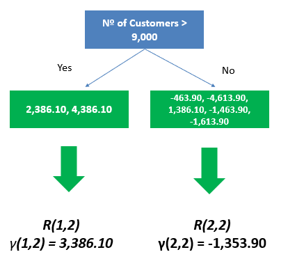
  &nbsp;
  
  We know that the output values is the average of all residuals on each terminal region:
  
  

* **V. Generate predictions**

  &nbsp;
  

  &nbsp;
  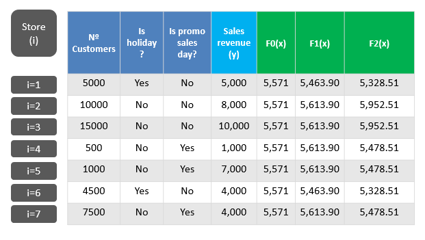
  
  For stores 1, 2, 3, 4, 6, 7 we got much better predictions than F0(x), while for store 5 we got worse prediction. If you compare the first prediction F0(x) and F1(x) to F2(x) prediction values, we see more variability among values, which indicates that the more trees are added, the more specific the predictions will be for each store. Therefore, even though we had a worse prediction for store 5 on F2(x), the tendency is to get better predictions as the number of trees increases.
&nbsp;

Now that we have two trees in our model, what if we wanted to predict sales revenue for a store by using this trained model? Let's say we have some data from store nº10:

In this example, our gradient boosting model predicted a sales revenue of $5,328.51 for store nº 10.

By setting the example above, we depicted the main message of gradient boosting: by training several individual ("weak") trees, we focus on gradually minimizing the error for each of them (hence the name ["gradient"](https://en.wikipedia.org/wiki/Gradient_descent)), and combine the outputs of all trees altogether (again, hence the name "boosting") to generate the final prediction value.

With all of gradient boosting mechanics explained, **the XGBoost Regressor (XGB)** is a variant of the gradient boost model. There are many advantages of XGB over the gradient boost model, such as:

* **Regularization**: like the Ridge/Lasso/ElasticNet regressors that penalizes parameters to lessen the effect of unrelevant features during prediction, XGB also imposes a regularization on each tree's leaves, which helps reducing overfitting.

* **Tree Pruning**: If necessary, XGB prune leaves (and even trees), which helps avoiding overfitting. 

* **Computation Processing**: XGB trains faster than gradient boosting and some other models due to its [parallel processing](https://searchdatacenter.techtarget.com/definition/parallel-processing)

* **In-built Cross-Validation**: the algorithm can handle cross-validation for each iteration, and use the optimum number of iterations according to prediction results;

Since the mechanics of the math present in the gradient boost is somewhat similar to the XGBoost, we will not cover the model here. There are two excellent videos from StatQuest on Youtube that explains the [model](https://www.youtube.com/watch?v=OtD8wVaFm6E), the [math behind the algorithm](https://www.youtube.com/watch?v=ZVFeW798-2I) and the [parameters](https://www.youtube.com/watch?v=oRrKeUCEbq8) in detail. Also, the [paper](https://arxiv.org/abs/1603.02754) written by the XGBoost creators themselves could be of some help. Xgboost parameters will be explored in depth on the [hyperparameter tuning](#08-hyperparameter-tuning) section.

With the XGBoost regressor, we obtained the following results:

&nbsp;

### Model Performance

Here we show all algorithm performances we obtained so far:

We have the Random Forest Regressor and XGBoost Regressor models generating less errors than the others (MAPE: 5-9%), and our baseline model is the worst model (MAPE: 20%). As we can tell, linear models performed fairly good but not as good as decision-tree based models. One of the reasons is that our data is not linear - therefore, decision-tree models would perform better.

### III. Cross-Validation

The results obtained with the models gave us a taste on how well each algorithm predicted our target variable. However, in order to measure the real performance of machine learning algorithms, we must go over to one of the most important steps in data science projects: the cross-validation. 

Cross-validation is a method to test an algorithm performance across the whole data by splitting it into k-folds (usually five folds), choosing one fold to represent the validation data (being the remnant the training data), training the model, and calculate the error metrics MAE, MAPE, and RMSE. Then we go back to splitting the data but selecting a different k-fold as the validation data, and run the same process. Repeat it until you get the results for all folds, and average all the error metrics. We do this to each algorithm, and compare results across different algorithms to determine the best model. 

In this project, we used time to split the data into k-folds. For k = 1, training data represents the whole data minus the last six weeks, and the validation data is exactly the last six weeks of the whole data. We train all models for this fold and obtain the performance measurement metrics. For k = 2, training data is the whole data minus the last 12 weeks, and the validation data is the last 12 weeks. We do the same thing: train all models and obtain the metrics. By the time we finish k = 5, we should be able to calculate the average of each error metric for each model.

We obtained the following results:

The results confirm what we saw earlier: the Random Forest Regressor and the XGBoost Regressor generates less errors with MAPE of 7% and 9%, respectively. Since the XGBoost Regressor is known to train data fastly than random forest algorithms (and the model performance is not too different), we will use the XGBoost regressor as the main machine learning model for our project.

One important note: we performed the cross-validation step for each k-fold by using the raw data. We did this in order to avoid [data leakage](https://www.kaggle.com/alexisbcook/data-leakage), which is when information from the validation/test data is leaked to the trained model. This issue usually reflects as an overestimated predictions coming from the contaminated model. Using raw data to perform the cross-validation step ensure us we use completely distinct data for training and for validation.

[back to top](#table-of-contents)

---
## 08. Hyperparameter Tuning

[(go to next section)](#09-error-interpretation-and-business-performance)

In this task, our goal is to find the best parameters that maximizes the learning in our model. The best parameters are found by testing a set of parameters iteratively - the set that best performs is the chosen one. There are three methods to find these parameters:
  1. Random Search: this method randomly choose parameters from a given list of candidates. It is the fastest method available;
  2. Grid Search: this method is the most complete one and find the absolute best values for each parameter on the model. Once a list of parameters is set, this method performs combination of every single possibility among parameters. Very slow and costly;
  3. Bayesian Search: based on the Bayes' Theorem, this method defines parameters according to prior knowledge. It starts with one initial set of parameters that has its performance calculated. Then, for the next set of parameters, one parameter is changed and its performance is calculated again. If results get better, parameters will be changed. Otherwise, parameters will be kept. This method is faster than Grid Search and slower than Random Search.

In this project, we will use the Random Search on the XGBoost Regressor. The XGBoost Regressor have the following parameters (descriptions retrieved from the [official documentation](https://xgboost.readthedocs.io/en/latest/parameter.html#general-parameters), and [Cambridge Spark](https://blog.cambridgespark.com/hyperparameter-tuning-in-xgboost-4ff9100a3b2f)):

1. `objective`: parameter that sets the learning method and the loss function. In our model, we set `objective='reg:squarederror'` which is a regression with squared loss
2. `n_estimators`: number of trees
3. `eta`: the learning rate. A lower eta makes our model more robust to overfitting thus, usually, the lower the learning rate, the best. But with a lower eta, we need more boosting rounds, which takes more time to train, sometimes for only marginal improvements.
4. `max_depth`: maximum depth of a tree (or maximum number of nodes). Deeper trees can model more complex relationships by adding more nodes, but as we go deeper, splits become less relevant and are sometimes only due to noise, causing the model to overfit.
5. `subsample`: ratio of training sample (example: 0.5 means that XGBoost will randomly sample half of training data before growing trees. It prevents overfitting)
6. `colsample_bytree`: ratio from 0 to 1 representing the number of columns used by each tree.
7. `min_child_weight`: is the minimum weight (or number of samples if all samples have a weight of 1) required in order to create a new node in the tree. A smaller `min_child_weight` allows the algorithm to create children that correspond to fewer samples, thus allowing for more complex trees, but again, more likely to overfit.

We found out that the best set of parameters were:

`param_tuned = {'n_estimators': 1500,'eta': 0.03,'max_depth': 9,'subsample': 0.7, 'colsample_bytree': 0.9 ,'min_child_weight':8}`

Using the optimal set of parameters, we obtained the following results:

which had a MAPE improvement of 5%.

[back to top](#table-of-contents)

---
## 09. Error Interpretation and Business Performance

[(go to next section)](#10-deploy-machine-learning-model-to-production)

In this step, we analyze the predictions' performance generated by the XGBoost model from a business perspective. Our focus is to translate and interpret errors from our ML model into three steps:

### I. Business Performance

In this project, business performance for each store is measured by the average of all predicted sales for the next six weeks. We then sum up the predictions with the Mean Absolute Error (MAE) to get the best scenario figures and subtract predictions with the MAE to get the worst scenario figures. Here's a sample of our model performance for 10 stores:

Considering all stores, we would have total predicted sales for the next six weeks of \$284,153,920, being \$283,772,779 for the worst scenario sales prediction, and \$284,535,044 for the best scenario.

### II. Worst Performance

To check if there's any store that our model couldn't predict well, we plot a scatterplot with stores in the x-axis and the Mean Absolute Percentage Error (MAPE) in the y-axis:

The stores circled in red have high MAPE values. Let's identify these stores:

Store 909 has a MAPE of 20%, which means that predictions are off by 20%. Store 875 and 291 are off by 16% and 14%, respectively. Usually, the business have the final word on how permissible these error percentages can be when determining the model performance. As we saw in the scatterplot above, the model performs fairly well for most of the stores with a MAPE of ~5%, but prediction for these stores should be analyzed in more detail. In this project, we don't have access to information; therefore, we will fictionally consider that the business has approved the model predictions.

### II. Machine Learning Performance

Our last step before deploying our model to production is to evaluate the overall model's performance. As the lineplot below shows, predictions (in orange) were fairly on par with the true, observed sales values (in blue) across the last six weeks of sales represented by the validation data. 

The following graph shows the error rate (the ratio between prediction values and observed values) across the six weeks of sales. Ideally, errors should be close to the dashed line, since it represents an error rate of 1 (predicted values = observed values). As we can observe, the model performs fairly well since it doesn't achieve error rates above 1.075 or below 0.925. The 3rd and 5th weeks were the ones that the model performed not so well compared to other weeks; but again, the error rate range is short, so our model looks just fine. 

One of the premises for a good machine learning model is to have a normal-shaped distribution of residuals with mean zero. In the following graph, we can observe that the errors are centered around zero, and its distribution resembles a normal, bell-shaped curve.

The following graph is a scatterplot with predictions plotted against the error for each sales day. Ideally, we would have all data points concentrated within a "tube", since it represents low error variance across all values that sales prediction can assume:

There are six sales days that the model generated errors above \$10,000. Ideally we would separate these days and conduct a thorough analysis to check why they have such errors. Since it is only six, we will proceed with the trained model to production.

[back to top](#table-of-contents)

---
## 10. Deploy Machine Learning Model to Production

[(go to next section)](#11-a-sales-bot)

In this section, we will deploy the prediction model we have just built in a cloud server. For non-computer science background people, some terminology might be daunting as they were to me when I first deployed the model in the cloud. Some are:

**1. Application Programming Interface (API)**. I'm pretty sure there are better definitions on internet, but in palatable words, API is kind of a "manual" of how to send/retrieve information from an application or web platform. For example, in this project we want to send a request to the API by sending a store number, and want the API to send us back the predictions for that store;

**2. API Request:** as the name suggests, it is a request a user makes for an API;

**3. Endpoint:** the connection between the user and a service/app. In this project, it is the URL/Api port where the service can be access by users;

**4. Deploy:** in our project, deploy means to set the model into a production environment (like the cloud) so that other users can access the model and retrieve predictions from it;

**5. Local Development Environment:**  we use a local development environment (your PC) to test the model before taking it to a production environment. This is usually described as '0.0.0.0'. in an url;

**6. Production environment:** once testing is done, the model is ready to operate (or go to "production") on the web and make itself available for users. In this project, we use cloud-based servers in Heroku as our production environment.

Next step is to describe our production architecture and the steps for putting our model into production.

### I. Production Architecture

  

The production architecture for this project is fairly straight-forward. Users (which could be a person, a smartphone, a website, and app, really anything that can access the API) make a API request (Handler API - handler.py) by sending the store(s) the user wishes to retrieve predictions, and the API uses the information received to prepare the data (Data Preparation - Rossmann.py) and get predictions (Model). Once the process is completed, the API returns the prediction back to the user. 

There are three main steps to deploy our model to production: (1) build the Handler API (handler.py); (2) build the Data Preparation file (Rossmann.py); (3) build the API tester file.

- **Build handler.py**: this archive is the API; it essentialy redirects the information received by the user to Data Preparation and the Model, and returns the prediction.
  - Steps in the project's main directory:
    - Create a folder `api`. Within api, create a folder `rossmann` (use `mkdir -m api/rossmann` command on terminal);
    - Create an empty handler.py file on `api` folder. (use `touch handler.py` on terminal)
  - Steps in the project's notebook:
    - Save the model `xgb_model_tuned` in a serialized format (we use [pickle](https://docs.python.org/3/library/pickle.html) for that).
  - Steps in the file handler.py:
    - Import `pickle` and load the serialized model and save it in a variable called `model`;
    - Import Flask in the file. Flask is a python-based library for web development;
    - Import `pandas` library;
    - Import Rossmann class as `from rossmann.Rossmann import Rossmann`. This line means: from folder `rossmann` at file Rossmann.py, import `Rossmann` class;
    - Create new variable `app` that uses the flask method with a builder argument (`__name__`); 
    - Create endpoint (url) to enable API requests by `@app.route`. Use the method POST, which is a method indicating that the user sends data to retrieve data from the API. The endpoint is `/rossmann/predict`;
    - Create function `rossmann_predict()` that receives the store information from the user, and manages the data preparation and prediction generation. Now, everytime that the endpoint receives an API call via POST, it executes this function. it has an `request.get_json()` method to retrieve the JSON formatted data containing the store information, an if/else statement to validate the data, and transform the JSON data into a pandas dataframe. If information is not valid, the API returns the error 200 for the user (request was correct but execution failed). Then, we check whether the data is a single line or has multiple lines. For each case, there's a different way to generate the pandas dataframe;
    - Within the function `rossmann_predict()`, create a conditional statement with `__name__` and `__main__`. When the API runs, the python interpreter searches `__main__` and runs flask on local host ('0.0.0.0');
    - Within the function `rossmann_predict()`, instantiate (copy) Rossmann class in a variable called `pipeline`.
    - Call Rossmann to run data cleaning, feature engineering, data preprocessing, and prediction on the raw data sent by the user.
&nbsp;
    At the end, it should look like this:
&nbsp;
    
    &nbsp;
- **Build Rossmann.py (Data Preparation)**: this archive is called by the handler.py. It transforms the raw data in the right format (encoding, transformation, feature engineering, etc) in order to fit the XGBoost model we created. It returns the predictions.
  - Steps:
    - Create an empty Rossmann.py file on `rossmann` folder;
    - Create a class called `Rossmann(object)` in the file;
    - Within Rossmann class, create `__init__` function with argument `self`. When the Rossmann class is called, the `init` function will be activated. `self` are variables within Rossmann class that can't be instantiate from outside the class;
    - Save all rescaling methods used at [data preparation](#05-data-preparation) section by using pickle, and load them in the `__init__` function;
    - Create `data_cleaning` function. 1st argument is `self` and 2nd is a dataframe `df1`. In this function, write all data cleaning steps done in the [data cleaning](#iii-data-cleaning) section;
    - Create `data_preparation` function. 1st argument is `self` and 2nd is a dataframe `df2`. Add all data preparation steps done in the [data preparation](#05-data-preprocessing) section;
    - Import all necessary packages to run Rossmann.py. Remove the target variable from script - after all, the raw data to be transformed doesn't have the sales variable on it (we are trying to predict it);
    - Create `get_prediction` function to generate predictions. Transform the predicted values into exponential values (remember: the model `xgb_model_tuned` had sales in log scale). Return data to API in JSON format.
&nbsp;

    Since the file is very large, we won't show it here - you can access the Rossmann.py in the `api` folder located in this repository.
&nbsp;

- **API tester: create a script to test the API**
  - Steps in Jupyter notebook:
    - Load test dataset;
    - Merge store dataset on test dataset;
    - Remove closed stores and ID column;
    - Select some stores as if we were the user requesting predictions. In this case we selected stores 22, 100, 40 for testing;
    - Convert data into JSON;
    - Create an API Call (`requests.post`) with the following items:
      - `url` (where the endpoint request goes)
      - `header `(what kind of data it is sent to the API)
      - `data` (the raw data sent by the user)

    &nbsp;

    At the end, it should look like this:
    &nbsp;

    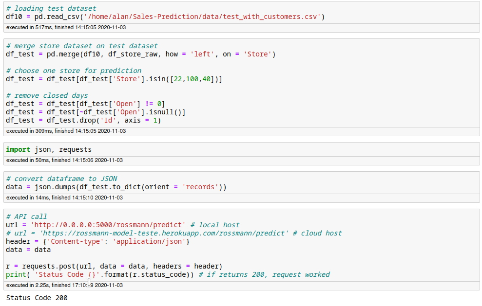

    The `http://0.0.0.0:5000/rossmann/predict` part means that the API call is made to the local host `0.0.0.0` at the `5000` flask port at endpoint `rossmann/predict`. If it returns the code 200, it means that our API call succeded.
    &nbsp;  
  
### II. Development Environment

Once all archives are set, we can run the API on the local host (your PC) to test whether our production architecture is working.  
- Steps on terminal:
  - Run the API by running `python handler.py` on terminal. The message "running on" means that the handler is waiting for a API request:

  
  &nbsp; 
  - Now let's test the API on the local host server (development environment). Run the API tester on jupyter notebook. If it shows status code 200, everything is correct. Check the results by running a dataframe with r.json():
  &nbsp; 
  

  - Here we can see predictions for stores 22, 100, 40. Seems like our production architecture is working perfectly; we can now proceed to deployment. 

### III. Production Environment

In this task, we include all the environment set on local host in the cloud. For this project, we are using [Heroku](https://www.heroku.com/), a cloud-based platform for building, scaling and running applications in the web.

Steps:
  - In the main directory, create folder `webapp`. Inside the folder, create folders `model`, `parameter`, `rossmann`. Copy all contents of model, parameter and rossmann from the main directory on their respective new folders.
  - In `webapp` folder, create an empty file `Procfile` containing `python handler.py` on it. By doing this, we will set the API on Heroku instead of running it on terminal;
  - With the virtual environment activated, create `requirements.txt` file on webapp folder with `pip freeze > requirements.txt` command on terminal. `requirements.txt` is a file that contains all libraries used in this project, and Heroku will install the packages to set the same environment we had on the local host but in the cloud;
  - Create a git repository with the command `git init` on terminal in the `webapp` folder;
  - Copy API (handler.py) to `webapp`. Access handler.py and change path (in heroku, the path should be relative to folder, not the absolute path);
  - In handler.py, set environment variables since Heroku doesn't know Flask's port (5000). Use `os.environ.get('PORT', 5000)` and save as a variable `port`. Update `app.run` by adding the `host = '0.0.0.0'` (local host), and the `port=port`;
  - Go to `Rossmann.py` and substitute absolute path to relative path on scalers;
  - Install Heroku client on your computer. To check how to install it, see the link [here](https://devcenter.heroku.com/articles/heroku-cli);
  - Login into Heroku via terminal with `heroku login`
  - On terminal, create heroku app with `heroku apps:create <name-of-the-app>`:

  

  The right link is the endpoint where the app is running, and the left link is the git path where all the data we have will be sent for deployment;
  - Deploy model: in the terminal, go to the `webapp` directory and run the following commands: `git status` >> `git add .` >> `git commit -m 'initial commit` >> `git push heroku master`. This series of git commands will send all data we have in our local environment to Heroku, and Heroku will start building the app by installing libraries and executing the Procfile to start the API. Then, the API will be located at the endpoint (right link) where API requests can be made;
  
  - On Jupyter Notebook, substitute the url with the right link and run api call. If necessary, run a request on [Postman](https://www.postman.com/) (no need to create a new account - google chrome extension available):
  to test the production environment.

   

  &nbsp; 
  
If everything goes well, a status code 200 will be shown. The only difference from the development environment to the production environment is that the former is ran locally (your PC), and the latter is ran at Heroku (cloud).

[back to top](#table-of-contents)

---
## 11. A Sales Predictor Bot
[(go to next section)](#conclusion)

This is the last section of the project. The goal is to provide a solution where stakeholders of the company can easily access sales predictions made by the model through a smartphone app. In this project, a [Telegram](https://telegram.org) bot will be used.

### I. Production Architecture + Telegram Bot

Let's update the Production Architecture we had by including the  Telegram environment on it:

  

The architecture works like this: (1) a user texts the store number it wishes to receive sales prediction to a Telegram Bot; (2) the Rossmann API (rossmann-bot.py) receives the request and retrieve all the data pertaining to that store number from the test dataset; (3) the Rossmann API send the data to Handler API (handler.py); (4) the Handler API calls the data preparation (Rossmann.py) to shape the raw data and generate predictions using the `xgb_tuned_model`; (5) the API returns the prediction to Rossmann API; (6) the API returns the sales prediction to the user on Telegram.

### II. Create the Rossmann API
Our first task is to create the Rossmann API. In other words, we will replicate the API Tester script we ran on Jupyter Notebook before but in a file called rossmann-bot.py. 

- In the main directory, create folder `rossmann-telegram-api` that contains an empty file rossmann-bot.py;
- In rossmann-bot.py, copy the whole API Test section from Jupyter Notebook. Import necessary libraries, and load store.csv dataset. By the end, it should look like this:

- Testing the Rossmann API: call API by running `python rossmann-bot.py` on terminal to check whether the rossmann-bot.py is working correctly. By running this command, it will call the API hosted in Heroku. It may take some seconds, since Heroku is in idle state (I'm using Heroku's free account).
_Note: in the rossmann-bot.py file, we used the store 22 to run the test but it could be any store(s)_;

As we can observe, the test was successful. Terminal returned status code 200 and the sales prediction for store 22. 

- Since it is unknown what store number the user wants to retrieve sales prediction, let's substitute the store number (previously 22) for a variable named `store_Id` in rossmann-bot.py. Then, create a `load_dataset` function that takes `store_Id` as an argument, and include all steps related to test data loading. Return data in JSON format as `data`;
- Still in rossmann-bot.py, create `predict` function that takes the argument `data`, and include all steps related to API Call. Return pandas dataframe `d1` with the sales prediction;

At the end, the rossmann-bot.py should look like this:

### II. Set up Telegram Bot

In this task, we will set the Telegram Bot to connect with our cloud-based platform (Heroku). We must perform four tasks: (1) Set the telegram bot; (2) Customize the bot; (3) Test the bot on local host.

**Set the Telegram Bot**:
- Steps:
  - Activate virtual env on terminal;
  - In your smartphone, install Telegram app. Then search for "BotFather" on Telegram, which is a telegram account that manage Telegram bots:
  &nbsp; 

  

  &nbsp; 

  - Text `/newbot`. BotFather will ask you to name your bot - I named it as `RossmannBot`. Then you choose the bot username that ends in "bot" (I named it as `rossmann_prediction_bot`):
  &nbsp; 

  

  &nbsp; 
  
  Observe that BotFather returns a confirmation message with the HTTP API: this is a token used to connect users with the telegram API. 

  - Press on `t.me/rossmann_prediction_bot` link to find the bot we have just created and press start on the new screen:

  &nbsp; 

  

  &nbsp;

  - In the rossmann-bot.py, create variable `TOKEN` and insert the Telegram bot token we just received;
  - To check how to make API requests, access [https://core.telegram.org/bots/api](https://core.telegram.org/bots/api). At the time this project was done, the url for API requests was https://api.telegram.org/bot123456:ABC-DEF1234ghIkl-zyx57W2v1u123ew11/getMe;
  - Add the url in rossmann-bot.py. The `\bot` in the middle of the url is the endpoint, and after the endpoint till `/getMe` is the token. Replace the token with our token;
  _Quick note: `/getMe` is a method that gives information about the Telegram Bot_ .
  - Copy and add the same url in the file but change the `/getMe` method by `/getUpdates` method. With this method, we can get any messages a user sends to the bot. 
  - Test the getUpdates method by texting a message to RossmannBot on Telegram:
  &nbsp; 
  

  &nbsp;

  and copy-paste the url in the web browser:

  

  The `"text": "Hi!"` is shown, which indicates that the message I texted on telegram was captured by the method;

  - Copy and add the same url in rossmann-bot.py but change the end part by `/sendMessage?chat_id=& text=Hi! I will send your sales prediction soon.`. With this method, we will send back the message `Hi! I will send your sales prediction soon` for the telegram user. The question mark after the method indicates the parameters `chat_id` and `text`; the `chat_id` is shown in the picture above ("id": 1288672672) and the text is the message we wish to send. Then, copy-paste the url in the web browser;
  - If we receive the message `Hi! I will send your sales prediction soon` on Telegram, then our bot is ready to connect with our handler API:

  &nbsp; 
  

  &nbsp;
  
  The rossmann-bot.py script should look like this:

  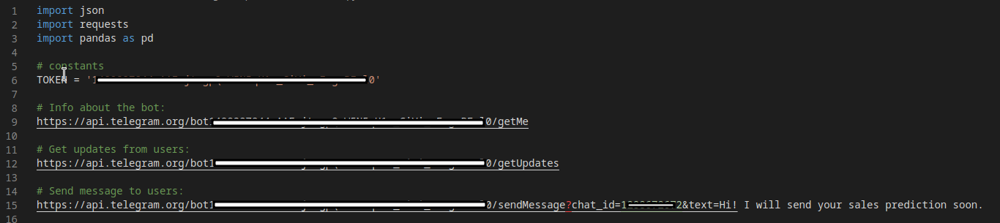

**Now we are all set to customize our bot to our needs**:
- Steps:
  - To send a customized message to users, create `send_message` function with chat_id and text arguments. In the test ran earlier, we already knew the chat_id and the text we wanted to sent to Telegram; however, in real life, we won't know who's requesting (chat_id) and we would want to customize the text according to the information the user sent:

  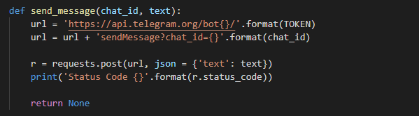

  - to receive the store prediction request from users, we create a new endpoint (flask app) connected to a port 5000 (flask port). When the user sends a request, Telegram will redirect it to the endpoint. Once the endpoint is called, it runs the `index` function that checks whether the information sent by the user is valid or not. If valid, it calls the data transformation steps and generate sales predictions for the store the user requested a prediction. Note that `send_message` function is constantly called under the if-else conditional statements: this is to ensure that our user gets an customized answer according to the data he sent to our bot:

  
  
  - Note that we have included a lineplot that shows the sales revenues prediction progress by each week. We use the buffer module `BytesIO()` to keep the plot as bytes, and use the `send_photo()` method from the `telegram` package to retrieve the the plot and send back to the user. Here we import the libraries as `from io import BytesIO` and `import telegram` in the beginning of the script;

  

  - a `parse_message` function was created to extract the chat_id and store_id from the user's request. If the store_id is invalid, it returns the message "error":

  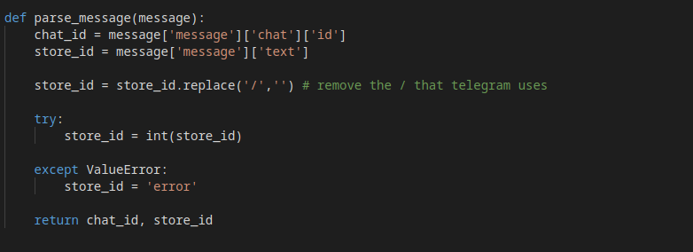

  - the `load_dataset` function was updated in case there is no sales' data entry for a specific store a user wishes to get predictions. In such case, the function returns the message "error":
  
  

**Let's test the bot in the local host**:
  - Use ngrok service (for free) to make the local host (your pc) available in the internet. Whenever a API request comes from Telegram, the request is redirected from the internet (by port 80) to your pc (port 5000 - flask). Complete installation and set the service to connect with port 5000:

  

  and copy the https url that ends in ngrok.io.

  - To make Telegram send the user's messages to the endpoint, we use the WebHook method from Telegram. We copy the same link from the GetUpdates method, but substitute it by the webhook method and include the url we just copied in the previous step.
  
  Then, we copy and paste the link to the web browser. If message "Webhook was set" is shown, then Telegram is connected with our endpoint `https://f690a0cf7282.ngrok.io`:

  

  - Activate the rossmann API by running `python rossmann-bot.py` on terminal;

  - Test all entry possibilities on Telegram. Seems like our app is working fine:
  &nbsp; 
  

  &nbsp;

  Telegram is returning messages, graphs, and sales predictions correctly, so  we are ready to put our entire project on Heroku!

### III. Final Deploy on Heroku

Last step of this project! To deploy our project on Heroku, we will follow the same steps we did in [production environment](#iii-production-environment) step with a few changes. 

As we did before, we will need to perform the following steps in the `rossmann-telegram-api` directory:

- Create Procfile archive with `web: rossmann-bot.py` on it: this file starts the API on Heroku;
- Update requirements.txt with `pip freeze > requirements.txt`: this file contains all libraries of the project. With this, we set up our exact local environment to production;
- Remove absolute paths and insert relative paths in rossmann-bot.py. In this file, we only had to change paths for the `load_dataset()` function:

- Copy relevant datasets to directory. In this case, we copy `store.csv` and `test_with_customers.csv`;

- In rossmann-bot.py, create variable port that takes os.environ.get('PORT', 5000). This is to make sure Heroku uses Flask port 5000 when activating the API. Import os library:

- Create git repository with `git init` on terminal: we set all the relevant archives in a git repository to be sent to Heroku. Then, run `git status`, `git add .`, `git commit -m 'commit name'`;

- Log in Heroku through terminal by `heroku login`. If logged, the following message will appear in terminal:

- Create a new Heroku app called `rossmann-telegram-bot-final` with `heroku apps: create` command. It will show Heroku's endpoint (right link) that we will use later:

- Run `git push heroku master` to send the repository to Heroku. It may take a while since it will install all packages;
- When we connected the telegram API with the local host with ngrok, we have used an Webhook method from telegram at the end of the url like this `https://api.telegram.org/bot**********/setWebhook?url=https://f690a0cf7282.ngrok.io`. Now we need to delete that Webhook by running the following url on the web browser: `https://api.telegram.org/bot**********/deleteWebhook`:
_Quick note: I used ****** to hide the token._ 

Then, we connect Heroku and Telegram by substituting the end part of the url by Heroku's endpoint, and running the url on the web browser: `https://api.telegram.org/bot**********/setWebhook?url=https://rossmann-telegram-bot-final.herokuapp.com/`

- Test the model on Telegram and retrieve predictions. If succeded, the project was successfully implemented and the company's stakeholders will be able to use the solution on their devices.

[back to top](#table-of-contents)

---

## Conclusion

In this project, all necessary steps to deploy a complete Data Science project to production were taken. Using two CRISP-DM project management methodology cycles, a satisfatory model performance was obtained by using the XGBoost algorithm to predict sales revenue for Rossmann stores, and useful business information was retrieved during the exploratory data analysis section. Other than that, the project met the criteria of arranging a suitable solution for the company's stakeholders to access sales predictions on a smartphone application.

I took approximately two months to complete this project. From retrieving and cleaning the company's data, conducting descriptive statistics analysis, modeling the machine learning algorithms for regression, to grasp the main ideas behind deployment and production environment settings, this project was challenging in many ways. Among the challenges, the biggest one was documenting this project in a clear, neat way - I hope I had delivered it in the right tone. 

Other challenges would include: (1) the need for further information on each Rossmann store designated in the dataset - mainly geolocation information; (2) the lack of publicly available data about Rossmann in English; (3) more precise definition on the variables' description from the Kaggle dataset - especially the variables `assortment` and `store_type`; (4) time management and computer processing limitations, since the entire project was done in my personal laptop - processing times were extremely long when training machine learning models and running feature selection algorithms. 

However, it is important to note that solutions for the aforementioned challenges could be easily overcame if one has tackled this project from within the company. Therefore, this project is not targeted at achieving the best solution possible but to show how a Data Science project can be implemented in a structured, fast-paced way with the CRISP-DM methodology. 

Hope you have enjoyed the journey with me!

[back to top](#table-of-contents)

---

## Appendix I Datasets

| No | Name | Source | Link |
| -- | -- | -- | -- |
| 1 | cpi_germany.csv | OECD | https://stats.oecd.org/Index.aspx?DataSetCode=PRICES_CPI |
| 2 | interest_germany.csv  | OECD | https://stats.oecd.org/index.aspx?queryid=86 |
| 3 | germany_gdp.csv | OECD | https://stats.oecd.org/index.aspx?queryid=66948# |
| 4 | unemployment_germany.csv | OECD | https://stats.oecd.org/index.aspx?queryid=36324 |
| 5 | CCI_germany.csv | OECD | https://data.oecd.org/leadind/consumer-confidence-index-cci.htm |
| 6 | stores.csv | Kaggle | https://www.kaggle.com/c/rossmann-store-sales/data?select=store.csv |
| 6 | train.csv | Kaggle | https://www.kaggle.com/c/rossmann-store-sales/data?select=train.csv |
| 6 | test.csv | Kaggle | https://www.kaggle.com/c/rossmann-store-sales/data?select=test.csv |
| 6 | test_with_customer | Author | https://github.com/alanmaehara/Sales-Prediction/blob/master/data/test_with_customers.csv |

[back to top](#table-of-contents)

