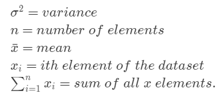
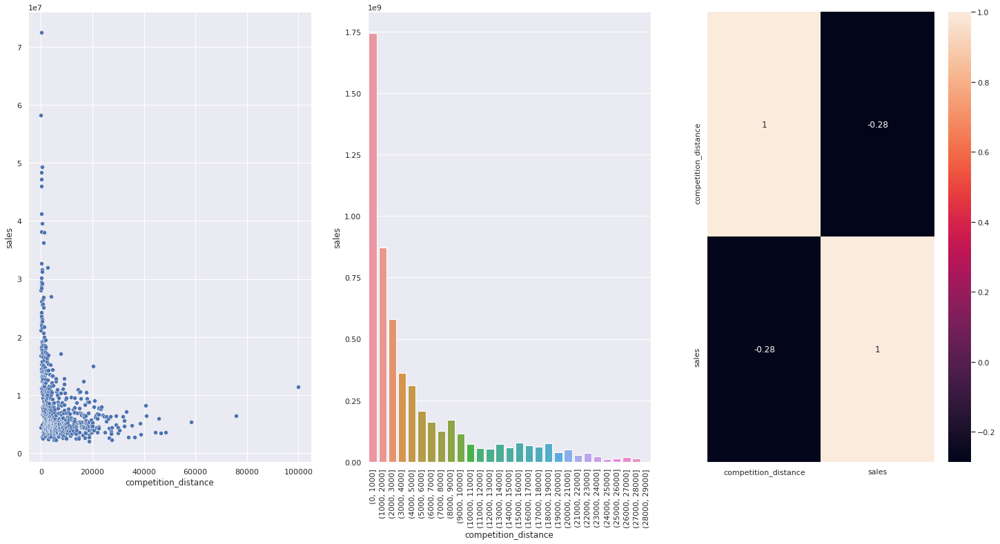

# From Statistics 101 to Production: a Sales Prediction Project for Rossmann

_This sales prediction project uses data from Rossmann, a Germany-based drug store chain with operations over more than 3,000 stores across seven european countries. The dataset is publicly available from a [Kaggle competition](https://www.kaggle.com/c/rossmann-store-sales/data)._

For starters in the Data Science field, it is not always clear how to build end-to-end solutions to solve complex problems involving data. Understanding how to tackle such challenges is key, so does understanding the reasoning behind each step. With this in mind, this project have four goals:

1. Tackle a classic Data Science problem faced by many firms: sales prediction.
2. Go through the statistics theory behind our project steps. We will go deep enough to make sense of the concepts, but won't reach to a point where we bog ourselves down in the road.
3. Unlock insightful information for the business by doing a thorough, detailed data study over the company's data.  
4. Deploy a complete solution suitable for the business needs. Here, we will go from understanding the business demands and prepare the data, to Machine Learning (ML) modeling and posterior production.

#### Special Mention

This project was born from [Meigarom Lopes](https://github.com/Meigarom)'s course _Data Science em Produção_. In this course, learners apply a data science solution from scratch from a business perspective. The course goes through the design and implementation of a machine learning project departing from data collection to deployment - for more details, please check his course (in portuguese) [here](https://sejaumdatascientist.com/como-ser-um-data-scientist/).

#### How to read this README.MD?

This is a very extensive README since it carries the responsibility of showing the project outcomes and also to explain the statistics under the hood of our algorithms and analyses. There is also a somewhat palatable length of explanations on the reasoning of each step in this project. Here is my suggestion for the readers:

1. If you are an **experienced reader and don't mind going directly to a notebook**, access the notebook [here](https://github.com/alanmaehara/Sales-Prediction/blob/master/notebooks/cycle02_rossmann_sales_prediction.ipynb) and go back to the [table of contents](#table-of-contents) whenever some explanation is lacking there. 
2. If you wish to **read the project's main findings instead of going through the entire project**, look no further and [get there.](#main-findings)
3. **If you wanna bear the adventure with me**, just read the entire readme. A [(go to next section)]() hyperlink will be available for each section to make your reading smoother, and a [(skip theory)]() hyperlink will be there to skip technical explanations. Codes for this project can be found [here](https://github.com/alanmaehara/Sales-Prediction/blob/master/notebooks/cycle02_rossmann_sales_prediction.ipynb).

I would appreciate any comments or suggestions on how to improve this project. Please feel free to add me on GitHub or [Linkedin](https://www.linkedin.com/in/ammaehara/) - I will get back to you as soon as possible. 

With no further due, let's get started!

---
## Table of Contents
- [Brief Intro - Dirk Rossmann GmbH](#brief-intro-dirk-rossmann-GmbH)
- [Main Findings](#main-findings)
- [Project Methodology](#project-methodology)
- [Cycle Description](#cycle-description)
- [01. A Business Request](#01-a-business-request)
- [02. Data Preparation](#02-data-preparation)
- [03. Feature Engineering](#03-feature-engineering)
- [04. Exploratory Data Analysis (EDA)](#04-exploratory-data-analysis-eda)
- [05. Data Preprocessing](#05-data-preprocessing)
- [06. Feature Selection](#06-feature-selection)
- [07. Machine Learning Modeling](#07-machine-learning-modeling)
- [08. Hyperparameter Tuning](#08-hyperparameter-tuning)
- [09. Error Interpretation & Business Performance](#09-error-interpretation-business-performance)
- [10. Deploy Machine Learning Model to Production](#10-deploy-machine-learning-model-to-production)
- [11. A Sales Predictor Bot](#11-a-sales-predictor-bot)
- [Conclusion](#conclusion)
- [Appendix 1 - Datasets](#appendix-1-datasets)
- [Appendix 2 - References](#appendix-2-references)

---
## Brief Intro - Dirk Rossmann GmbH

[(go to next section)](#main-findings)

Dirk Rossmann GmbH (Rossmann) is a private, German drug store chain founded in 1972 and is a key player on the European pharmacy market, with operations in healthcare and beauty retail industries. According to [Bloomberg](https://www.bloomberg.com/profile/company/122549Z:GR), Rossmann offers a wide range of products including baby and body care, hygiene, sun protection, cosmetics, dental hygiene, household, pets, hair care, perfume, fragrances, and food products. 

 Aside from the +2,000 on-site Germany stores (see stores location [here](https://www.rossmann.de/de/filialen/index.html)), Rossmann operations extend to Poland, Czech Republic, Turkey, Albania and Hungary, totaling +4,100 on-site stores. 
 
 Rossmann is also active on e-commerce for Germany-based customers, with around [$30 million EUR in online revenues per year](https://www.world-today-news.com/the-giant-of-cosmetics-and-drugstore-rossmann-fixed-in-valencia-the-venue-for-its-deployment-in-spain/), making up for 15.2% of market share in Germany. Complete financial data is not publicly available - although [Dun & Bradstreet](https://www.dnb.com/business-directory/company-profiles.dirk_rossmann_gmbh.7342471a5e75a2072c060665843eeecd.html#financials-anchor) claims that Rossmann's 2018 annual revenue was approximately \$9 billion EUR. 

[back to top](#table-of-contents)

---
## Main Findings

[(go to next section)](#project-methodology)

dasdadasdasdas

[back to top](#table-of-contents)

---

## Project Methodology

[(go to next session)](#cycle-description)

For this project, we will use the CRISP-DM as the main method for project management. CRISP-DM stands for "**CR**oss-**I**ndustry **S**tandard **P**rocess for **D**ata **M**ining",  and is considered as one of the gold standards for project management methods in Data Science. For further details on the methodology, Himanshu Shekhar has a [great introduction article](https://medium.com/voice-tech-podcast/cross-industry-standard-process-for-data-mining-crisp-dm-9edc0c5e3a1) to CRISP-DM, although the usage of this method will be easily understood if one follow along with the project's next steps.

The CRISP-DM is a project management methodology that shows a 360º outlook of data science projects. It is composed of six steps that together forms a complete CRISP-DM cycle as follows:

### The CRISP-DM Cycle
  
&nbsp;

  

&nbsp;

Each cycle is iterative and future cycles serve as a way to improve the current project. There are many benefits for using CRISP-DM as a project management method. Here I highlight three main reasons in favor of CRISP-DM:
*  Delivers an end-to-end solution;
*  Each cycle should be done in a fast-paced. Why? Think of you trying to perfect each and every single step until you are satisfied with the results. It is likely that you will spend weeks (if not months) on a single step, and therefore, won't deliver true value to business since time is usually a constraint;
* By going through a complete cycle, CRISP-DM users can get a grasp of the whole project and map all possible problems on time.

For the purpose of this project, I adapted the CRISP-DM methodology into five steps (instead of six) and allocated each item of the [table of contents](#table-of-contents) on every CRISP-DM step as follows:

**I. Business Understanding**
  * A Business Request

**II. Data Understanding and Data Preparation**
  * Data Preparation
  * Feature Engineering
  * Exploratory Data Analysis (EDA)
  * Data Preprocessing
  * Feature Selection

**III. Modeling**
  * Machine Learning Modelling
  * Hyperparameter Tuning

 **IV. Evaluation**
  * Error Interpretation & Business Performance

 **V. Deployment**

* Deploy Machine Learning Model to Production
* A Sales Predictor Bot

The purpose and application of each step will be shown through the project, so bear with me till the end!
___
## Cycle Description

[(go to next session)](#01-a-business-request)

In this project, you will see the results of the 2nd CRISP-DM cycle. See the log of each cycle below:

| Cycle      | Description | Notebooks |
| ----------- | ----------- | ----------- | 
| 1º      | In this cycle, the main dataset for this project was retrieved from [Kaggle](https://www.kaggle.com/c/rossmann-store-sales/data), and complementary datasets related to Germany's economic indicators were retrieved from [OECD.Stat](https://stats.oecd.org/). Customer related data was not utilized in this cycle since such data wouldn't be available at the prediction time.         | [cycle 01](https://github.com/alanmaehara/Sales-Prediction/blob/master/notebooks/cycle01_rossmann_sales_prediction.ipynb)
| 2º   | A few variables were added to the dataset. Number of customers (which was previously dropped from the model) were added. In order to allow this variable into the project, a complementary project to predict number of customers for each Rossmann store was done and predictions were added test dataset. We also remodeled the whole project to attend data leakage issues, although significant effects on performance were not observed.|[complementary project](https://github.com/alanmaehara/Sales-Prediction/blob/master/notebooks/rossmann_customers_prediction.ipynb) & [cycle 02](https://github.com/alanmaehara/Sales-Prediction/blob/master/notebooks/cycle02_rossmann_sales_prediction.ipynb) |

Exact source links of all datasets will be displayed on [Appendix 1 - Datasets](#appendix-1-datasets). 

[back to top](#table-of-contents)

---
## 01. A Business Request
[(go to next session)](#02-data-preparation)

We start this project with the most important step. Here we understand why a data-driven project needs to be done in first place. There are three tasks to be done:

- **Business Question**: understand the main issue to be solved/question to be answered. Answer the question: "What is the company's main problem and what information addresses this issue (what is the target variable?)
- **Issue Owner and Motive**: get to know who originated the request and why.
- **Solution Format and Deliverables**: identify the type of data problem to be solved. Check possible methods to solve the problem. Define the solution format (how users will access your solution) and granularity (eg: will it be a six-month sales prediction project or six weeks?).

Since we just have the sales dataset from Rossmann and we don't have professional ties with the company, we will create a hypothetical business situation to guide our project. 

### The Business Situation
Let's pretend that we are data scientists working for Rossmann, and that we have just received a business request from three sales managers. They were requesting the exact same thing: a sales forecast for the next six weeks on their respective regional areas. 

Later on, you find out that the CFO was the one who has made this business request to all sales managers. You reached out the CFO and got to know its initial motive: to figure out the total revenue per store after six weeks in order to finance upcoming investments for each store. Then, you suggest a sales forecast project that has as the main output the 6-week sales forecast to be displayed on a smartphone app.

- **Business Question**: what is the sales forecast for the next six weeks?
- **Issue Owner and Motive**: the CFO needs to plan the finance strategy for each store after two months (~6 weeks)
- **Solution Format and Deliverables**:
    - **Data Problem Type**: sales forecast
    - **Possible Solution Methods**: Regression, Time Series, Neural Networks 
    - **Deliverables**: 6-week daily sales forecast per store. Stakeholders (sales managers, CFO, CEO..) will be able to get forecasts from a smartphone app.

[back to top](#table-of-contents)

---
## 02. Data Preparation
[(go to next session)](#03-feature-engineering)

In this step, we work on acquiring data and get first impressions of our problem. Four tasks to be performed:

### I. Data Collection

Once we've set up the business problem and deliverables of our project, let's get our hands into data. Usually, one must check the data whereabouts: is your data publicly available or do you need to acquire it from the business? Will you have enough processing and capacity power to acquire the data? Or rather you figure out that you don't have the means to get the necessary data (in this case, the project might not be feasible). 

In our case, things a bit different. As mentioned in [Cycle Description](#cycle-description), our data comes from a Kaggle competition held by Rossmann. Therefore, our project is pretty limited on the information contained in the dataset. In real life, we would collect all information available in the company's data warehouse that helps answering our [Business Question](#01-a-business-request). As for this project, it is fine to proceed as it is, since we are running this project under a fictitional business standpoint.

**At this point, we should know what is the phenomenon that we are trying to predict (target variable): sales revenues.**

### II. Data Description

Once you get your hands on data for the first time, analyze the dimension of your data (how many rows vs columns?) and the data types (categorical data? numerical data? Discrete or continuous data?). For a reference on data types, check this [diagram](https://o.quizlet.com/8UUywzzaMhY2ZGHrWE7VkA_b.png). 

**A quick note on statistical terminology**: our sales variable, which is what we want to predict in this project, can assume many names such as _dependent variable_, _predicted variable_, _response variable_ or _target variable_. Other variables that helps us explain sales, they are commonly called _independent variable_, _predictor variable_, _feature_, or _explanatory variable_. In a regression model context, you might also see explanatory variables being called as _regressors_.

Our initial set of variables are as follows:

| Variable      | Description | Data Type |
| ----------- | ----------- | ----------- | 
| store   | a unique Id for each store  | numerical (discrete)  |
| day_of_week   | day of the week (1 = Monday, 7 = Sunday) | numerical (discrete)    |
| date  | date of each sales entry | date  |
| sales   | the turnover for any given day (this is what you are predicting) | numerical (continuous)   |
| customers  | the number of customers on a given day  | numerical (discrete) |
| open   | an indicator for whether the store was open: 0 = closed, 1 = open | numerical (dummy*)  | 
| promo  | indicates whether a store is running a promo on that day | numerical (dummy*)   |
| state_holiday   | indicates a state holiday. Normally all stores, with few exceptions, are closed on state holidays. Note that all schools are closed on public holidays and weekends. a = public holiday, b = Easter holiday, c = Christmas, 0 = None | categorical (nominal)  |
| school_holiday  | indicates if the (Store, Date) was affected by the closure of public schools: 1 = affected, 0 = not affected | numerical (dummy*)  |
| store_type   | differentiates between 4 different store models: a, b, c, d | categorical (nominal)  |
| assortment | describes an assortment level: a = basic, b = extra, c = extended | categorical (ordinal)  |
| competition_distance   | distance in meters to the nearest competitor store | numerical (continuous)   |
| competition_open_since_month  | gives the approximate month of the time the nearest competitor was opened | numerical (discrete)  |
| competition_open_since_year   | gives the approximate year of the time the nearest competitor was opened | numerical (discrete) | 
| promo2  | promo2 is a continuing and consecutive promotion for some stores: 0 = store is not participating, 1 = store is participating | numerical (dummy)  |
| promo2_since_week   |describes the calendar week when the store started participating in Promo2 | numerical (discrete) |
| promo2_since_year   |describes the year when the store started participating in Promo2 | numerical (discrete) |
| promo_interval   |describes the consecutive intervals Promo2 is started, naming the months the promotion is started anew. E.g. "Feb,May,Aug,Nov" means each round starts in February, May, August, November of any given year for that store | categorical (nominal) |

*dummy variable is one that takes either 0 or 1. For more details, check [here](https://en.wikipedia.org/wiki/Dummy_variable_(statistics)).

* **Data Dimensions (rows x columns)**: 

  * Train dataset: 969264 x 18 
  * Valid dataset: 47945  x 18
  * Date Range: 2013-01-01 (first) / 2015-07-31 (last)
  
To build a machine learning model, we need **training data**, which is a data that a machine learning algorithm work on to learn (or "train") the data patterns to create a prediction model, and a **validation data**, which is the data that the prediction (or "trained") model will generate predictions to check whether the model accurately works. 

In this project, we splitted the whole data into training and validation parts:
* **Training data** corresponds to all data entries between **2013-01-01 to 2015-06-19**
* **Validation data** contains entries from the last 6 weeks of available data, **2015-06-19 to 2015-07-31**. 

We splitted so that we could avoid [data leakage](https://www.kaggle.com/alexisbcook/data-leakage) (we will get into this later), and also to simulate how our model will predict sales revenues for each Rossmann store on a 6-week validation data. If our model works well, then we are good to predict sales revenues on the **test data**, which is the data we really want to predict sales revenues. 
* **Test data** corresponds to data entries between **2015-07-31 to 2015-09-16**. 

Once we validate our model, we can put it into "production", so that all stakeholders of this project can access sales predictions for the next six weeks.

This idea of splitting data into training, validation, and test will be clearer when we reach to the [Machine Learning Modeling](#07-machine-learning-modeling) part. For now, don't worry - just proceed to the next step.

### III. Data Cleaning

This is a crucial step to any data science project. Many Machine Learning algorithms don't cope well with missing (null) values or data that isn't in the right format. Here we perform two tasks:

* **Change data types**: In python, some features (columns) might not be in the right format to work on (e.g: variable "date" in string format instead of "date" format). In our case, we can simply use the pandas `.astype()` method to change data types.
* **Imputation**: check the volume of null values on each column of your dataset, and find a method to impute null values. Usually, a good way to determine the best imputation method is to reflect upon the reasons why you have null values for each feature on your dataset. 
    _Quick note: depending on the volume of missing values in the dataset, you might want to go back to the previous task "Data Collection"._

    
Let's check the missing values for each dataset:
* Null Values for training data: 

* Null Values for validation data: 

The imputation method for each variable is as follows:
  * **promo_interval**: fill null values with 0 (store is not participating in consecutive promo sales "promo2") 
  * **competition_distance**: fill null values with 100000. The reason is that null values are probably an indicative that stores don't have closer competitors. Therefore we fill out with a value way above the maximum competition distance seen (75860m)

  The following variables don't seem to have an ideal imputation method. Imputing null values with mean, median, or zero doesn't sound good, due to the high percentage of null values. Therefore we use the `date` column:
  * **promo2_since_week**: fill with the week number located in `date` 
  * **promo2_since_year**: fill with the year located in `date` 
  * **competition_open_since_year**: fill with the year located in `date` 
  * **competition_open_since_month**: fill with the year located in `date`   

### III. Descriptive Statistics

Descriptive statistics is a summary of the data. It quantitatively describes the data by using some statistic metrics depending on the nature of your data. 

For numerical variables, we usually use statistics that measure **dispersion** (Variance, Standard Deviation, Range, First and Third Quartiles, Minimum, Maximum, Skewness, Kurtosis) and **central tendency** (mean, median). Find below a quick explanation on such measures.

[(skip theory)](#numerical-data)

Let's start with measures of **Central Tendency**, which are measures of where the center of a data set lies:

##### 1. Mean
Most commonly known as the "average", the mean (or arithmetic mean) is equal to the sum of a list of values divided by its total number of elements:

where,

##### 2. Median
Median (or the "middle" value) is simply a value separating the data on half. It is also known as the 2nd quartile (Q2). The median is best understood when given an example:

  
 
* List A has 7 elements; for odd-numbered lists, we find the median by picking the middle term, which is **4**.
* List B has 4 elements; for even-numbered lists, the median is the average of the middle two numbers: **2**

Now we turn our focus to measures of **Dispersion**:

#####1. Variance:

Variance is the average of the squared differences from the mean. It measures how far a set of numbers is spread out from their mean (average) value. In order to calculate the variance, find the mean value and subtract its value from each number on your set. Then square the result, and average it:

where,

**2. Standard Deviation**

As we can notice from the formula above, standard deviation is just the square root of the variance. This is usually a better statistic to measure data dispersion than variance, since it gives a meaningful interpretation to its values. To better understand the concept of standard deviation, let's graph a normal distribution curve like the one below (graph retrieved [here](https://upload.wikimedia.org/wikipedia/commons/thumb/8/8c/Standard_deviation_diagram.svg/1024px-Standard_deviation_diagram.svg.png)). The x-axis represents the standard deviations from the mean (centered on zero), and can assume negative or positive values. The y-axis is the probability density function (PDF) and represents the likelihood of an outcome to happen. 

Data that follows a normal distribution has its mean, median and [mode](https://en.wikipedia.org/wiki/Mode_(statistics)) values centered around zero, and have a bell-shaped curve. One example of data that falls into a normal distribution is the height of human beings. Since most people aren't super tall nor very short, their height tend to converge closer to a mean value. 

Here's where the standard deviation comes into play: for normal distributions, around 68% of the world's population height falls between -1 and +1 standard deviations from the mean. If we go to +-2 standard deviations, then we could say that 95% of our population height falls into that threshold. Going even further, we could say that 99.7% of the world's population heights are included within +- 3 standard deviations from the mean.

In our project, however, we can´t assume that our variables follows a normal distribution (we will see graphs proving it). With this in mind, we calculate the standard deviation for each variable we got in our dataset in order to find out how spread the data is. For example, if the variable "customers" has low standard deviation (let's say 5), it means that the number of customers in our dataset is not widespread and are closer to the mean values of customers. On the other hand, if standard deviation is very high (think of 20 or higher), then the number of customers are too sparse. The following graph (with mean equal 100 customers) illustrates the situation for normal distributed variables (graph retrieved [here](http://www.skillpower.co.nz/wp-content/uploads/2015/12/mmm.png)):

_Quick note: while the result of the standard deviation can't be negative, standard deviation thresholds on a distribution can assume negative and positive values to determine dispersion from the mean value (as we showed on the first graph)_

**3. Minimum/Maximum**

Minimum is the smallest value found from a list of numbers. Maximum is the biggest value found from the same list.

**4. Range**

Range is the difference between the lowest and highest value. This is a useful statistic that also tell us about the statistical dispersion of the data, and shows a rough idea of the magnitude and scale of our data.

The range of list A is simply:

**5. Quartiles**

Quartiles are values that divide a list of numbers into quartiles (four or less equal parts). We usually have three types of quartiles:
  *  **1st Quartile (Q1)**: also known as the 25th percentile, it cuts the lowest 25% of data.
  *  **2nd Quartile (Q2)**: known as the 50th percentile, it cuts the dataset in half. Its value is also the **median**. 
  *  **3rd Quartile (Q3)**: known as the 75th percentile, it represents the value that splits 75% of the data from the top 25%.

A illustration might help internalizing the idea behind quartiles (retrieved from [here](https://www.mathsisfun.com/data/images/quartiles-c.svg)):

We also have the Interquartile Range (IQR), which is the difference between Q3 and Q1. In the illustration above, IQR would be 4.

This is a good moment to explore **boxplots**, which is a very useful tool for statistic analysis and uses concepts related to quartiles, minimum and maximum, and outliers. I will explain just enough to make ourselves comfortable with boxplots, but you may find a complete explanation on the topic by [Michael Galarnyk](https://towardsdatascience.com/understanding-boxplots-5e2df7bcbd51).

Boxplots is a controlled, neat way to visualize the variability of our data. On the x-axis, the numbered ticks represent the values that our data can assume. The figure above shows numbers ranging from -4 to +4 but they could be really any number, for example, from 50 to 250 centimeters (human body height) to -20 to +40 Cº (temperature in celsius).
There are many ways to read a boxplot, but whenever I deal with them I take the following steps:
  1. **Find the median**: you can identify the median (Q2) as the yellow line that divides the red box into two parts.
  2. **Identify the Interquartile Range (IQR)**: the IQR is the whole red box and represents 50% of your data. If you read the boxplot from right to left, the Q1 is the line where the IQR box starts, and the Q3 is where the IQR box ends. 
  Just by reading the IQR box, one can understand the variability of the data. If the median line is symmetric between Q1 and Q3, your data distribution is more symmetric. Otherwise, if the median line is closer to either Q1 or Q3, then the distribution is asymmetric.
  3. **Minimum/Maximum**: the minimum and maximum values in a boxplot **are not equal** to the data's true minimum and maximum values. In a boxplot, minimum (also known as _lower fence_) is the difference between the value representing the 25th percentile of your data (Q1) and 1.5 times the IQR. Maximum (or _upper fence_) is the sum of the value representing the 75th percentile of your data (Q3) and 1.5 times the IQR.
  4. **Outliers**: outliers are data points that differs greatly from other data points. You can identify them as mini-circles in the extreme sides of a boxplot. The threshold that determines whether a data point is an outlier or not is the minimum and maximum values.

Let's check a practical example that records time slept (hours) by an individual across weekdays (graph retrieved [here](https://plot.ly/static/img/literacy/boxplot/boxplotfig9.jpg)):

Although these boxplots are in vertical position, there's nothing different in terms of data interpretation. 
Let's start by looking at Monday's boxplot. The median for Monday is approximately 7.5 hours of sleep, with its median mark closer to the Q3 value, which indicates that the data distribution is asymmetrical (this individual has slept between 6 to 7.5 hours more frequently). Now see the box on its entirety: 50% of the time, this person has slept between 6 to 8 hourse on Mondays and no unusual time sleep hours were recorded (no outliers). 
Now look at the Thursday boxplot. On thursdays, this individual had 5.5 to 6.5 hours of sleep 50% of the time. The box size is very small, which indicates that the data distribuion is more concentrated on the median value (and less dispersed compared to Monday). Sadly, this person slept less one day - there is an outlier around 2.5 hours of sleep.

**6. Skewness**

Before explaining skewness, we need to understand what is a random variable and a probability distribution. 

According to [Yale](http://www.stat.yale.edu/Courses/1997-98/101/ranvar.htm), a **random variable** (usually described as X) is a variable whose possible values are numerical outcomes of a random phenomenon. For example, flipping a coin 100 times is a random phenomenon - there is no way to know the outcome for each and every single coin flip unless you actually flip the coin 100 times. But you know that there are only two possible outcomes: heads or tails. When we quantify our possible outcomes - let's say, X = 0 for tails and X = 1 for heads, then we got a random variable.

A **probability distribution** is a list of probabilities associated with each and every single possible values of a random variable. In the graph below, let's say that we calculate the probability distribution on the event (or probability) of getting heads [P(X = 1)], from 100 coin flips. Our distribution is plotted below:

Each bar represents the event of flipping a coin 100 times. Assuming that our coin is not biased (in other words, don't tend to flip one side more than the other), then we notice that our probability distribution has a bell-curve shape resembling a normal distribution with mean 50. Therefore, the probability of getting 50 heads when flipping a coin 100 times is the highest one. It makes sense - if you flip a coin 100 times on your own, you might get a number of heads that is close to 50. This has a theory behind it - the [Law of Large Numbers](https://www.investopedia.com/terms/l/lawoflargenumbers.asp), which states that as the sample size grows, its mean gets closer to the average of the whole population. In our flip-a-coin case, if we flip a coin 1000 times instead of 100 times, we would have a probability distribution with a very narrow bell-shaped curve closer to the mean 50.

Now we are ready to dig into **skewness**. Skewness is the degree of distortion (or a measure of the asymmetry) of a probability distribution of a random variable about its mean. In the graph below, we see three graphs: (1) a distribution with positive skew; (2) a symmetrical distribution with zero skewness; (3) a distribution with negative skew.

Take a closer look on the graphs. The one with positive skew has a longer, fatter tail on the right side of the distribution. It has a mean value greater than the median and mode, and its peak is on the left side. Now look to the symmetrical distribution graph in the middle. It has its mean = media = mode - basically a normal distribution curve with a centered peak. The last one, with negative skew, has a longer, fatter tail on the right side and its mean value is lower than the median and mode, with a peak located on the right side. 

You can also tell the direction (but not the number) of outliers in a skewed distribution. For positive skewed curves, outliers are most present on the right side of the curve, while for negative skewed curves is just the opposite side.

In the real world, data not always assume a normal, symmetric bell-curved shape as the graph depicted in the middle. For instance, there are many types of distribution that describes data (see a few examples [here](https://www.google.com/imgres?imgurl=http%3A%2F%2Fimage.sciencenet.cn%2Falbum%2F201609%2F13%2F175607zopgnj40j00so4ee.png&imgrefurl=https%3A%2F%2Fwww.kaggle.com%2Fgetting-started%2F81761&tbnid=t4_CFhWWxcakyM&vet=12ahUKEwiMuMipvrnsAhWEAbkGHTpyBJkQMygJegUIARCiAQ..i&docid=wiph3DFgr5Q8AM&w=680&h=735&q=distributions%20cheat%20sheet&client=firefox-b-d&ved=2ahUKEwiMuMipvrnsAhWEAbkGHTpyBJkQMygJegUIARCiAQ)). This is the reason why an analysis on skewness is important: it shows how data behaves and what we can do about it when doing ML modeling. 

A very good example on how we should take care of skewness is depicted by linear models, since such models takes the assumption that the independent variable follows the same distribution as the target variable. Let's look on an example depicted by [Abhishek Sharma](https://www.analyticsvidhya.com/blog/2020/07/what-is-skewness-statistics/) on its article about skewness in statistics. Let's say you want to predict the mpg (miles per gallon) of a car by running a linear regression that has one independent variable: horsepower:

The shape of this distribution resembles the one with positive skewness. Since your data is concentrated on the left side, our linear model will give us good mpg predictions on cars with low horsepower, but will probably perform poor predictions on cars with high horsepower. In this case, skewness is a problem and we usually use rescaling techniques that helps us reshaping the distribution of skewed variables. We will get into more details on rescaling in the [Data Preprocessing](#05-data-preprocessing) part.

To determine when skewness is symmetrical or not just by looking at skewness values, you can check the table below:

| Skewness     | Distribution shape | 
| ----------- | ----------- |
| skew between -0.5 and 0.5 | Symmetrical |
| skew between -1 and -0.5| Negative, moderately skewed | 
|skew between 1 and 0.5| Positive, moderately skewed |
| skew lower than -1| Negative, highly skewed|
| skew higher than 1| Positive, highly skewed|

&nbsp;
**7. Kurtosis**

Kurtosis is a measure of tailedness of a probability distribution - therefore, it solely focuses on the tails. This is a great statistic to measure the presence of outliers on our distribution. 

Data distributions with **high kurtosis** (K > 3) indicates that the data has many outliers, and therefore, a detailed investigation on outliers are a must. Distribution with **low kurtosis** (k < 3) has fewer and less extreme outliers.

There are three types of kurtosis as follows:
  * **Leptokurtic (K > 3)**: Distribution has fatter, longer tails, a sharp peak;
  * **Mesokurtic (K = 3)**: Distribution resembles a normal distribution;
  * **Platykurtic (K < 3)**: Distribution has shorter, thinner tails. 

In summary, skewness and kurtosis serve us to indicate: (1) how our data is distributed and if we should be extra careful during data preprocessing; (2) presence of outliers and if we need to figure out a way to make our model more robust to outlier effects.

Now, let's go back to our project! Here we separate numerical and categorical data to perform this step. 

##### Numerical data:

##### Categorical data (boxplots):

Some notes from the summary statistics above:
* `competition_distance, competition_open_since_year` are heavily skewed;
* `customers, competition_distance, competition_open_since_year` have a high kurtosis, which indicates a profusion of outliers;
* `state_holiday, store_type, assortment` have many outliers.

[back to top](#table-of-contents)

---

## 03. Feature Engineering

[(go to next session)](#04-exploratory-data-analysis-eda)

In this task, we create new features (variables) on our dataset based on the existent set of variables. Our main compass for feature creation is the business needs; therefore, three tasks must be performed:

### I. Hypothesis List

In order to guide our feature engineering process (and later on, our [exploratory data analysis](#04-exploratory-data-analysis-eda)), we need to create a hypothesis list first. Hypothesis should be testable (you should able to reject or fail to reject it), and must be written as a clear statement that exposes a personal belief to be tested. In our project's case, we will write hypotheses that are connected with the target variable (sales).

To guide our hypothesis list creation, a mindmap is a great tool to map all factors that influences our target variable.

#### Stores
1. Stores with more employees sell more
2. Stores with bigger available stock sell more
3. Bigger stores sell more
4. Stores with extended assortment type sell more
5. Stores near competitors sell less
6. Stores with newly opened competitors sell less than stores with old competitors

#### Time
1. Stores sell more on weekdays than weekends/holidays
2. Stores sell more during the 2nd semester
3. Stores sell more during summer/winter breaks (schools)
4. Stores sell less during school holidays
5. Stores sell more on Christmas than other holidays
6. Stores sell more after day 10 of each month
7. Stores sell more along the years

#### Products
1. Stores with higher marketing investments sell more
2. Stores with products in promotion displayed at the entrance sell more
3. Stores with cheaper products sell more
4. Stores with aggresive price strategies sell more
5. Stores frequently doing standalone promo sales sell more
6. Stores doing consecutive promo sales in the beginning of the year sell more
7. Stores participating in consecutive promo for a longer time sell more
8. Stores with more consecutive promo sale days sell more

#### Customers
1. Stores with more customers who have children sell more
2. Stores with more customers who have higher income sell more
3. Stores with more elderly customers sell more
4. Stores with more customers who have higher # of family members sell more
5. Stores with more loyal customers sell more

#### Location
_note: Location of each store is not given. Hypothesis are displayed below just for the purpose of completeness._

1. Stores with higher pedestrian count (front street) sell more
2. Stores located in an expensive neighborhood sell more
3. Stores located in urban areas sell more
4. Stores located in residential areas sell more
5. Stores near schools sell more
6. Stores near shopping malls sell more
7. Stores located inside malls sell more than standalone stores

#### External Factors (Economy, Healthcare, Weather)
* **Economy**: usually macroeconomic data is not very relevant to analyze a firm's sales performance - there are some markets that thrive even when economic indicators are bad.  
Another caveat to economic indicators is that Rossmann stores are not located in Germany on its entirety, and we don't know their precise location since they are unknown in the dataset. 
Some macroeconomic data could be relevant if divided by location or month/week, but at the time this project was done, data was not available. 
Another aspect to be considered is the Germany's economy. From 2013 to 2015, Germany has always ranked in the top 10 economies in GDP per capita with high HDI value. Therefore, economic fluctuations over the time span would not affect directly Rossmann stores. Therefore, some hypotheses are displayed below just for the purpose of completeness.
* **Healthcare**: relevant data (per month) was either unavailable on public datasets or not possible to be utilized. Therefore, some hypotheses are displayed for the purpose of completeness.
* **Weather**: although Rossmann stores are mainly located in Germany, their location is not present on the dataset. Therefore, the usage of weather as a predictor for this model would be a big assumption to take, but hypotheses were written below for the purpose of completeness.

1. Stores within areas with low unemployment rate sell more
2. Stores within areas with high number of patients sell more
3. Stores within areas with high Gross Domestic Product Per Capita (GDPpc) sell more
4. Store sales increase when GDPpc increases (month)
5. Store sales increase when interest rates decrease (month)
6. Store sales increase when Consumer Price Index (CPI) rate increases (month)
7. Store sales increase when the number of patients hospitalized (per month) increase
8. Store sales increase when the air quality gets worse (AQI)
9. Store sales increase when the weather is above 28ºC or below 18ºC
10. Store sales increase when Consumer Confidence Index (CCI) rate increases (month)
11. Store sales increase when Unemployment rate decreases (month)

### II. Viable Hypothesis List

From 44 hypothesis listed, we select **19 hypothesis** that can be tested with the current dataset. Our feature engineering process will be focused on answering the following hypotheses:

1. Stores with extended assortment type sell more
2. Stores near competitors sell less
3. Stores with newly opened competitors sell less than stores with old competitors
4. Stores sell more on weekdays than weekends/holidays (sales rate)
5. Stores sell more during the 2nd semester
6. Stores sell more during summer/winter breaks (schools)
7. Stores sell less during school holidays
8. Stores sell more on Christmas than other holidays
9. Stores are selling more along the years
10. Stores sell more after day 10 of each month
11. Stores frequently doing standalone promo sales sell more
12. Stores doing consecutive promo sales in the beginning of the year sell more
13. Stores participating in consecutive promo for a longer time sell more
14. Stores with more consecutive promo sale days sell more
15. Stores sales increase when GDPpc increases (month)
16. Stores sales increase when interest rates decrease (month)
17. Stores sales increase when Consumer Price Index (CPI) rate increases (month)
18. Stores sales increase when Consumer Confidence Index (CCI) rate increases (month)
19. Stores sales increase when Unemployment rate decreases (month)

### III. Feature Engineering

The main purpose of feature engineering is to improve the performance of our predictive model. New variables added to a machine learning model can contribute in many ways, such as creating a more accurate model that better predicts our target variable, or making our model simpler and less complex by creating independent variables that better explain the dependent variable. In this project, we will also use the new variables to help us reject/fail to reject our hypotheses on the [Exploratory Data Analysis](#04-exploratory-data-analysis-eda) section.

The following tasks were performed on this part:
* We used the variable `date` to create time-related variables. Now we have new variables that explains how long stores were holding traditional and consecutive promotion sales, and how long stores were facing competition from other companies. All time-related variables are divided by day, month, and year;
* We also used the variable `date` to get a better sense of seasonality - `day, month, year, year_week, is_weekday` variables were created;
* Variables with data described by single letters were transformed into full text (e.g: all 'a' in variable `state_holiday` were transformed to 'christmas') 
* Germany's Gross Domestic Product (GDP) per capita, Consumer Price Index (CPI), interest rates, unemployment rate, Consumer Confidence Index (CCI) datasets were added as new variables. All economic indicators correspond to month values except for GDPpc (quarters). See below a description of these indicators (retrieved from [OECD](https://stats.oecd.org/) - all dataset references are available in [Appendix I - Dataset](#appendix-dataset)):
  * **Gross Domestic Product (GDP)**: monetary measurement of all goods and services produced within a country. income per capita (per head), in US$ (current prices) and current PPPs, adjusted quartely;
  * **Consumer Price Index (CPI)**: measures inflation by looking at the average price changes from a basket of consumer goods and services of a country. The base year is 2015 (2015 = 100).
  * **Interest Rate**: interest rate is the cost of borrowing money. The rate is usually set by governments or central banks. Here we use long-term interest rates, per cent per annum, divided monthly.
  * **Unemployment Rate**: measurement of changes in unemployment within a country. Unemployment rate is the fraction of total number of unemployed population by the total number of active population. 
  * **Consumer Confidence Index (CCI)**: measurement of consumer confidence within a country, it indicates how future developments on consumption and saving will be based on the current households' economic situation. Values below 100 indicate a pessimistic attitude towards future developments in the economy, possibly resulting in a tendency to save more and consume less.  

## Appendix I - Datasets

### IV. Filtering Variables
In this part, we need to check the business restritions that should be considered in the project and filter variables/rows from the dataset that can't be used to predict sales revenues.

We divide this part into two tasks:
* **Data Entry Filtering**: data entries with characteristics that won't be considered on the model should be excluded from the dataset. Here we removed closed stores and stores with no sales revenue, since such entries are irrelevant to our goal of predicting sales revenue. 
* **Column Selection**: variables that won't be available at the moment of prediction must be dropped from the dataset. In the 1st CRISP-DM cycle, we dropped the number of customers from the training dataset since this feature was not present in the test dataset. It makes sense, since this is a business restriction: there is no way to know the number of customers at the time we predict sales revenues for the next six weeks. In order to keep the number of customers in the model, we have created a [new project](https://github.com/alanmaehara/Sales-Prediction/blob/master/notebooks/rossmann_customers_prediction.ipynb) that predicts number of customers for the next six weeks for each Rossmann store, and included results on the test dataset. Otherwise, we wouldn't be able to use this variable in our project.

[back to top](#table-of-contents)

---

## 04. Exploratory Data Analysis (EDA)

[(go to next session)](#05-data-preprocessing)

We shift our focus to explore our dataset and generate valuable insights for the business. This is what Exploratory Data Analysis (EDA) really means: to go even further on our data to unlock precious insights from it. An EDA is an important step to get a sense of which variables are vital to our prediction model, and how our features relate to the target variable. 

We will divide this task into three parts:
1. **Univariate Analysis**: check data distribution of each feature and get a first look on how your data is organized as a whole;
2. **Bivariate Analysis**: check how each feature behaves against the target variable. Here we validate the hypothesis list (created on the [feature engineering](#03-feature-engineering) section), generate business insights, and analyze how relevant each variable is to our model.
3. **Multivariate Analysis**: check whether there are repetitive information across features. Since machine learning models work best when data is less complex, dimensionality reduction plays a big role on ML models.

EDA's can take literally days to be performed if one doesn't narrow down the topics to be analyzed. Since we are using the CRISP-DM methodology, we ought to perform a guided EDA to deliver fast, business-driven insights from the data - and this is why the creation of a [hypothesis list](#03-feature-engineering) is very important.

As mentioned before, I also performed a complementary project to predict number of customers for each Rossmann store in a separate notebook. If you wish to see a detailed EDA study on the variable `customers`, please check the project [here](https://github.com/alanmaehara/Sales-Prediction/blob/master/notebooks/rossmann_customers_prediction.ipynb).

#### Quick note on Data Visualization

We have already seen some histograms showing distributions, some line plots, barplots and boxplots. From now on, we will go deep on data exploration, and some other types of graphs will inevitably appear here, such as scatterplots, heatmaps, plots with regression lines, and we must get ourselves comfortable with understanding data relationships graphically. 

Data visualization is a key tool for data science practitioners. Although there are several ways to graphically represent data, delivering the right message to an audience by using the right data visualization technique is usually the hardest part. I won't do better job explaining the myriad of data visualization types than Mehul Gupta's article [Data Visualization for Data Science Beginners](https://medium.com/data-science-in-your-pocket/data-visualization-for-data-science-beginners-84bacdb8d72e) - this should suffice to get ourselves on track with EDA.

### I. Univariate Analysis 

Usually, the univariate analysis supports the [descriptive statistics](#iii-descriptive-statistics) part we have done before by showing a distribution analysis on univariate data. Here we check each single variable's distribution by using histograms, with x-axis showing all possible values that a variable can assume, and a y-axis showing the [absolute frequency](https://www.statisticshowto.com/absolute-frequency-definition-examples/):

* **Target Variable (sales)**: distribution looks like a [poisson distribution](https://en.wikipedia.org/wiki/Poisson_distribution), with a positive skew and right tail. We will need to rescale our data before creating our model. 

* **Numerical variables (histograms)**

* **Highlights**:
  * All variables don't follow a normal distribution;
  * `day`: there are specific days which has almost double sales data points than others;
  * `month`: more sales data points on the first semester;
  * `year`: less data points in 2015 is observed since our dataset goes until June 2015.
  * `customers`: resemble a poisson distribution, with concentrated data between 500~1000 customers;
  * `week_of_year`: a boom of sales data points during the first weeks of the year is observed;
  * `day_of_week`: there are less sales data points on sundays;
  * `is_weekday`: there are more sales data points on weekdays;
  * `school_holiday`: there are more sales data points on regular days;
  * `competition_distance`: there are more sales data points for stores with closer competitors;
  * `competition_open_since_month`: there are more sales data points for competitors which entered competition on April, July, September;
  * `is_promo2`: there are more sales data points for stores which are not joining consecutive promotion sales;
  * `promo2_since_year`: most stores joined consecutive promotion sales in 2013;
  * `promo`: in the dataset, there are more stores doing traditional, single-day promotions than stores not joining such promotions;   
&nbsp;
* **Categorical variables (barplots)**

* **Highlights**:
  * `state_holiday`: there are more sales data points on public holidays than other holidays. Easter and Christmas are on a similar level;
  * `store_type`: there are more sales data points for store of type "a", and less stores of type "b";
  * `assortment`: there are less sales data points for stores with assortment of type 'extra' than other assortment types.
&nbsp;
### II. Bivariate Analysis

Now our focus goes to the bivariate analysis - when we observe how each independent variable behaves against the dependent variable (sales). Here we reject or fail to reject our viable hypothesis list, and raise valuable insights for the business. This is also the place where we analyze a variable's relevancy to the model.

####  H1. Stores with extended assortment type sell more

For the variable `assortment`, we have three types of store assortment: basic, extended and extra. There is no clue on the magnitude of these categories, and therefore we assume that "extra" refers to a bigger assortment type, "extended" is a medium, and "basic" is the smallest assortment type.

 

**Verdict: FALSE**.
Stores with bigger assortment sell less. However, the number of data points for stores with assortment 'extra' is very low compared to the other two (refer to [univariate analysis](#univariate-analysis)). Since assortment 'extra' follows a similar sales pattern of the other two, assortment might not be meaningful on our model.

#### H2. Stores near competitors sell less

The variable `competition_distance` is the distance from a Rossmann store to a competitor.

**Verdict: FALSE**
Stores near competitors sell more than stores with competitors located far away. We can tell that because there are more concentrated data around a competition distance of 0~20000 meters (see scatterplot). From the barplot, we can also tell that sales revenue are higher for stores with competitors located within 0~4000 meters.

Quick note: the third graph (from right to left) is a **heatmap**. The value of -0.28 inside the black square is the [pearson correlation](https://en.wikipedia.org/wiki/Pearson_correlation_coefficient) value between the variables `sales` and `competition_distance`. I will explain the pearson correlation in detail later, but as for now think of this negative value as depicting a linear negative relationship between sales and competition distance (as competition distance increase, sales revenues decrease). Pearson correlation values goes from -1 (negative linear correlation) to 1 (positive linear correlation).

#### H3. Stores with newly opened competitors sell less than stores with old competitors

The variable `competition_since_month` tells us since when a Rossmann store has started facing competitors (in months). Note that negative values mean that competition hasn't started yet.

**Verdict: FALSE**
Stores with newly opened competitors sell more than stores with competitors from a long date.

#### H4. Stores sell more on weekdays than weekends/holidays (sales rate)

To validate this hypothesis, we list the total sales on weekdays and weekends on a data frame, and illustrate this values on the barplots below. 

The variable `is_weekday` is a dummy variable in which 1 corresponds to weekdays, and 0 to weekends. `day_of_week` takes values from 1 to 7, which represents respectively, Monday to Sunday.

**Verdict: TRUE**
 From the data table and the right barplot above, sales is bigger on weekdays than weekends. The barplot on the left shows that Rossmann stores sell more on Mondays (1), has a stable sales performance across the weekdays (2-5), and starts declining till the worst day of sales on Sundays (7).

 As shown in the heatmap and scatterplot, the variable `day_of_week` shows a strong linear negative correlation with sales, which indicates that `day_of_week` is probably an essential feature to explain our target variable. 

 
#### H5. Stores sell more during the 2nd semester

**Verdict: FALSE** 
Stores sell more on the 1st semester. The heatmap shows that `month` and `sales` have a strong, negative linear correlation: as the months go by, sales decrease.

#### H6. Stores sell more during summer/winter breaks (schools) 

**Verdict: FALSE**
School breaks in Germany are scattered throughout the year. The longest school break is the summer break in August and mid-September. During these months, stores sell less (refer to barplot above on [H5](#h5-stores-sell-more-during-the-2nd-semester)).

#### H7. Stores sell less during school holidays

`school_holiday` takes values of 0 (if regular day) and 1 (if school holiday):

**Verdict: TRUE**
Stores sell less during school holidays except in August. Not a surprise, since the longest school break in Germany happens in August.

#### H8. Stores sell more on Christmas than other holidays

**Verdict: FALSE**
Stores sell more on public holidays and Easter. However, our data doesn't capture christmas sales in 2015 since the dataset goes until mid-June.

#### H9. Stores are selling more along the years

**Verdict: FALSE**
Stores are selling less along the years, and `year` has a strong, negative linear correlation with `sales`. However, the year 2015 is not closed (dataset goes till mid-2015) so our analysis on year should be taken as incomplete.

#### H10. Stores sell more after day 10 of each month
In some companies, the salary payment is set on day 10 every month. To analyze the effect of sales before and after day 10, we create the variables `before_day_10` and `after_day_10` 

**Verdict: TRUE**
Stores sell more after day 10. Not a surprise, since there are more days after day 10.

#### H11. Stores frequently doing traditional promo sales sell more

To analyze traditional, single-day promotion sales, we will use the dummy variable `promo` that carries two values: 1 for traditional promo sales, 0 for regular sales day.

**Verdict: TRUE**
We can observe in the barplot that traditional promotion sales generate bigger sales revenue volume than regular days, although there were more regular sales days than traditional promotion sales days (see `promo` distribution on [univariate analysis section](#i-univariate-analysis)). In the scatterplot, we observe that the more traditional promo sales days a store has, the more sales revenues it makes. 

#### H12. Stores doing consecutive promo sales in the beginning of the year sell more

To analyze consecutive promotion sales, we use the dummy variable `is_promo2` that carries two values: 1 for consecutive promo sales, 0 for regular sales day.

**Verdict: TRUE**
Although the sales volume is higher for regular days (see first barplot), stores running consecutive promo sales sell more in the beginning of the year (see second barplot). However, sales are unstable for February.

#### H13. Stores participating in consecutive promo for a longer time sell more

To run this analysis, we will pick the variable `promo2_time_week` that shows by when a Rossmann store started consecutive promo sales (in weeks). Negative values indicate that stores haven't started consecutive promo yet, and positive values indicate that stores are already doing consecutive promo sales.

**Verdict: FALSE**
As depicted in the first barplot, stores participating in consecutive promo for a longer time sell less.
You may find odd to see a very weak correlation between `sales` and `promo2_time_week`, and a somewhat definite linear relationship on the two scatterplots drawn above. The reason is that we have splitted the variable `promo2_time_week` into positive and negative values. While considering the entire variable as a predictor for sales prediction, dividing `promo2_time_week` into two variables could be a good idea.

#### H14. Stores with more consecutive promo sale days sell more

**Verdict: TRUE**
Stores with more consecutive promo days sell more. However, sales volume is bigger for days with no consecutive promotion.

We can observe in the barplot that regular sales days generate bigger sales revenue volume than consecutive promo sales days. In the scatterplot, we observe that the more consecutive promo sales days a store has, the more sales revenues it makes. 

#### H15. Stores sales increase when GDPpc increases (month)

**Verdict: FALSE**
Given the caveats that including an economic indicator on a model have, we don't expect to find extremely important insights from them.

Overall, sales decrease when GDPpc increase. This is an indicative that Rossmann stores are not impacted by GDPpc fluctuations; therefore, we will not include GDPpc on the prediction model.

The lineplots representing sales and GDP performance over time (we used `year_month`) shows that Rossmann sales and GDP are not related. The heatmap also confirms a weak, negative linear correlation between GDP and sales.

A better variable would be Germany's GDPpc per region - however, the location of each Rossmann store in the dataset is unknown. For this and other reasons already discussed in the [feature engineering](#03-external-factors-economy-healthcare-weather) section, we will drop it from our model.

#### H16. Stores sales increase when interest rates decrease (month)

**Verdict: FALSE**

Sales increase when interest rate increase over time. However, we were expecting to actually confirm this hypothesis, since a low interest rate stimulates people to purchase more.

Since we were not able to confirm this hypothesis (and for other issues already discussed in the [feature engineering](#03-external-factors-economy-healthcare-weather) section), we will drop it from our model.

#### H17. Stores sales increase when Consumer Price Index (CPI) rate increase (month)

**Verdict: FALSE** 
When inflation increases, we expect people to purchase more since the value of money decreases. In our case, sales decrease when inflation increases. Since we were not able to confirm this hypothesis (and for other issues already discussed in the [feature engineering](#03-external-factors-economy-healthcare-weather) section), we will drop it from our model.

#### H18. Store sales increase when Consumer Confidence Index (CCI) rate increases (month)

**Verdict: FALSE**
When consumer confidence increases, we expect people to increase their expenditures. In our case, sales decrease when consumer confidence increase. Since we were not able to confirm this hypothesis (and for other issues already discussed in the [feature engineering](#03-external-factors-economy-healthcare-weather) section), we will drop it from our model.

#### H19. Store sales increase when Unemployment rate decreases (month)

**Verdict: FALSE**
An increase in unemployment rate can lead a  economy slowdown. In this case, we might expect people to reduce their expenditures.
In our case, sales increase when unemployment rate increase. Since we were not able to confirm this hypothesis (and for other issues already discussed in the [feature engineering](#03-external-factors-economy-healthcare-weather) section), we will drop it from our model.

### III. Multivariate Analysis

In a multivariate analysis, we must answer two questions:
1. **Target variable & independent variables (predictors)**: is there any predictor in our dataset that are highly correlated to the target (variable to be predicted)? If so, this predictor is likely to be an important feature to our prediction model.
2. **Independent variables**: is there any predictor that is highly correlated to another predictor? If so, we might consider removing one of them since they behave in a similar way when "explaining" the target variable. We have to remove one or another due to two reasons: (1) in machine learning models, a simpler model is preferred (we will get into details on the [feature selection](#06-feature-selection) section) ; (2) it eliminates [multicollinearity](https://statisticsbyjim.com/regression/multicollinearity-in-regression-analysis/) problems, which can be a serious issue on linear regression models (we will explore linear regression models later) where independent variables should be independent to each other. Models full of highly correlated independent variables creates a lot of noise on the model, which makes our sales prediction unreliable. 

But how to tell whether a variable is correlated to another one? Let's get into a bit of theory again.

[(skip theory)](#heatmap)

#### Correlation

In statistics, we use correlation to understand relationships between variables. Correlation can be strong (high) or weak (low), and can take positive or negative values. 

Correlation is best understood graphically though (graph retrieved [ here](https://miro.medium.com/max/320/0*abk24QJL8-9JKFEz.png)):

How to interpret these graphs? Let's see some examples:

* **Strong Positive Correlation**: the amount of time spent reading this project in the x-axis, and how much you understood this project in a confidence scale in the y-axis. For most of us, the relationship is positive because the more you read this project, the more you understand it.
* **Strong Negative Correlation**: time slept in hours and time awake in hours. This negative relationship is easy to understand: the more you sleep, the less hours you are awake.
* **Weak-No Correlation**: your skills in data science and you driving skills. This has a weak (even zero) correlation because no matter how skilled you are in data science, it doesn't relate to your ability to drive.

A quick note on correlation is needed here. A famous maxima that every statistician knows is that **correlation does not imply causation**. In other words, correlation cannot answer whether one variable **causes** the other. Let's go back to our strong positive correlation example. It may be common sense to affirm that, the more you read this project, the more you understand it. But what if the person is reading this very project in a language that he does not know? Then spending long hours reading it in a different language doesn't imply that he will in fact understand the project.

Although we have learned that correlation doesn't imply causation, understanding association relationships between variables is crucial in data science projects. In our project, using variables which have some sort of relationship with sales revenues can increase our success rate of getting accurate predictions, and this is why we look at correlation.

But how do we calculate linear correlation? There are few methods to measure association between variables, but we will focus on the **correlation coefficient** (or Pearson correlation coefficient):

where,

The correlation coefficient can assume values from -1 to 1. Graphically, this should look like this:
&nbsp;

| Degree of correlation | Correlation Coefficient (R) |
|----|---|
| Perfect | ± 1 | 
| Strong | between ± 0.5 and ± 1 | 
| Medium | between ± 0.30 and ± 0.49 |
| Weak | below ± 0.29 | 
| No correlation | zero | 

**Important**: while the pearson correlation coefficient works well to measure associative relationships between linear variables, other methods of correlation measurement should be taken for non-linear or too complex data. 
&nbsp;

Now we are ready to proceed with our multivariate analysis! There are some techniques to find out correlation depending on the kind of data you are working with:
&nbsp;

_Retrieved from [Outside Two Standard Deviations](https://medium.com/@outside2SDs/an-overview-of-correlation-measures-between-categorical-and-continuous-variables-4c7f85610365)_ 
&nbsp;

For **numerical variables**, we will use  a heatmap with pearson correlation coefficient values, and for **categorical variables** we use Cramer's V technique. 
#### Numerical Variables

**1. Target variable & independent variables (predictors)**
* **Variables with positive correlation with sales**:

  * **Strong**: `customers`
  * **Medium**: `promo`
  * **Weak**: `is_weekday`, `promo2_since_year`
  
* **Variables with negative correlation with sales**:

  * **Strong**: -
  * **Medium**: -
  * **Weak**: `promo2`, `day_of_the_week` 

**2. Multicollinearity problems (independent variables that are highly correlated to other independent variables)**

* **Negative correlation**:
  `competition_open_since_year` vs `competition_open_since_month`
  `year` vs `interest_rate`
  `promo2_since_year` vs `promo2_time_month`
  `promo2_since_year` vs `promo2_time_week`
  `day_of_week` vs `is_weekday`
  `year` vs `unemployment_rate`
  `gdp` vs `unemployment_rate`
  `cci` vs `unemployment rate`
&nbsp;
* **Positive correlation**:

  `month` vs `week_of_year`
  `gdp` vs `year`
  `cpi` vs `year`
  `gdp` vs `cpi`
  `promo2` vs `promo2_time_week`
  `promo2` vs `promo2_time_month`
  `cci` vs `year`
  `cci` vs `gdp`
  `cpi` vs `cci`
  `interest rate` vs `unemployment_rate` `promo2_time_week` vs `promo2_time_month`
&nbsp;
#### Categorical Variables

In order to compare correlations between categorical variable, we will use Cramér's V technique. The only difference from the Pearson Correlation Coefficient is that its values varies from 0 to +1, without negative values. The closer a Cramér's V value is from 1, the stronger the association between variables.

We won't go into details on how to calculate the Cramér's V, but you can find more details on [Wikipedia](https://en.wikipedia.org/wiki/Cram%C3%A9r%27s_V). In this project, I created a python function `cramer_v` that calculates Cramér's V and returns a dataframe with correlation values between categorical data. In the [Jupyter notebook](https://github.com/alanmaehara/Sales-Prediction/blob/master/notebooks/cycle02_rossmann_sales_prediction.ipynb), you can find the function in the section `0.1. Helper Functions`.

`store_type` and `assortment` have a mild correlation of 0.51.

[back to top](#table-of-contents)

---

## 05. Data Preprocessing
[(go to next session)](#06-feature-selection)

Data is usually not ordered in a similar manner. Some variables might have an extremely high range, while others might have minimal range. Some variables might be categorical or numerical, or a data type variable. The problem is: most ML models perform better when data is of numerical type. Therefore, this task is centered on standardizing, rescaling and encoding our variables.

[back to top](#table-of-contents)

---

## 06. Feature Selection
[(go to next session)](#07-machine-learning-modeling)

In this step, we select the variables that best explain our response (target) variable. There are three methods to do so: 
  * Filter Methods, which is usually the simplest, fastest method to select relevant variables but exclude [multicollinearity issues](https://statisticsbyjim.com/regression/multicollinearity-in-regression-analysis/); 
  * Embedded Methods, which simply runs a ML algorithm that already has an in-built feature selection step; 
  * Wrapper Methods, which is computationally expensive but a reliable method that uses a ML algorithm to determine the best features to keep.
        
    Detailed explanation on feature selection methods can be found [here](https://www.analyticsvidhya.com/blog/2016/12/introduction-to-feature-selection-methods-with-an-example-or-how-to-select-the-right-variables/).

[back to top](#table-of-contents)

---
## 07. Machine Learning Modeling
[(go to next session)](#08-hyperparameter-tuning)

The fun part has just arrived! We divide this step into four tasks:
  
  * **Performance Metrics**: choose suitable metrics to measure performance on our model. In this case, we will use three metrics:
    1. Mean Absolute Error (MAE)
    2. Mean Absolute Percentage Error (MAPE)
    3. Root Mean Squared Error (RMSE) 
  
  * **Modeling:** split the dataset into training and validation data, and choose ML models to get the predictions. To get a criteria for which algorithm to run, check a cheat sheet for machine learning algorithms [here](https://blogs.sas.com/content/subconsciousmusings/2017/04/12/machine-learning-algorithm-use/). 
  For our project, we will run to run the following models:
    1. Mean of the target variable (baseline)
    2. Linear Regression. If performance is poor, the data is probably complex and non-linear.
    3. Random Forest Regressor and XGBoost Regressor

  * **Cross-validation:** in order to measure the real performance of each algorithm, split the dataset into k-folds (usually five folds), choose one fold to be the validation dataset, and run all algorithms. Repeat until you get the results for all folds, and average all results. The algorithm that produces the best result will be used in this prediction project. 

[back to top](#table-of-contents)

---
## 08. Hyperparameter Tuning

[(go to next session)](#09-error-interpretation-business-performance)

in this task, our goal is to find the best parameters which maximizes the learning on our model. There are three methods to find these parameters:
    1. Random Search: this method randomly choose parameters from a given list. It is the fastest method available;
    2. Grid Search: this method is the most complete one and find the absolute best values for each parameter on the model. Once a list of parameters is set, this method performs combination of every single possibility among parameters. Very slow and costly;
    3. Bayesian Search: based on the Bayes' Theorem, this method defines parameters according to prior knowledge. It starts with one initial set of parameters that has its performance calculated. Then, for the next set of parameters, one parameter is changed and its performance is calculated again. If results get better, parameters will be changed. Otherwise, parameters will be kept. This method is faster than Grid Search and slower than Random Search.

[back to top](#table-of-contents)

---
## 09. Error Interpretation & Business Performance

[(go to next session)](#10-deploy-machine-learning-model-to-production)

Also known as _Residual Analysis_, in this step we analyze the predictions' performance from a business perspective. Our focus is to translate and interpret errors from our ML model. 

[back to top](#table-of-contents)

---
## 10. Deploy Machine Learning Model to Production
[(go to next session)](#11-a-sales-bot)

---
## 11. A Sales Predictor Bot
[(go to next session)](#conclusion)

[back to top](#table-of-contents)

---

## Conclusion

[back to top](#table-of-contents)

---

## Appendix I - Datasets

GDP https://stats.oecd.org/index.aspx?queryid=66948#
CPI https://stats.oecd.org/Index.aspx?DataSetCode=PRICES_CPI
Interest Rates https://stats.oecd.org/index.aspx?queryid=86
Unemployment rate https://stats.oecd.org/index.aspx?queryid=36324
CCI https://data.oecd.org/leadind/consumer-confidence-index-cci.htm

[back to top](#table-of-contents)

---

## Appendix II - References

[back to top](#table-of-contents)

